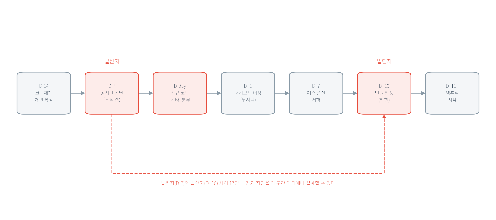
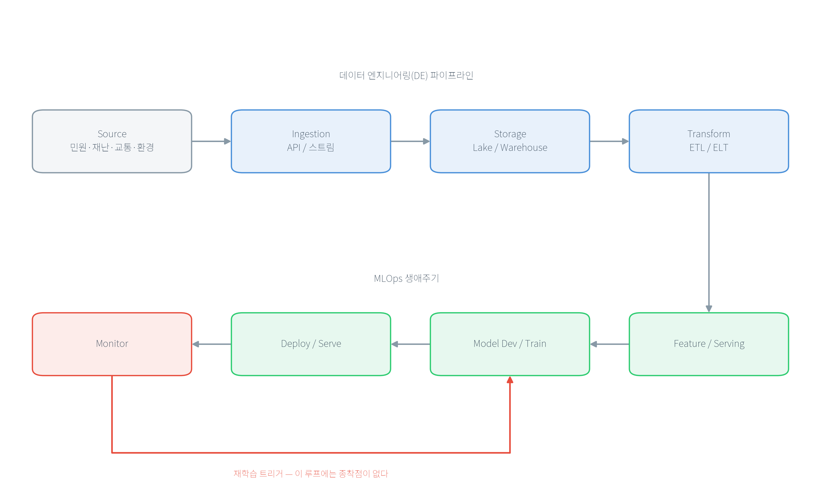

# 1장 데이터는 어떻게 모델까지 가고, 그사이에 무엇이 깨질까

> **1주차 · 데이터 엔지니어링과 MLOps**

이 장은 도구를 배우는 장이 아니다. Kafka, Airflow, MLflow 같은 이름은 4장 이후에 하나씩 나온다. 지금 확인할 것은 **데이터가 어딘가에서 들어와 모델의 판단으로 나가기까지 어떤 단계를 거치고, 그 사이 어디가 조용히 깨지는가**이다.

이 장에서 다루는 대기질 수치는 실제 공공 API를 한 번 호출해 얻은 값이며, 호출 시점마다 달라진다. 변하지 않는 것은 응답의 구조다.

## 1. 오늘의 질문

- 공공 API에서 JSON 파일을 하나 받았으면 데이터 수집이 끝난 것일까?
- 분석가가 쓰는 파이썬 스크립트(script)와 운영 중인 데이터 파이프라인(pipeline)은 무엇이 다를까?
- 모델의 정확도가 높은데도 서비스가 실패할 수 있는 이유는 무엇일까?
- 데이터 엔지니어링(Data Engineering, DE)과 MLOps는 어디에서 만날까?

한 문장으로 미리 답해 두면 이렇다. **데이터 엔지니어링은 믿을 수 있는 데이터를 계속 공급하는 일이고, MLOps는 그 데이터로 만든 모델을 계속 검증하며 운영하는 일이다.** 이 둘을 따로 떼어 관리하면 데이터 문제를 모델 문제로 오해하기 쉽다.

## 2. 학교 급식으로 보는 전체 흐름

데이터 파이프라인과 모델 운영은 학교 급식 운영과 단계가 대응한다. 재료가 들어와 밥상에 오르기까지 여러 손을 거치고, 어느 한 단계가 잘못되면 마지막 밥상에서야 문제가 드러난다는 점이 같다.

| 급식 | 시스템 | 여기서 잘못되면 |
|---|---|---|
| 식재료 납품 | 원천 데이터 | 어디서 언제 왔는지 모르면 원인을 못 찾는다 |
| 검수와 입고 | 수집 | 수량을 세지 않으면 누락을 늦게 안다 |
| 냉장·상온 보관 | 저장 | 원본을 버리면 다시 만들 수 없다 |
| 세척·조리 | 변환 | 형식만 바꾸고 의미를 놓치면 값이 왜곡된다 |
| 배식 | 제공 | 정해진 시간과 형식을 어기면 받는 쪽이 깨진다 |
| 조리법 | 모델 | 재료가 바뀌면 같은 조리법도 결과가 달라진다 |
| 배식 후 관찰 | 모니터링 | 안 보면 언제부터 나빠졌는지 모른다 |

앞의 다섯 줄이 데이터 엔지니어링, 뒤의 두 줄이 MLOps에 가깝다. 이 대응에서 기억할 것은 두 가지다. 좋은 조리법으로 상한 재료를 되살릴 수 없듯 좋은 모델로 잘못된 데이터를 되살릴 수 없고, 입고 기록이 없으면 문제 재료를 못 찾듯 데이터 기록이 없으면 잘못된 예측의 원인을 못 찾는다.

다만 비유는 여기까지다. 급식은 하루에 한 번 끝나지만 데이터 파이프라인은 멈추지 않고 돌며, 재료와 달리 데이터는 상해도 겉모습이 그대로다. 이 차이가 다음 절의 주제다.

## 3. 스크립트와 파이프라인은 무엇이 다른가

어느 담당자가 매주 월요일 공공 API를 호출해 엑셀 파일을 만드는 파이썬 스크립트를 갖고 있다고 하자. 실행하면 결과가 잘 나온다. 그래도 이것을 운영 파이프라인이라고 부르지는 않는다.

담당자가 휴가를 가면 그 주 데이터가 없다. API가 빈 응답을 보내도 파일은 생성되므로 성공으로 보인다. 원본 응답을 저장하지 않았으면 1년 뒤 그 수치의 근거를 확인할 수 없다. 담당자가 부서를 옮기면 실행 순서와 인증키 관리 방법이 함께 사라진다.

데이터 엔지니어링은 이 네 가지를 시스템이 지켜야 할 요구사항으로 바꾼다.

| 스크립트의 문제 | 파이프라인의 요구사항 |
|---|---|
| 사람이 실행해야 한다 | 정해진 일정에 자동으로 실행하고, 실패하면 다시 실행한다 |
| 성공했는지 알 수 없다 | 건수·결측률·응답 코드를 검사하고 어긋나면 알린다 |
| 원본이 남지 않는다 | 받은 응답 그대로와 처리 시각을 보존한다 |
| 방법이 사람 머릿속에 있다 | 코드·설정·데이터 형식을 버전으로 관리한다 |

이 요구사항은 수집·저장·변환·제공 네 단계 모두에 걸린다. **수집**은 원천에서 데이터를 가져오는 단계이고 유실·중복·인증 실패가 대표 실패다. **저장**은 원본과 가공본을 함께 보관하는 단계이며 원본 삭제가 가장 흔한 사고다. **변환**은 형식뿐 아니라 의미를 업무에 맞게 바꾸는 단계이고, 다음 절에서 볼 조용한 왜곡이 여기서 생긴다. **제공**은 분석·모델·화면에 넘기는 단계인데, 받는 쪽이 기대한 형식을 말없이 바꾸면 하류 전체가 깨진다.

## 4. 침묵 실패 — 프로그램은 성공했는데 데이터가 틀렸다

프로그램이 멈추고 빨간 오류 메시지를 뱉으면 그나마 다행이다. 그때는 누구나 알아차린다. 데이터 시스템에서 진짜 위험한 것은 **프로그램이 정상 종료하고 파일도 만들어졌는데 그 안의 데이터가 틀린 경우**다. 이것을 침묵 실패(silent failure)라고 부르며, 이 용어는 이 책 전체에서 반복해 나온다.

세 가지 전형이 있다.

**결측을 0으로 바꾼 경우.** 공공 API는 측정 장비가 점검 중이거나 통신이 끊기면 값을 `"-"`나 `null` 같은 문자열로 돌려준다. 이 값을 숫자로 바꿔야 하니 편의상 0으로 채우면 코드는 아무 오류 없이 돌아간다. 그런데 그 0은 "미세먼지 농도 0㎍/㎥", 즉 **대기질이 매우 좋다**는 뜻으로 읽힌다. 측정에 실패한 순간이 최고 등급 기록으로 바뀐 것이다. 결측은 0이 아니라 결측으로 남겨야 한다.

**페이지네이션(pagination)을 처리하지 않은 경우.** API는 한 번에 돌려주는 건수에 한도가 있다. 전체가 100건인데 한도가 50건이면 나머지 50건은 다음 요청으로 받아야 한다. 이 확인을 빠뜨린 수집기는 오류 없이 50건만 저장한다. 절반이 조용히 사라졌지만 로그에는 성공만 남는다.

**HTTP 200만으로 성공이라고 판단한 경우.** HTTP 상태 코드 200은 서버가 HTTP 요청을 정상적으로 처리했다는 뜻이다. 하지만 이것만으로 요청한 업무까지 성공했다고 단정할 수는 없다. 일부 공공 API는 200을 돌려주면서 응답 본문의 헤더에 별도 업무 오류 코드를 담는다(인증키 만료, 호출 한도 초과 등). HTTP 상태만 검사하는 코드는 이 오류 응답을 정상 데이터로 저장한다. 따라서 HTTP 상태와 응답 본문의 업무 코드를 각각 검사해야 한다.

주) HTTP 상태 코드의 첫 숫자는 결과의 큰 범주를 나타낸다. `1xx`는 처리 중 정보, `2xx`는 성공, `3xx`는 요청을 마치기 위한 추가 동작, `4xx`는 요청 쪽 오류, `5xx`는 서버 쪽 오류다. 자주 만나는 코드는 `200` 요청 처리 성공, `201` 새 자원 생성 성공, `400` 잘못된 요청, `401` 인증 필요 또는 실패, `403` 접근 거부, `404` 자원 없음, `429` 호출 횟수 초과, `500` 서버 내부 오류, `503` 일시적 서비스 불가이다([RFC 9110 §15](https://www.rfc-editor.org/rfc/rfc9110.html#name-status-codes), [RFC 6585 §4](https://www.rfc-editor.org/rfc/rfc6585.html#section-4)).

침묵 실패가 위험한 이유는 **문제가 시작된 곳과 눈에 보이는 곳이 다르기 때문**이다. 민원 유형 코드가 다른 부서에서 개편됐는데 파이프라인 담당자에게 공지가 가지 않았다고 하자. 그날부터 새 코드는 매핑되지 않아 전부 "기타"로 분류된다. 며칠 뒤 모델의 예측 품질이 떨어지고, 다시 며칠 뒤 시민이 "민원이 엉뚱한 부서로 갔다"고 항의한다. 시작은 공지 누락이고, 처음 나타난 기술 증상은 매핑 실패이며, 사람이 겪은 증상은 잘못된 배정이다.



**그림 1.1** 실패의 연쇄 — 발원지와 발현지 사이의 간극. 날짜는 실제 장애 기록이 아니라 전파 순서를 보여 주기 위해 구성한 시나리오다.

붉은 상자 셋을 보라. 왼쪽이 발원지(D−7, 공지 미전달), 가운데가 침묵 실패가 시작되는 날(D-day, 전부 "기타"로 분류), 오른쪽이 발현지(D+10, 시민 민원)다. 둘 사이는 11일이나 벌어져 있고, 그 사이 D+1의 대시보드 이상은 임계와 알림이 없어 그냥 지나간다. 점선이 지나는 구간 어디에나 감지 지점을 놓을 수 있으며, **발원지에 가까울수록 수습이 싸다.**

여기서 얻을 규칙은 하나다. **모델 성능만 감시하면 늦는다.** 상류의 미매핑 비율과 결측률을 함께 감시해야 문제가 시민에게 도달하기 전에 멈출 수 있다.

## 5. 모델은 만들어지는 것이 아니라 운영된다

머신러닝/딥러닝 수업에서는 모델을 만들고 정확도를 확인하는 데서 끝난다. 운영은 거기서 시작한다.

배포한 모델은 시간이 지나면 성능이 떨어진다. 코드를 고치지 않았는데도 그렇다. 세상이 변하기 때문이다. 민원 유형이 개편되고, 계절이 바뀌어 대기질 분포가 달라지고, 새 정책이 생겨 사람들의 신청 행동이 바뀐다. 모델은 과거 데이터에서 배운 관계를 그대로 적용하는데 그 관계 자체가 흐려진다. 이것을 드리프트(drift)라고 부르며 11장에서 자세히 다룬다.

그래서 MLOps는 한 방향으로 끝나는 절차가 아니라 순환이다.



**그림 1.2** 데이터 공급부터 모델 감시까지의 연결. 위쪽은 데이터 엔지니어링, 아래쪽은 MLOps에 해당하며, 모니터링 결과가 다시 모델 개발로 돌아온다.

이 순환에는 한 가지 성질이 붙는다. **하나를 바꾸면 다른 것이 함께 달라진다.** 데이터를 하나 더 넣으면 모델이 달라지고, 모델이 달라지면 응답 속도와 예측 분포가 달라지며, 그러면 감시 기준도 다시 정해야 한다. 일반 소프트웨어 개발에서는 코드만 버전으로 관리하면 되지만 여기서는 **데이터·피처(feature)·모델·코드가 함께 움직인다**. 무엇을 어떤 데이터로 언제 만들었는지 기록해 두지 않으면, 성능이 떨어졌을 때 원인이 어느 쪽인지 나눌 수 없다.


### 공공 서비스에서는 하나가 더 붙는다

공공 AI는 민간 서비스와 기술 구조가 거의 같다. 데이터를 모으고, 피처를 만들고, 모델을 배포하고, 감시한다. 다른 것은 **무엇을 최적화하고 누구에게 설명해야 하는가**다.

민간 추천 서비스가 잘못되면 매출이 줄어든다. 공공 민원 배정이 잘못되면 시민의 처리가 늦어지고, 왜 그렇게 됐는지 설명할 의무가 생긴다. 그래서 공공 시스템에는 질문 하나가 더 붙는다.

> **그 시점의 데이터와 모델로 그 결과를 다시 만들 수 있는가?**

이 질문에 답하려면 원천 데이터의 시각과 버전, 변환 코드와 피처 정의, 모델 버전, 배포 시각과 담당자, 최종 결과가 서로 연결되어 있어야 한다. 사고가 난 뒤 사람이 기억을 더듬어 쓰는 설명문은 근거가 되지 못한다. 실행 중에 자동으로 남긴 기록이라야 근거가 된다.

공공 AI가 사람 대신 결정을 내리는 서비스라면 시민이 그 결정에 설명을 요구하고 이의를 제기할 수 있어야 한다. 관련 법령과 적용 요건은 16장에서 다룬다.

## 6. 학습-서빙 불일치 — 같은 피처를 같은 규칙으로 계산하라

데이터 엔지니어링은 원천 데이터를 모델이 사용할 입력값으로 가공한다. 이 입력값을 **피처(feature)**라고 한다. MLOps는 그 피처로 모델을 학습하고 실제 예측을 수행한다. 따라서 피처를 만들어 넘기는 자리가 두 영역의 접점이다.

민원 처리 지연을 예측하는 모델이 `최근 7일 민원 수`를 사용한다고 하자. 먼저 이 피처의 뜻을 “각 예측 시각의 직전 168시간 동안 접수된 민원 수”로 정한다.

학습 데이터를 만들 때는 과거 민원마다 당시의 접수 시각을 기준으로 직전 168시간을 센다. 실제 서비스에서는 새 민원이 들어온 현재 시각을 기준으로 직전 168시간을 센다. 과거와 현재의 데이터가 다르므로 두 결과값은 달라도 된다. **같아야 하는 것은 결과값이 아니라 시간 범위, 결측 처리, 중복 제거와 같은 계산 규칙이다.**

학습에서는 최근 7일을 달력 날짜로 세고, 서비스에서는 168시간으로 센다면 같은 이름의 피처가 서로 다른 뜻을 갖게 된다. 두 코드 모두 정상 실행되지만 모델은 학습할 때와 다른 방식으로 만든 입력을 받는다. 이것이 **학습-서빙 불일치(training-serving skew)**이며, 오류 메시지 없이 모델 성능만 떨어지는 침묵 실패다.

피처 스토어(Feature Store)는 피처의 이름과 계산 규칙을 한곳에서 관리한다. 학습 경로는 그 정의에 따라 과거 시점별 값을 가져가고, 서비스 경로는 같은 정의에 따라 현재 값을 가져간다. 8장에서 이 구조를 직접 만든다.

앞의 민원 처리 지연 사례를 그대로 이어 가자. 모델의 문제는 새 민원이 접수된 순간 “이 민원의 처리가 지연될까?”를 예측하는 것이다. 과거 민원이 실제로 지연됐는지는 이미 결과가 나왔으므로, 이를 정답인 **레이블(label)**로 사용해 모델의 예측과 비교한다. 정답이 있어야 모델도 어떤 예측이 맞았는지 배울 수 있다.

반면 모델에 넣는 **입력 피처**는 그 과거 민원이 접수된 순간에도 알 수 있었던 정보로 제한한다. 민원 종류, 처음 접수한 부서, 접수 직전 168시간의 민원 수는 사용할 수 있다. 실제 처리 완료일은 접수 뒤에 생긴 정보이므로 입력 피처로 사용할 수 없다.

실제 처리 완료일을 입력하면 모델은 그 민원이 지연됐는지 쉽게 알아낼 수 있어 학습 성능이 높게 나온다. 하지만 새 민원이 접수된 순간에는 처리 완료일이 아직 없다. 학습할 때만 있던 이 단서를 피처에 넣는 오류를 **미래 정보 누출(future leakage)**이라고 한다. 정리하면 과거의 처리 결과는 정답 레이블로 사용하되, 입력 피처에는 당시 알 수 있었던 정보만 넣는다.

## 7. 실습 1.1 공공 API 응답 뜯어보기

실제 공공 API(한국환경공단 에어코리아 대기오염정보)를 호출해 응답이 어떻게 생겼는지 직접 본다. 순서를 지킨다. **예측을 먼저 적고 그다음 실행한다.** 응답을 보고 나서 적으면 무엇을 잘못 알고 있었는지 드러나지 않는다.

### 실행 전에 적을 것

| 예측 항목 | 내 예측 | 그렇게 생각한 이유 |
|---|---|---|
| 서울의 측정소는 몇 개일까 | | |
| 측정값은 숫자로 올까 문자열로 올까 | | |
| 측정 장비가 점검 중이면 값이 어떻게 표시될까 | | |
| 성공·실패를 어디에서 읽을까 | | |

이유 칸에 "그럴 것 같아서"라고 쓰지 않는다. 측정소가 옥외에 놓인 물리 장비라는 점, 응답이 JSON이라는 점처럼 이미 아는 사실에서 끌어낸다.

### 실행

```bash
cd practice/chapter1
python3 -m venv venv && source venv/bin/activate
pip install -r code/requirements.txt
python3 code/1-1-public-api.py --sido 서울 --rows 100
```

인증키는 환경변수 `DATA_GO_KR_API_KEY`로 넘기고, 코드나 문서에 직접 적지 않는다. 공공데이터포털에서 활용신청을 승인받은 직후에는 잠시 403이 반환될 수 있는데, 이것은 코드 버그가 아니라 권한이 아직 전파되지 않은 상태다.

_전체 코드는 practice/chapter1/code/1-1-public-api.py 참고_

### 응답의 두 계층

| 계층 | 키 | 내용 |
|---|---|---|
| header | `resultCode`, `resultMsg` | 처리 성공 여부(`00`이면 정상) |
| body | `totalCount`, `numOfRows`, `pageNo` | 전체 건수와 페이지 정보 |
| body | `items[]` | 측정소별 실제 데이터 |

측정소 레코드 하나에는 23개 필드가 있고, 측정 항목마다 값·등급·플래그(flag)가 한 묶음이다(`pm10Value`, `pm10Grade`, `pm10Flag`). 값만 저장하고 등급과 플래그를 버리면 나중에 결측이 왜 생겼는지 설명할 근거가 사라진다.

### 실행 결과와 대조

이 책을 쓰며 실행한 결과는 다음과 같다. 실시간 데이터이므로 여러분의 값은 다르다. **값은 달라도 구조는 같아야 한다.**

- 출력 파일: `practice/chapter1/data/output/ch1_api_summary.json`
- 측정 시각 2026-06-28 22:00, 서울 측정소 40개
- PM10 평균 20.0㎍/㎥, PM2.5 평균 12.7㎍/㎥, 결측 0건
- 예시 레코드: 정릉로 측정소 — `pm10Value` 21, `pm25Value` 12

예측표와 대조한다. 어긋난 항목이 여러분이 무엇을 잘못 가정했는지 알려 준다. 특히 마지막 줄을 보라. 결측이 0건이라고 해서 이 API에 결측이 없다는 뜻이 아니다. **이번 호출에서 0건이었을 뿐이다.**

## 8. 핵심 요약

이 장에서 확실히 가져갈 것은 다섯 가지다.

**1. 데이터 엔지니어링과 MLOps는 하는 일이 다르다.** 데이터 엔지니어링은 믿을 수 있는 데이터를 계속 공급하고, MLOps는 그 데이터로 만든 모델을 계속 검증하며 운영한다. 둘을 따로 관리하면 데이터 문제를 모델 문제로 오해한다.

**2. 스크립트와 파이프라인은 결과물이 아니라 요구사항이 다르다.** 파이프라인은 사람 없이 실행되고, 스스로 검사하고, 원본을 남기고, 방법을 버전으로 관리한다. 실행해서 파일이 나온다는 것만으로는 운영할 수 없다.

**3. 침묵 실패는 프로그램이 성공한 채로 데이터가 틀리는 일이다.** 결측을 0으로 채우기, 페이지네이션 빠뜨리기, HTTP 200만 믿기가 대표적이다. 오류 메시지가 없으므로 발견이 늦고, 문제가 시작된 곳과 눈에 보이는 곳이 다르다. 그래서 모델 성능만 감시하면 늦는다.

**4. 모델은 만드는 것이 아니라 운영하는 것이다.** 코드를 고치지 않아도 세상이 변하면 성능이 떨어진다(드리프트). 데이터·피처·모델·코드가 함께 움직이므로, 무엇을 언제 어떤 데이터로 만들었는지 기록하지 않으면 원인을 나눌 수 없다.

**5. 두 영역이 만나는 자리는 피처이고, 거기서 학습-서빙 불일치가 생긴다.** 학습 경로와 실시간 경로가 같은 피처를 다르게 계산하면 두 코드 모두 오류 없이 돌면서 모델만 틀린다. 피처의 정의를 한곳에 모으는 것이 해결 방향이며, 공공에서는 여기에 "그 결과를 다시 만들 수 있는가"라는 요구가 하나 더 붙는다.

## 9. 과제

실습 1.1을 실행해 만든 `ch1_api_summary.json`을 첨부하고, 다음 세 가지를 각각 세 문장 이내로 쓴다.

1. 예측표에서 실제와 어긋난 항목 하나와, 왜 그렇게 예측했는지.
2. 이 응답을 쓰는 코드가 가장 먼저 깨질 지점 하나와, 그 지점을 어떻게 자동으로 검사할지.
3. `pm10_reported`와 `pm10_missing`, `station_count` 사이에 성립해야 하는 등식.

값을 지어내지 않는다. 실행이 안 되면 어디서 막혔는지 그대로 쓴다. 수업일 포함 7일 이내에 LMS로 제출한다.

## 10. 더 알아보기

이 장에서는 뼈대만 다뤘다. 아래 내용은 실무교재 `docs/chapter1.md`에 있으며 관심 있는 학생만 읽으면 된다.

- **우리 기관은 어느 수준인가** — MLOps 성숙도 모델(수준 0·1·2): `docs/chapter1.md` §1.2.3
- **데이터를 넘길 때의 약속** — 데이터 계약과 스키마 변경 통지: §1.1.5
- **이름이 붙은 실패 패턴** — 글루 코드, 파이프라인 정글, 미신고 소비자: §1.3.4
- **공공 AI와 법령** — 개인정보 보호법 관련 조문과 감사 대응 절차: §1.4.1~§1.4.2 (16장에서 본격적으로 다룬다)
- **발주와 검수, 예산** — 검수 가능한 요구사항 문장 만들기: §1.4.4~§1.4.6

원문을 직접 보고 싶다면 다음 두 편이 출발점이다.

- Sculley 외, 「Hidden Technical Debt in Machine Learning Systems」 — 4절과 6절에서 다룬 실패들이 왜 반복되는지 설명한다. https://papers.nips.cc/paper_files/paper/2015/file/86df7dcfd896fcaf2674f757a2463eba-Paper.pdf
- Kreuzberger 외, 「Machine Learning Operations (MLOps): Overview, Definition, and Architecture」 — MLOps의 정의와 구성요소를 정리한 논문. https://arxiv.org/abs/2205.02302
