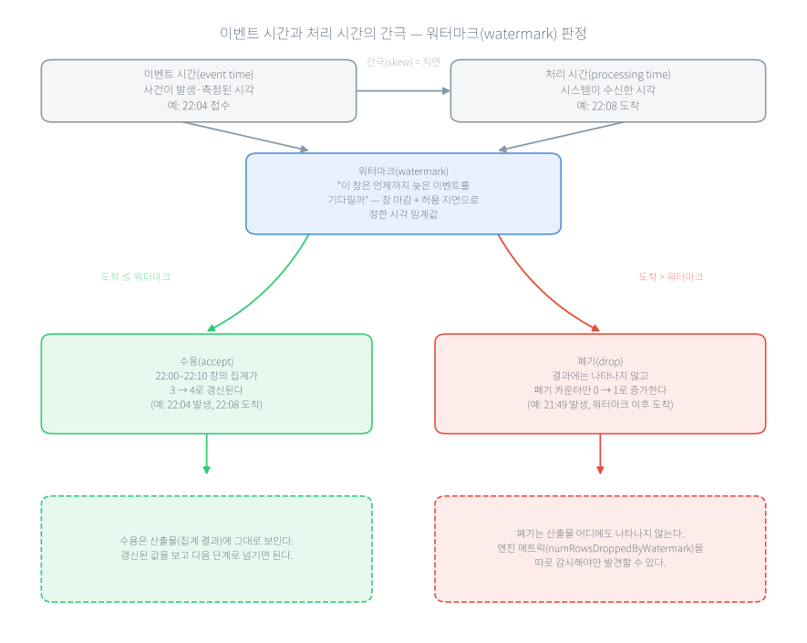

# 2주차 공공 실시간 데이터는 어떻게 망가지는가

> **2주차 · 공공 데이터 품질**

□ 1장에서 데이터가 모델까지 가는 길을 봤다면, 이 장은 그 길에 실제로 흐르는 **공공 실시간 데이터**를 들여다봄  
  ○ 어떤 속도로 들어오는지 다룸  
  ○ 어디가 망가지는지 다룸  
  ○ "값이 변했다"를 언제 문제로 볼지 판단하는 방법을 다룸  
□ 이 장의 수치는 서울 40개 측정소의 실제 대기질 응답을 두 시각에 받아 비교한 결과임  

## 1. 오늘의 질문

□ "실시간"이라는 말은 항상 같은 속도를 뜻할까?  
□ 실시간 데이터에서 가장 흔히 망가지는 곳은 어디일까?  
□ 22시에 측정된 값을 22시 30분에 받았다면, 이것은 몇 시의 데이터일까?  
□ 데이터가 변했다는 것을 어떻게 알아차리고, 언제 문제로 볼까?  

## 2. 우편물 처리소로 보는 이 장

□ 이 장의 네 주제는 우편물 처리소에 하나씩 대응함  

| 우편물 처리소 | 실시간 데이터 |
|---|---|
| 편지가 들어오는 방식이 다르다 — 매일 조금씩, 명절에 폭증, 정해진 시간에 한 묶음 | 유입 패턴이 유형마다 다르다 |
| 같은 편지가 두 번 오고, 늦게 오고, 주소가 비어 있고, 봉투 규격이 바뀐다 | 중복·지연·결측·스키마 변경 |
| 소인 날짜(부친 날)와 도착 날짜는 다르다 | 이벤트 시간과 처리 시간 |
| 해가 바뀌며 오가는 우편물의 종류 구성이 달라진다 | 데이터 드리프트 |

□ 특히 세 번째 대응이 이 장의 핵심임  
  ○ **"언제 부쳤는가"로 세는 것과 "언제 받았는가"로 세는 것은 다른 통계를 만든다.**  
  ○ 우편물은 사람이 소인을 눈으로 확인함  
  ○ 데이터에서는 시스템이 무엇을 기준으로 셀지 코드로 정해 놓아야 함  

## 3. "실시간"은 하나의 속도가 아니다

□ 실시간 데이터라고 하면 초 단위로 쏟아지는 장면을 떠올리기 쉬움  
  ○ 공공 데이터는 그렇지 않음  
  ○ 들어오는 방식이 네 갈래로 갈림  

| 유입 패턴 | 어떻게 들어오는가 | 공공 예 |
|---|---|---|
| 지속 유입 | 업무시간 내내 대체로 일정한 속도 | 접수되는 민원 |
| 버스트 | 평소 조용하다 특정 사건에 폭증 | 재난 문자 발송 직후의 신고 |
| 고빈도 | 초 단위로 대량 유입 | 교통 센서 스트림 |
| 주기 갱신 | 정해진 간격으로 한 묶음씩 | 분·시 단위 환경 측정값 |

□ 이 구분은 이름표를 붙이려는 것이 아니라 **설계를 미리 갈라 두려는 것**이다  
  ○ 평균 유입량에 맞춰 용량을 잡으면 버스트가 오는 날 시스템이 포화됨  
  ○ 반대로 한 시간마다 갱신되는 주기 갱신 데이터를 1분마다 호출하면 API 호출 한도만 소진되고 새 데이터는 없음  
□ 한 가지 축으로 정리하면 **사람이 입력하는가, 기계가 입력하는가**다  
  ○ 민원처럼 사람이 자유 텍스트로 입력하는 데이터  
    – 필드가 비고 표현이 제각각임  
    – 본문에 개인정보가 섞임  
  ○ 교통·환경 센서처럼 기계가 보내는 데이터  
    – 개인정보 위험은 낮음  
    – 장비 오작동과 통신 장애가 결측의 주된 원인임  
□ 같은 사건이 유형에 따라 다르게 나타남  
  ○ 초미세먼지 비상저감조치가 발령된 날, 환경 데이터는 값의 수준만 오르고 유입 구조는 그대로임  
  ○ 민원은 "매연 차량 신고" 같은 유형의 비중이 늘어 분포가 바뀜  
  ○ 안내 문자 발송 직후 문의는 폭증함  
  ○ 하나의 "폭증"에 세 가지 다른 대응이 필요하다  

## 4. 네 가지가 반복해서 망가진다

□ 실시간 데이터에서 품질 문제는 예외가 아니라 정상 상태에 가깝다  
  ○ 반복해서 나타나는 것이 네 가지임  
□ **중복 — 안전장치의 부작용**  
  ○ 같은 이벤트가 두 번 이상 들어옴  
  ○ 대부분 버그가 아니라 유실을 막으려는 재시도의 결과임  
  ○ 4장에서 처리를 커밋보다 앞세운 설계로 실험하면 프로그램이 크래시(crash)한 뒤 재시작할 때 **중복 10건**이 생김  
  ○ 민원 1건이 두 번 세어지면 "민원이 늘었다"는 잘못된 신호가 대시보드와 모델 입력에 그대로 들어감  
  ○ 막는 방법은 이벤트마다 고유 식별자를 붙이는 것임  
    – 5장에서 직접 만듦  
□ **지연 — 늦게 도착하는 과거**  
  ○ 이벤트가 발생 시각보다 늦게 도착함  
  ○ 이미 마감해 보고한 집계가 나중에 틀린 것이 됨  
  ○ 6장에서 허용 지연을 10분으로 두고 늦은 이벤트 두 건을 흘린 결과  
    – 22:04에 발생한 것은 **수용되어 집계가 3에서 4로 갱신**됨  
    – 21:49에 발생한 것은 **폐기되어 폐기 건수가 0에서 1로 증가**함  
  ○ 여기서 중요한 것은 비대칭임  
    – 수용은 결과를 보면 확인됨  
    – **폐기는 결과 어디에도 보이지 않는다.**  
    – 따로 세지 않으면 사라진 줄도 모름  
□ **결측 — 값과 파생 필드는 따로 본다**  
  ○ 있어야 할 값이 빔  
  ○ 그런데 결측을 데이터 전체 단위로만 세면 놓침  
  ○ 이 장의 실습에서 서울 40개 측정소 스냅샷을 보면 PM10 측정값(`pm10Value`)은 40개가 모두 채워져 있는데 그 값에서 계산되는 등급(`pm10Grade`)은 한 측정소에서 비어 있음  
    – 값은 있는데 등급이 없음  
  ○ **결측 점검은 데이터 전체가 아니라 필드별로 해야 한다**는 것이 이 관찰의 결론이다  
□ **스키마 변경 — 죽지 않고 조용히 틀린다**  
  ○ 필드가 추가·삭제되거나 타입이 바뀜  
  ○ 1장에서 본 침묵 실패가 여기서 다시 나옴  
  ○ 없는 필드를 찾으면 파서는 오류를 내지 않고 `None`을 돌려줄 뿐임  
    – 집계는 계속 돌면서 결측률만 조용히 100%가 됨  
  ○ 7장에서는 표준 코드 사전에 없는 표기를 비슷한 자치구에 억지로 끼워 맞추지 않고 **미매핑으로 분리해 보고**함  
    – 건수 합이 맞지 않으면 배치 자체를 실패시킴  

| 위험 | 운영에서 보이는 신호 | 최소 대응 | 실측이 나오는 장 |
|---|---|---|---|
| 중복 | 같은 이벤트가 반복 수신 | 고유 식별자로 중복 흡수 | 4장(중복 10건), 5장 |
| 지연 | 발생 시각과 수신 시각이 벌어짐 | 이벤트 시간 기준 집계, 폐기 건수 감시 | 6장, 14장 |
| 결측 | 필드별 결측률 증가 | 필드별·사유별로 나누어 집계 | 실습 2.1, 7장 |
| 스키마 변경 | 코드·단위·필드가 조용히 바뀜 | 스키마 검증, 변경 통지 | 7장 |

□ 다섯 번째 위험인 **개인정보 유입**은 성격이 다르다  
  ○ 민원 텍스트처럼 사람이 입력한 데이터에는 식별 가능한 값이 섞임  
  ○ 수집한 뒤에 처리하려 하면 이미 로그와 백업에 퍼진 뒤라 되돌릴 수 없음  
  ○ 그래서 마스킹은 수집 단계의 설계 조건이다  
  ○ 접근 통제와 관련 법령은 13장과 16장에서 다룸  

## 5. 이벤트 시간과 처리 시간

□ **이벤트 시간**은 사건이 일어나거나 측정된 시각이다  
□ **처리 시간**은 시스템이 그 데이터를 받은 시각이다  
  ○ 이벤트 시간과 처리 시간은 거의 항상 벌어짐  
    – 네트워크 지연, 배치 갱신, 재전송, 원천의 게시 지연 때문임  
□ 공공 환경 데이터에는 구조적인 게시 지연이 있다  
  ○ 22:00에 측정된 값이 22:00보다 늦게 게시됨  
  ○ 그래서 "이것이 몇 시 데이터인가"는 내 컴퓨터의 시계가 아니라 **응답 안의 `dataTime` 값**으로 확인해야 함  
□ 처리 시간으로 집계하면 "언제 일어난 일인가"가 흐려짐  
  ○ 구청이 22:00~23:00에 접수된 민원 40건을 처리해야 하는데 시스템 부하로 그중 15건이 23시 이후에 적재됐다고 하자  
    – 처리 시간 기준 집계는 "22시대 25건"으로 보고함  
    – 다음 배치가 그 수치로 인력을 정함  
    – 22시대는 실제보다 적게, 23시대는 많게 배치되어 두 시간대가 모두 어긋남  
  ○ 이벤트 시간 기준이었다면 40건이 온전히 22시대로 귀속됐을 것임  



**그림 2.1** 이벤트 시간과 처리 시간의 간극, 그리고 워터마크(watermark) 판정

□ 워터마크는 이 간극을 얼마나 허용할지 정한 시각 임계값이다  
  ○ 도착이 워터마크 안이면 수용해 집계를 갱신함  
  ○ 넘으면 폐기하고 폐기 건수만 올림  
  ○ 4절에서 말한 비대칭이 그림에 그대로 나타남  
  ○ 자세한 처리는 6장에서 직접 실행함  
□ 원칙은 하나다  
  ○ **집계와 드리프트 판단은 이벤트 시간 기준으로 설계하고, 산출물에 어떤 시간을 썼는지 적어 둔다.**  

## 6. 데이터 드리프트 — 코드는 그대로인데 성능이 떨어진다

□ **데이터 드리프트**는 입력 데이터의 분포가 시간에 따라 변하는 현상이다  
  ○ 모델은 학습 당시의 분포를 전제로 동작함  
    – 입력 분포가 달라지면 코드가 한 줄도 바뀌지 않아도 성능이 떨어짐  
  ○ 테스트는 코드를 고쳐야 돌지만 드리프트는 아무도 아무것도 고치지 않아도 옴  
□ 공공 데이터에서 드리프트를 부르는 원인은 네 갈래다  
  ○ **정책 변화**로 민원 유형 코드가 개편되면 분포가 바뀜  
  ○ **계절성**은 미세먼지·한파 민원처럼 매년 반복됨  
  ○ **외부 이벤트**는 대형 재난처럼 일시적으로 폭증시킴  
  ○ **시스템 변경**은 센서 교체나 API 변경으로 값의 범위와 결측 패턴을 바꿈  
□ 여기서 바로 반대 방향의 주의가 붙음  
  ○ **감지했다고 항상 경보를 울리면 안 된다.**  
  ○ 특히 계절성처럼 매년 반복되는 변화를 매년 "이상"으로 경보하면 알림에 무뎌져 진짜 경보까지 무시하게 됨  
  ○ 예상되는 패턴은 경보가 아니라 모델에 반영할 조건으로 다루는 편이 옳음  
□ 한 가지 구분을 덧붙임  
  ○ 데이터 드리프트는 입력 분포의 변화임  
  ○ **개념 드리프트**는 입력과 정답 사이 관계 자체의 변화임  
    – 같은 민원 문장이라도 "긴급"의 기준이 바뀌면 입력은 그대로인데 정답이 달라짐  

### 변화를 어떻게 재는가 — KS 검정

□ 두 시점의 분포를 비교하는 방법으로 **콜모고로프-스미르노프(Kolmogorov-Smirnov, KS) 2표본 검정**을 쓴다  
  ○ 두 표본의 누적분포 사이 최대 간격을 잼(통계량 D)  
  ○ "두 표본이 같은 분포에서 나왔다"고 가정했을 때 그만큼 큰 간격이 우연히 나올 확률(p-value)을 돌려줌  
□ 해석에서 두 가지를 반드시 주의함  
  ○ 이 두 가지가 시험에도 나옴  
□ **첫째, p-value는 "분포가 변했을 확률"이 아니다.**  
  ○ 귀무가설이 참일 때 이만큼의 차이가 우연히 나올 확률임  
  ○ 그래서 p-value가 크다고 "두 분포가 같다"가 증명되지 않음  
  ○ 정확한 진술은 **"다르다고 볼 충분한 증거가 없다"**이다  
□ **둘째, 결과는 표본 크기에 좌우된다.**  
  ○ 표본이 크면 사소한 차이도 유의해짐  
  ○ 작으면 진짜 변화도 놓침  
  ○ 실습의 표본은 측정소 40개로 작은 편임  
    – 작은 변화를 애초에 잡아내기 어려운 크기라는 점을 결과와 함께 읽어야 함  
□ 두 주의를 합치면 원칙이 하나 나옴  
  ○ **단일 지표만으로 판정하지 않는다.**  
  ○ 11장에서 같은 서울 PM10 데이터에 9일 간격 비교를 더한 결과  
    – PSI(Population Stability Index)는 **0.3324**로 경보 구간에 들어감  
    – KS는 여전히 유의하지 않음  
  ○ 두 지표가 다른 결론을 내는 것이 지표 하나를 믿으면 안 되는 이유다  

## 7. 실습 2.1~2.2 응답 EDA와 분포 변화 비교 (난이도 ★★☆☆☆)

### 실습 목표

□ 에어코리아 응답의 측정소 레코드를 DataFrame으로 바꾸고, 결측을 **필드별로** 요약함  
□ 같은 변수(PM10)의 두 시각 분포를 KS 검정과 분위수로 비교함  
  ○ "값은 변해도 분포 변화가 통계적으로 유의하지 않을 수 있다"를 실제 데이터로 확인함  

### 실행 환경

□ Python 3.10 이상, `pandas`·`numpy`·`scipy`·`requests`·`matplotlib`(`practice/chapter2/code/requirements.txt`)  
□ 입력은 저장된 스냅샷 파일이 기본값임  
  ○ 실시간 호출은 `--live` 옵션으로 하되 `DATA_GO_KR_API_KEY`가 필요함  

### 실행 명령

```bash
cd practice/chapter2
pip install -r code/requirements.txt

# 2.1 파싱 + EDA
python3 code/2-1-parse-api.py

# 2.2 분포 변화 비교
python3 code/2-2-drift-visualize.py \
  --baseline data/input/airquality_seoul_2200.json \
  --current  data/input/airquality_seoul_current.json \
  --col pm10Value
```

### 핵심 코드

```python
# 2-1-parse-api.py — 결측 표기('-') 처리와 EDA
df = pd.DataFrame(items)                                          # response.body.items
df[col] = pd.to_numeric(df[col].replace({"-": np.nan}), errors="coerce")
missing = {col: int(df[col].isna().sum()) for col in MEASURE_COLS}
```

```python
# 2-2-drift-visualize.py — 두 시각의 분포를 KS 검정으로 비교
base, base_time = load_series(Path(baseline), col)                # 기준 스냅샷
curr, curr_time = load_series(Path(current), col)                 # 현재 스냅샷
stat, p = ks_2samp_with_fallback(base, curr)                      # 분포 동일성 검정
```

_전체 코드는 practice/chapter2/code/2-1-parse-api.py, practice/chapter2/code/2-2-drift-visualize.py 참고_

### 실행 결과 확인 사항

□ 서울 22:00 스냅샷(측정소 40개)과 22:00→23:00 비교 결과다(`ch2_eda_summary.json`, `ch2_drift_result.json`)  

1. **측정소 수**: 40개
2. **PM10**: 최소 14, 최대 27, 평균 20.0, 중앙값 20.0 (㎍/㎥)
3. **결측**: PM10 측정값(`pm10Value`) 결측 0건 — 그러나 등급(`pm10Grade`)은 **1건 결측**
4. **PM10 등급 분포**: 1등급(좋음) 28개, 2등급(보통) 11개, 결측 1개
5. **KS 검정(22:00 vs 23:00)**: 통계량 0.175, p-value 0.579 (alpha=0.05 → `drift_detected = False`)
6. **분위수 이동**: 25%는 17 → 19, 75%는 22 → 23으로 소폭 상승(50% 중앙값은 20 → 20으로 동일)

**표 2.4** PM10 분위수 비교(기준 22:00 vs 현재 23:00)

| 분위수 | 기준(22:00) | 현재(23:00) |
|---|---|---|
| 0% | 14.0 | 14.0 |
| 25% | 17.0 | 19.0 |
| 50% | 20.0 | 20.0 |
| 75% | 22.0 | 23.0 |
| 100% | 27.0 | 27.0 |

□ 실시간 데이터이므로 여러분의 값은 다르다  
  ○ 확인할 것은 값이 아니라 판정 절차다  
  ○ `p_value`와 `alpha`를 비교해 `drift_detected`가 어떻게 정해지는지를 6절과 대조함  
  ○ 그 판정을 어떻게 서술해야 맞는지를 6절과 대조함  

## 8. 핵심 요약

□ **1. "실시간"은 네 가지 유입 패턴으로 갈린다.**  
  ○ 지속 유입·버스트·고빈도·주기 갱신임  
  ○ 이 구분이 처리량 산정과 호출 주기라는 구체적 설계 결정으로 이어짐  
  ○ 평균에 맞춰 잡은 용량은 버스트가 오는 날 포화됨  
□ **2. 반복해서 망가지는 곳은 네 군데다.**  
  ○ 중복은 재시도의 부작용임  
  ○ 지연은 마감한 집계를 뒤집음  
  ○ 결측은 필드별로 봐야 보임  
  ○ 스키마 변경은 오류 없이 조용히 틀림  
  ○ 특히 지연에서 폐기된 건수는 결과 어디에도 나타나지 않으므로 따로 세야 함  
□ **3. 집계 기준은 이벤트 시간이다.**  
  ○ 처리 시간으로 세면 "언제 일어났는가"라는 질문의 답이 틀림  
  ○ 22시대 민원 40건이 25건으로 보고되면 인력 배치가 두 시간대 모두 어긋남  
  ○ 어떤 시간을 썼는지 산출물에 적어 둠  
□ **4. 드리프트는 아무것도 고치지 않아도 온다.**  
  ○ 정책 변화·계절성·외부 이벤트·시스템 변경이 원인임  
  ○ 코드가 그대로여도 성능이 떨어짐  
  ○ 다만 계절처럼 반복되는 변화를 매번 경보로 처리하면 진짜 경보까지 무시하게 됨  
□ **5. p-value가 크다고 "분포가 같다"가 아니다.**  
  ○ "다르다고 볼 충분한 증거가 없다"는 뜻임  
  ○ 결과는 표본 크기에 좌우되므로 측정소 40개 정도의 작은 표본에서는 진짜 변화도 놓칠 수 있음  
  ○ 그래서 KS 하나로 판정하지 않고 PSI 같은 다른 지표와 함께 봄  

## 9. 과제

□ 실습을 실행해 생성된 다음 두 파일을 LMS에 그대로 업로드한다  
  ○ `practice/chapter2/data/output/ch2_eda_summary.json`  
  ○ `practice/chapter2/data/output/ch2_drift_result.json`  
□ 이어서 두 가지를 각각 세 문장 이내로 쓴다  

1. 본인의 `p_value`와 `alpha`를 비교해 `drift_detected` 값이 왜 그렇게 나왔는지 판정 규칙으로 설명한다.
2. `drift_detected`가 `false`인 것을 "두 시점의 분포가 같음이 확인되었다"로 보고하면 왜 틀린 서술인지, 본인의 `baseline_n` 값을 근거로 쓴다.

□ 수업일 포함 7일 이내에 제출한다  

## 10. 더 알아보기

□ 이 장에서 다루지 않은 내용은 실무교재 `lecture/docs/chapter2.md`에 있다  
□ **데이터 관측성** — 신선도·양·스키마·분포·계보를 하나의 감시 체계로 묶는 관점: `lecture/docs/chapter2.md` §2.2  
□ **드리프트의 시간적 양상** — 급격·증분·점진·재발의 구분과 대응: §2.4  
□ **민간 현장의 감시 지표** — skew 분포(p50·p95·p99), 지연 이벤트 비율, 재학습 트리거 빈도: §2.3~§2.4  
□ **개인정보와 법령** — 개인정보 보호법 적용 범위와 인용 시 주의: §2.2 (13장·16장에서 본격적으로 다룬다)  
