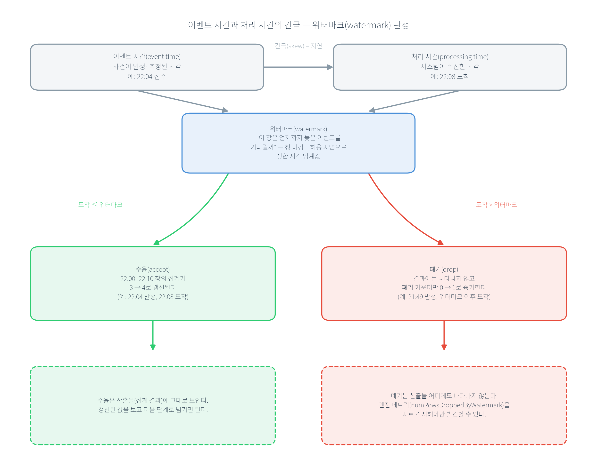

# 제2장 공공 실시간 데이터셋 이해

---

## [전반부] 이론 강의
---

### 학습 목표

- 공공 실시간 데이터를 형식·유입 패턴·품질 위험의 세 축으로 분류한다
- 실시간 데이터의 5대 품질 위험(중복·지연·결측·스키마 변경·개인정보)을 원인과 최소 대응으로 설명한다
- 이벤트 시간과 처리 시간을 구분하고, 혼동이 만드는 집계 왜곡을 설명한다
- 데이터 드리프트를 정의하고 KS 검정 결과를 올바르게 해석한다
- 이 장의 네 가지 설계 결정을 민간 현장으로 옮겨, 무엇이 그대로이고 무엇이 근거만 바뀌는지 구분한다

---

### 1. 공공 실시간 데이터의 유형
#### 1-1. "실시간"은 하나의 속도가 아니다

○ **지속 유입(steady stream)**
  - 업무시간 내내 대체로 일정한 속도로 들어옴
  - 예: 접수되는 민원

○ **버스트(burst)**
  - 평소엔 조용하다가 특정 사건에 폭증
  - 예: 재난 문자 발송 직후 몰리는 신고

○ **고빈도(high-frequency)**
  - 초 단위로 대량이 쏟아짐
  - 예: 교통 센서 스트림

○ **주기 갱신(periodic update)**
  - 정해진 간격으로 한 묶음씩 갱신
  - 예: 분·시 단위로 게시되는 환경 측정값

○ **왜 구분해야 하는가**
  - 버스트를 전제하지 않고 평균 유입량에 맞춰 용량을 잡으면 사건 당일 시스템이 포화됨
  - 주기 갱신 데이터를 초 단위로 폴링(polling)하면 쿼터만 소진되고 새 데이터는 없음
  - 유입 패턴은 처리량 산정·폴링 주기·버퍼 크기라는 구체적 설계 결정으로 이어짐

#### 1-2. 네 가지 유형의 해부

○ 유형을 형식만으로 나누면 "JSON이냐 센서 스트림이냐"에서 멈춘다. 운영에 쓰이는 분류는 형식·유입 패턴·품질 리스크·운영 포인트를 함께 묶는다.

**표 2.1** 공공 실시간 데이터 유형 비교

| 유형 | 형식 | 유입 패턴 | 대표 품질 이슈 | 운영 포인트 |
|---|---|---|---|---|
| 민원 | JSON 이벤트 로그 | 업무시간 지속 유입 | 개인정보, 코드 불일치 | 마스킹·접근 통제, 코드 매핑 |
| 재난·안전 | JSON/XML 피드 | 이벤트 버스트 | 중복 경보, 위치 오류 | 피크 처리량, 지연 이벤트 처리 |
| 교통 | 센서 스트림 | 초당 고빈도 | 센서 오작동, 통신 지연 | 실시간 집계, 결측 구간 처리 |
| 환경 | 시계열 측정값 | 분 단위 주기 갱신 | 결측, 단위 불일치 | 품질 모니터링, 표준화 |

○ 이 표를 관통하는 축은 **"사람이 입력하는가, 기계가 입력하는가"**다.
  - 민원: 사람이 자유 텍스트로 입력 → 필드 누락, 표현 다양성, 본문 개인정보 → 마스킹·접근 통제가 수집 단계의 설계 입력
  - 교통·환경 센서: 기계가 신호를 보냄 → 개인정보 위험은 낮지만 장비 오작동·통신 장애가 결측·이상치의 주 원인
  - 재난·안전: 그 중간에서 버스트 고유 문제 — 여러 경로의 중복 경보, 위치 정보 어긋남

#### 1-3. 분류는 운영 대응의 분기 조건이다

○ 유형 분류는 라벨을 붙이는 데 있지 않고 **대응 전략을 미리 갈라 두는 데** 있다
  - 버스트형(재난) → 피크를 흡수할 큐 + 지연 이벤트 처리 규칙(6장 watermark)
  - 고빈도형(교통) → 실시간 집계 + 결측 구간 보간
  - 개인정보 결합형(민원) → 마스킹·접근 로그(13·15장)
  - 유형을 먼저 판정하지 않으면 이 대응들이 사후에 하나씩 땜질로 붙는다

○ 분류 **기준** 자체가 도메인에 따라 갈린다
  - 민간: 고객 행동·거래·센서·마케팅으로 나누되 유형별 비용·수익 기여를 기준에 함께 넣음
  - 공공: 유형별 감사 의무·개인정보 통제가 법으로 정해져 있어 통제 수준이 먼저 기준이 됨

#### 공공 사례: 같은 "폭증"이 유형에 따라 다른 설계를 부른다

서울시가 초미세먼지 비상저감조치를 발령한 날, 세 유형의 데이터가 동시에 튄다.
  - 환경(주기 갱신): 값의 수준은 오르지만 유입 구조는 그대로 — 측정소 40개가 여전히 정시마다 한 묶음씩 보냄
  - 민원(지속 유입): "매연 차량 신고"·"공사장 비산먼지" 같은 유형의 건수가 늘며 유형 분포가 바뀜
  - 재난·안전(버스트): 저감조치 안내 문자 발송 직후 문의가 폭증

같은 "폭증"을 겪지만 대응은 다르다 — 환경은 값의 드리프트 감시(4절), 민원은 유형 분포 변화 추적, 재난·안전은 피크 처리량 확보다.

---

### 2. 데이터 품질 5대 위험
실시간 데이터에서 품질 문제는 예외가 아니라 정상 상태에 가깝다. 다섯 위험을 "무엇인가 → 없으면 무엇이 실패하나 → 현장은 어떻게 막나" 순서로 본다.

#### 2-1. 중복 — 안전장치의 부작용

○ 같은 이벤트가 두 번 이상 수신되는 현상. 대부분 버그가 아니라 유실을 막으려는 재시도의 부작용
○ 없으면: 집계가 부풀려짐 — 민원 1건이 두 번 세어지면 "민원이 늘었다"는 잘못된 신호가 대시보드·모델 입력에 들어감
○ 실측(4장): 커밋 시점 한 줄만 바꾸면 처리를 커밋보다 앞세운 설계(at-least-once)에서 크래시(crash) 후 재시작 시 **중복 10건** 발생 — 버그가 아니라 전달 보증의 정의대로의 동작
○ 대응: 멱등키(idempotency key) — 이벤트마다 고유 식별자 + Upsert로 재전송에도 상태가 바뀌지 않게 함(5장)
○ 지표: **중복률**(전체 수집 건수 중 중복 비율). 민간 과금 시스템은 0.01% 미만을 목표로 잡는 경우가 많음 — 공공은 같은 지표에 목표 근거만 다름(잘못 청구한 금액 ↔ 부풀려진 건수로 배분한 인력·예산)

#### 2-2. 지연 — 늦게 도착하는 과거

○ 이벤트가 발생 시각보다 늦게 도착하는 현상
○ 없으면: 이미 마감해 보고한 집계가 나중에 틀린 것이 됨
○ 실측(6장): watermark를 10분으로 두고 지연 이벤트 두 건을 흘리면, 하나(발생 22:04)는 **수용되어 집계가 3에서 4로 갱신**, 다른 하나(발생 21:49)는 **폐기되어 폐기 카운터가 0에서 1로 증가**. 두 판정의 증거가 서로 다른 곳에 남는 것이 핵심 — 폐기는 결과 어디에도 안 보이므로 반드시 엔진 메트릭으로 감시해야 함
○ 하류 영향(14장): 지연 레이블로 채점한 예측 6건 전체의 평균절대오차(MAE)가 **1.0** — 성능 계산이 하루 지연된다

#### 2-3. 결측 — 값 결측과 파생 결측은 별개다

○ 있어야 할 값이 비는 현상. 장비 오작동·API 오류·파싱 실패로 생김
○ 없으면: 결측을 0으로 대체하면 평균이 왜곡되고, 결측률을 지표로 안 두면 소스가 조용히 망가진 것을 놓침
○ 실측(실습 2.1, 뒤에서 다룸): 서울 40개 측정소 스냅샷에서 PM10 측정값(`pm10Value`)은 40개 모두 채워져 있었는데, 파생 등급(`pm10Grade`)은 한 측정소에서 비어 있었음 — 값은 있는데 그 값에서 계산되는 등급이 없는 경우. 그래서 결측 점검은 데이터 전체가 아니라 **필드별로** 해야 함
○ 대응: 결측 사유의 분리 집계(플래그로 점검/통신장애 구분), 버린 것을 세는 것(7장 총계 보존식 — 원본 60건 = 매핑 54 + 미기재 2 + 미매핑 3 + 중복 제거 1)
○ 지표: **피처별 결측률 임계** 2단계. 민간 예 — 추천 모델 입력 피처가 5% 초과면 경보, 10% 초과면 서빙 중단. 공공도 같은 구조를 쓰되 중단 근거는 매출이 아니라 "틀린 수치로 행정 결정을 내리지 않는다"

#### 2-4. 스키마 변경 — 죽지 않고 조용히 틀린다

○ 필드가 추가·삭제되거나 타입·의미가 바뀌는 현상
○ 없으면: 파싱은 즉시 죽지 않는다 — 없는 필드를 찾으면 파서는 에러 대신 `None`을 돌려줄 뿐이고 집계는 계속 돌면서 결측률만 조용히 100%가 됨 — **침묵 실패(silent failure)**
○ 실측(7장): 표준 코드 사전에 없는 표기(`판교`·`성남시`·`김포`)를 비슷한 자치구에 억지로 끼워 맞추지 않고 **미매핑으로 분리 보고**하며, 총계 보존식이 성립하지 않으면 배치 자체를 실패시킴
○ 현장 방법: 스키마 진화 호환성(schema evolution, 후방/전방 호환) 규칙화, 데이터 계약(data contract, 생산자-소비자 간 스키마·의미·변경 절차 합의), 머신러닝을 위한 데이터 검증(스키마를 명시적 산출물로 두고 벗어나면 경보) — 공통 정신은 **스키마를 암묵적 전제가 아니라 검증 가능한 계약으로 승격**
○ 지표: **스키마 변경 사전 공지율**(생산 팀이 바꾸기 전에 소비 팀에 알린 비율) — 낮으면 계약서가 있어도 소비자는 사고 뒤에 변경을 앎. 공공 발주에서는 과업지시서의 변경 통보 조항으로 요구 가능

#### 2-5. 개인정보 — 수집 단계부터 설계 입력

○ 식별 가능한 값이 데이터에 유입되는 현상. 민원 텍스트·신고자 정보처럼 사람이 입력한 데이터에 흔함
○ 없으면: 수집 후에 처리하려 하면 이미 로그·백업·하류 시스템에 퍼진 뒤라 되돌릴 수 없음
○ 실측: 13장은 역할·목적 기반 접근 정책으로 요청 12건 중 **허용 8건·거부 4건**을 만들고 거부를 전부 접근 로그에 남김. 15장은 질의가 생성에 이르기 전 PII를 마스킹하며, 개인정보가 포함된 질의 2건에서 **마스킹 토큰 3건**을 치환
○ 규제 근거: 개인정보 보호법 제18조(목적 외 이용·제공 제한) — 접근 정책에 "무슨 목적으로"가 들어가야 하고 목적 외 조회는 거부·기록되어야 함(13장 구조가 정확히 이것). 제23조(민감정보 처리 제한)는 건강 등 민감정보에 한정되므로, 일반 개인정보의 근거로 확대 인용하면 안 됨
○ 민간도 같은 자리에 같은 설계 — GDPR(EU 일반 데이터 보호 규정)·개인정보 보호법 준수를 위해 PII 마스킹을 수집 단계에 넣음. 규제 이름과 과징금 크기만 다르고 "퍼진 뒤에는 못 되돌린다"는 전제가 같음

**표 2.2** 품질 위험과 운영 대응

| 위험 | 운영에서의 신호 | 최소 대응 | 실측이 나온 장 |
|---|---|---|---|
| 중복 | 동일 이벤트가 반복 수신 | 멱등키/중복 제거 규칙 | 4장(중복 10건), 5장(UPSERT 흡수) |
| 지연 | 이벤트 시간과 수신 시간이 벌어짐 | 이벤트 시간 기준 집계/watermark | 6장(수용 갱신·폐기 카운터), 14장(MAE 1.0) |
| 결측 | 필드별 결측률 증가 | 소스 점검 + 필드별·사유별 집계 | 실습 2.1(등급 1건 결측), 7장(총계 보존) |
| 스키마 변경 | 코드/단위/필드가 조용히 바뀜 | 데이터 계약, 스키마 검증, 버전 | 7장(미매핑 분리 보고) |
| 개인정보 | 식별 가능 필드 유입 | 마스킹·목적 기반 접근·거부 로그 | 13장(거부 4건), 15장(PII 토큰 3건) |

○ 이 다섯 위험을 하나의 감시 체계로 묶는 관점이 **데이터 관측성(data observability)**이다 — 신선도(제때 갱신되는가)·양(건수가 정상인가)·스키마(구조가 바뀌었는가)·분포(값이 정상인가)·계보(어디서 와서 어디로 가는가)의 지속 감시
○ 민간은 이 다섯 지표에 SLA(서비스 수준 합의)를 붙이고 임계에 **금액**을 환산해 건다
  - 공공은 금액 대신 **보고 기한·감사 대응**이 임계의 근거 — 신선도가 무너지면 정시에 보고할 수치가 없고, 계보가 없으면 "이 수치가 어디서 왔나"에 답 못 함
  - 지표 정의는 같고, 임계를 정당화하는 단위가 바뀜

---

### 3. 이벤트 시간과 처리 시간의 차이
#### 3-1. 정의와 왜 벌어지는가

○ **이벤트 시간**: 사건이 일어난/측정된 시각
○ **처리 시간**: 시스템이 그 데이터를 받은/처리한 시각
○ 둘은 거의 항상 벌어짐 — 네트워크 지연, 배치 갱신, 재전송, 원천 자체의 게시 지연 때문
○ 공공 환경 데이터의 구조적 게시 지연: 정시(예: 22:00)에 측정된 값이 정시보다 늦게 게시됨 → 로컬 시계가 아니라 응답 내용(`dataTime`)으로 "이것이 몇 시 데이터인가"를 확인해야 함

#### 3-2. 혼동의 대가

○ 처리 시간으로 집계하면 "언제 일어난 일인가"가 흐려짐
○ 22:30에 받은 데이터를 "22:30의 대기질"로 기록하면 30분의 오차가 그대로 지표에 들어감
○ 환경 데이터는 정시 갱신이라 차이가 작아 보이지만, 재난·교통처럼 버스트가 큰 데이터는 "몇 시에 신고가 몰렸는가"라는 질문 자체의 답이 틀림

**표 2.3** 이벤트 시간과 처리 시간의 대비

| 구분 | 이벤트 시간(event time) | 처리 시간(processing time) |
|---|---|---|
| 뜻 | 사건이 발생·측정된 시각 | 시스템이 수신·처리한 시각 |
| 공공 예 | 민원 접수 시각, 대기질 `dataTime` | API 응답 수신 시각, 배치 실행 시각 |
| 벌어지는 원인 | — | 네트워크 지연, 배치 갱신, 재전송, 게시 지연 |
| 집계 기준으로 쓰면 | "언제 일어났나"가 정확 | "언제 일어났나"가 흐려짐 |
| 지연 이벤트 처리 | watermark로 수용/폐기 규칙 필요(6장) | 규칙 없이 마감 → 소급 수정 위험 |

○ 원칙: 집계·드리프트 판단은 **이벤트 시간 기준**으로 설계하고, 산출물에는 어떤 시간을 썼는지 명시해 재현성(reproducibility)을 확보

○ 민간 현장이 이 간극을 감시하는 지표 2개 — 공공 민원 집계에도 그대로 필요
  - **skew 분포**(이벤트–처리 시간 차이)를 p50·p95·p99로 추적. 광고 시스템에서 p99가 30분을 넘으면 일별 정산 정확도가 떨어짐
  - **지연 이벤트 비율**(watermark를 넘겨 폐기된 비율). 올라가면 watermark를 늘리라는 신호
  - 공공: 보고 마감 시각을 정하려면 "우리 데이터의 지연이 어디까지 벌어지나"를 숫자로 알아야 함 — 그 숫자 없이 정한 마감은 소급 수정으로 돌아옴



**그림 2.1** 이벤트 시간과 처리 시간의 간극 — 워터마크(watermark) 판정

○ 그림 읽는 법
  - 위쪽: 이벤트 시간(발생 시각)과 처리 시간(수신 시각) 사이에 간극(skew)이 있다
  - 워터마크 = 이 간극을 얼마나 허용할지 정한 시각 임계값
  - 도착 ≤ 워터마크 → 수용(예: 22:04 발생, 22:08 도착) → 창 집계가 3 → 4로 갱신
  - 도착 > 워터마크 → 폐기(예: 21:49 발생, 워터마크 이후 도착) → 폐기 카운터만 0 → 1 증가
  - 비대칭이 핵심: 수용은 결과를 보면 확인되지만, 폐기는 엔진 메트릭을 따로 감시하지 않으면 드러나지 않는다

#### 공공 사례: 시간 기준이 인력 배치를 바꾼다

구청이 22:00~23:00에 접수된 민원 40건을 처리해야 하는데, 시스템 부하로 그중 15건이 23시 이후에 적재됐다면 — 처리 시간 기준 집계는 "22시대 25건"으로 보고하고, 다음 배치가 그 수치로 인력을 정한다. 22시대는 실제보다 적게, 23시대는 많게 배치되어 두 시간대 모두 어긋난다. 이벤트 시간(접수 시각) 기준이었다면 40건이 온전히 22시대로 귀속되어 배치가 맞았을 것이다.

---

### 4. 데이터 드리프트의 직관적 이해
#### 4-1. 정의와 왜 위험 신호인가

○ **데이터 드리프트**: 입력 데이터의 분포가 시간에 따라 변하는 현상
○ 없으면: 모델은 "학습 당시의 분포"를 전제로 동작하므로, 입력 분포가 달라지면 코드가 한 줄도 안 바뀌어도 성능이 조용히 저하됨 — CI는 코드 push가 있어야 돌지만 드리프트는 push 없이 옴
○ 반대 방향의 조건: **"감지 = 항상 경보"가 아니다** — 분포가 조금 움직였다고 매번 경보를 울리면 알림 피로에 빠져 진짜 경보까지 무시하게 됨

#### 4-2. 공공 데이터에서의 원인 4분류

○ **정책 변화**: 민원 유형 코드 체계 개편 → 새 코드 유입으로 분포가 계단식으로 바뀜
○ **계절성**: 미세먼지·한파 민원처럼 매년 반복 — 예측 가능한 주기를 "이상"으로만 해석하면 불필요한 재학습 발생
○ **외부 이벤트**: 대형 재난 발생 시 접수량·유형 분포가 일시적으로 폭증(버스트)
○ **시스템 변경**: 센서 교체·API 스키마 변경으로 값의 범위·결측 패턴이 바뀜
○ 민간도 네 갈래가 그대로 — 자리에 들어가는 사건만 바뀜(정책 변화 → 상품 카테고리 개편 / 계절성 → 연말 쇼핑 시즌 / 외부 이벤트 → 특정 상품 수요 폭증 / 시스템 변경 → 로그 수집기 버전 업그레이드)
  - 목록이 완전히 겹치지는 않음 — 정책 변화는 공공 고유, 경쟁사 행동·마케팅 캠페인은 민간 고유
  - 경보를 받았을 때 먼저 뒤질 후보 목록이 도메인마다 다르다

#### 4-3. 변화의 시간적 양상과 개념 드리프트

○ 급격(sudden, 정책 시행일 계단식) · 증분(incremental) · 점진(gradual) · 재발(recurring, 계절처럼 주기적) — 이 교재는 증분·점진을 묶어 다룸
○ 재발형이 공공에서 특히 중요 — 매년 여름 변화를 매년 "이상"으로 경보하면 알림 피로만 쌓임. 예상된 패턴으로 모델에 반영하는 편이 옳음
○ **개념 드리프트(concept drift)**와 구분: 데이터 드리프트는 입력 분포 변화, 개념 드리프트는 입력-정답 관계 자체의 변화 — 같은 민원 텍스트라도 "긴급"의 기준이 바뀌면 입력 분포는 그대로여도 정답이 달라짐

#### 4-4. 감지 방법(KS 검정)과 해석 시 주의 2가지

○ **콜모고로프-스미르노프(KS) 2표본 검정**: 두 표본의 누적분포 사이 최대 간격(통계량 D)을 재고, "두 표본이 같은 분포에서 나왔다"는 귀무가설 아래 그만큼 큰 D가 우연히 나올 확률(p-value)을 답함
○ 주의 1 — **p-value의 의미**: "귀무가설이 참일 때 이만큼의 차이가 우연히 나올 확률"이지 "분포가 변했을 확률"이 아님. 값이 크다고 "두 분포가 같다"가 증명되지 않으며, 정확히는 "다르다고 볼 충분한 증거가 없다"는 뜻
○ 주의 2 — **표본 크기의 함수**: 표본이 크면 사소한 차이도 유의해지고, 작으면 진짜 변화도 놓칠 수 있음(검정력 부족)
○ 변수 하나를 눈으로 비교하는 것은 학습용 — 피처가 수백~수천 개인 현장은 자동화 도구에 맡김(민간: Evidently·Whylogs 같은 오픈소스, 클라우드 사업자의 관리형 모니터링). 도구가 바뀌어도 판정 규칙을 정하는 일은 사람 몫

#### 4-5. 단일 지표를 믿지 말라

○ 두 주의가 합쳐지면 하나의 원칙이 된다 — **단일 검정 결과만으로 판정하지 말고 조합 규칙을 쓴다**
○ 실측(11장): 같은 서울 40개 측정소 PM10에서, 1시간 간격 비교는 KS 통계량 0.175로 2장 값과 정확히 일치. 여기에 9일 간격 비교를 더하면 **PSI(Population Stability Index) 0.3324로 경보 대역**에 들어가는데 KS는 여전히 유의하지 않음(p>0.05)
○ PSI(distance metric)는 경보 대역에 들어가고 KS(statistical test)는 들어가지 않음 — 두 지표의 결론이 다르다는 것이 지표 하나만으로 판단하면 안 되는 이유 — 두 결과를 함께 보고 "주의" 등급으로 판정하는 것이 11장의 운영 규칙
○ PSI의 관행적 구간: 0.1 미만 안정 / 0.1~0.25 주의 / 0.25 초과 경보 — 11장 실측 0.3324가 세 번째 구간의 값
○ 임계 자체를 점검하는 지표: **재학습 트리거 빈도**(경보로 재학습이 실행된 횟수). 지나치게 잦으면 임계가 낮게 잡힌 것 → 다시 정함
  - 경보 피로를 막는 것은 해석 규칙만이 아니라 이 되먹임 — 공공은 재학습마다 검수 문서가 따라붙어 잦은 경보의 비용이 민간보다 큼

#### 4-6. 민간 비즈니스 로직의 공공 적용

○ 민간의 모델 비교 표준은 **A/B 테스트** — 트래픽을 나눠 절반에 A 모델, 절반에 B 모델을 서비스하며 관찰
○ 공공에서는 시민마다 다른 행정 서비스를 제공하는 것 자체가 형평성·법적 문제 → 같은 목적(두 모델 비교)을 **섀도 배포(shadow deployment)**로 달성
  - 전원에게 동일 서비스(A) 제공, 후보 모델(B)은 같은 입력을 받아 로그로만 평가(10장 실측)
○ 드리프트 감시 지표도 마찬가지 — 공공에서는 평균만 보지 않고 지역·집단별로 분해해 형평 축을 함께 봄
  - 전체 평균이 안정적이어도 특정 지역의 분포만 무너지는 것을 놓치는 것을 막기 위함(16장의 그룹별 성능 분해)

#### 4-7. 역방향 — 이 장의 설계를 민간 현장으로

○ **이커머스 고객 데이터 품질 관리** — 2절의 다섯 위험이 이름만 바꿔 그대로
  - 주문 이벤트 중복 = 이중 출고 / 주소 필드 결측 = 배송 누락 / 결제 모듈 스키마 변경 = 침묵 실패
  - 점검 방법도 그대로: 결측은 레코드가 아니라 **필드 단위**로(실습 2.1의 `pm10Value` 있음 vs `pm10Grade` 없음과 같은 구조)
  - 바뀌는 것은 임계의 근거 — 공공 "틀린 수치로 행정 결정 안 함" / 민간 "이탈 고객·반품 비용"

○ **실시간 광고 집계·과금** — 3절의 시간 기준 결정이 금액으로 환산됨
  - 집계 기준은 이벤트 시간(클릭 발생 시각). 처리 시간으로 세면 네트워크 지연 탓에 시간대별 성과가 통째로 어긋남
  - watermark 트레이드오프도 그대로: 짧으면 늦은 클릭 폐기 → 과금 누락, 길면 대시보드 지연 증가
  - 하루 끝에 배치로 재집계해 확정치 생성 — "빠른 근사치(스트리밍) + 정확한 확정치(배치)"는 공공 보고와 민간 정산에서 동일

○ **추천 시스템 드리프트 감시** — 4절의 판정 규칙이 그대로 이동
  - KS + PSI 조합 규칙, 재발형을 경보가 아니라 예상 패턴으로 다루는 원칙 모두 유효
  - 후자는 민간에서 더 절실 — 해마다 같은 쇼핑 시즌에 같은 경보가 울리면 운영팀이 경보를 무시하기 시작

○ **관통하는 하나** — 유입 패턴으로 분류 / 위험마다 운영 신호·최소 대응을 짝지음 / 집계 기준은 이벤트 시간 / 드리프트는 조합 규칙으로 판정. 이 네 결정은 어느 도메인에서도 똑같이 내린다. **근거만 도메인이 바꾼다**(공공: 감사·형평성·법적 의무 / 민간: 매출·비용·SLA)

○ **방향은 비대칭** — 민간→공공은 증거 산출 의무가 한 겹 얹히지만, 공공→민간은 그 겹을 벗겨도 손해가 없다(필드별 결측 집계 → 품질 리포트, 조합 규칙 → 불필요한 재학습 비용 절감)

---

## [후반부] 실습
---

### 실습 2.1~2.2: 공개 API 응답 EDA와 분포 변화 비교(난이도 ★★☆☆☆)

#### 실습 목표

- 한국환경공단 에어코리아 응답의 측정소 레코드를 DataFrame으로 변환하고, 결측을 **필드별로** 요약한다
- 같은 변수(PM10)의 두 시각 분포를 KS 2표본 검정과 분위수로 비교하고, "값은 변해도 분포 변화가 통계적으로 유의하지 않을 수 있다"는 결과를 실데이터로 관찰한다

#### 실행 환경

- Python 3.10+
- `pandas`, `numpy`, `scipy`, `requests`, `matplotlib` (`practice/chapter2/code/requirements.txt`)
- 입력은 저장된 스냅샷 파일(기본값) — 실시간 호출은 `--live` 옵션(선택, `DATA_GO_KR_API_KEY` 필요)

#### 실행 명령

```bash
cd practice/chapter2
pip install -r code/requirements.txt

# 2.1 파싱 + EDA
python3 code/2-1-parse-api.py

# 2.2 분포 변화 비교
python3 code/2-2-drift-visualize.py \
  --baseline data/input/airquality_seoul_2200.json \
  --current  data/input/airquality_seoul_current.json \
  --col pm10Value
```

#### 핵심 코드

```python
# 2-1-parse-api.py — 결측 표기('-') 처리와 EDA
df = pd.DataFrame(items)                                          # response.body.items
df[col] = pd.to_numeric(df[col].replace({"-": np.nan}), errors="coerce")
missing = {col: int(df[col].isna().sum()) for col in MEASURE_COLS}
```

```python
# 2-2-drift-visualize.py — 두 시각의 분포를 KS 검정으로 비교
base, base_time = load_series(Path(baseline), col)                # 기준 스냅샷
curr, curr_time = load_series(Path(current), col)                 # 현재 스냅샷
stat, p = ks_2samp_with_fallback(base, curr)                      # 분포 동일성 검정
```

_전체 코드는 practice/chapter2/code/2-1-parse-api.py, practice/chapter2/code/2-2-drift-visualize.py 참고_

#### 실행 결과 확인 사항

서울 22:00 스냅샷(측정소 40개)과 22:00→23:00 비교 결과다(`ch2_eda_summary.json`, `ch2_drift_result.json`).

1. **측정소 수**: 40개
2. **PM10(미세먼지)**: 최소 14, 최대 27, 평균 20.0, 중앙값 20.0 (㎍/㎥)
3. **결측**: PM10 측정값(`pm10Value`) 결측 0건 — 그러나 등급(`pm10Grade`, 미세먼지 등급)은 **1건 결측**
4. **PM10 등급 분포**: 1등급(좋음) 28개, 2등급(보통) 11개, 결측 1개
5. **KS 검정(22:00 vs 23:00)**: 통계량 0.175, p-value 0.579 (alpha=0.05 → `drift_detected = False`)
6. **분위수 이동**: 25%는 17 → 19, 75%는 22 → 23으로 소폭 상승(50% 중앙값은 20 → 20으로 동일)

**표 2.4** PM10 분위수 비교(기준 22:00 vs 현재 23:00)

| 분위수 | 기준(22:00) | 현재(23:00) |
|---|---|---|
| 0% | 14.0 | 14.0 |
| 25% | 17.0 | 19.0 |
| 50% | 20.0 | 20.0 |
| 75% | 22.0 | 23.0 |
| 100% | 27.0 | 27.0 |

#### 관찰 과제

○ **관찰 1**: 결측 0건인데 왜 "결측이 있다"고 말하는가?
  - `pm10Value`는 40개 모두 채워졌지만 `pm10Grade`는 1건 비었다
  - 값이 있어도 그 값에서 계산되는 파생 필드가 빌 수 있다 — "값 결측"과 "파생 필드 결측"은 별개
  - 결측 점검을 데이터 전체 단위로만 했다면 "결측 0건"이라는 잘못된 안심을 얻었을 것이다
  - 이 결측 레코드(강남구, 22:00)는 `pm10Flag`도 비어 있음 — "플래그로 결측 사유를 구분한다"는 방법이 통하지 않는 사례. 플래그가 모든 결측의 원인을 알려주지는 않으며, 원인 불명 결측도 실무에서 나타남

○ **관찰 2**: p-value 0.579는 "두 분포가 같다"는 뜻인가?
  - 아니다 — "다르다고 볼 충분한 증거가 없다"는 뜻이다
  - 평균은 20.0에서 20.8로, 분위수도 소폭 위로 이동했지만 이 정도 차이는 우연으로도 흔히 나올 수 있다는 것이 검정의 결론이다
  - n=40의 소표본이라 작은 변화는 애초에 잡아내기 어렵다는 검정력의 한계도 함께 작용한다

○ **관찰 3**: 짧은 간격에서 "변화 없음"이 항상 안전한가?
  - 1시간 간격에서는 KS가 비유의였지만, 11장이 같은 데이터로 9일 간격을 추가 비교하면 PSI가 0.3324로 경보 대역에 들어가는데도 KS는 여전히 비유의다
  - 짧은 간격의 출렁임을 매번 경보로 처리하지 않는 것은 옳지만, 간격이 길어지면 KS만으로는 못 잡는 변화가 있다 — 단일 지표를 믿지 말라는 원칙이 여기서 나온다

#### 확장 과제 (선택)

1. `--col`을 `pm25Value`로 바꿔 같은 두 시각을 비교하고, PM10과 결과가 어떻게 다른지 관찰한다
2. 두 스냅샷의 시간 간격을 벌려(예: 하루·1주) 다시 비교하면, 짧은 간격에서 '없음'이던 판정이 언제 뒤집히는지 확인한다

---

### 과제 (LMS 제출)

#### 제출물
다음 파일들을 LMS에 업로드한다.

- `practice/chapter2/data/output/ch2_eda_summary.json`
- `practice/chapter2/data/output/ch2_drift_result.json`
- 실습을 실행해 생성된 JSON 파일 그대로 제출

#### 평가 기준
- 실습을 실행해 생성된 파일을 제출하면 완료로 인정한다(별도 배점 없음).

#### 마감
- 수업일 포함 7일 이내

---
