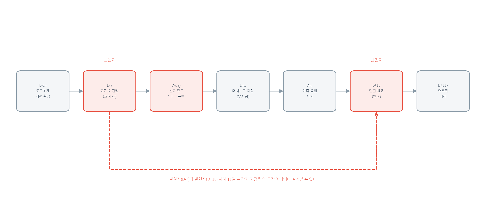

# 제1장 데이터 엔지니어링과 MLOps의 개요

공공 AI 서비스의 어려움은 모델을 만드는 데 있지 않고 운영하는 데 있다. 민원·재난·교통·환경 데이터는 정적 데이터셋이 아니라 지금 이 순간에도 유입되는 운영 데이터이고, 그 위에서 작동하는 예측 서비스는 데이터가 손상되는 방식·모델이 낡는 방식·시스템이 포화하는 방식을 모두 다뤄야 한다. 본 장은 그 운영의 두 축인 데이터 엔지니어링(Data Engineering, DE)과 MLOps(Machine Learning Operations)를 정의하고, 두 영역이 왜 분리된 채로는 공공 AI 서비스를 지탱하지 못하는지를 논증한다. 또한 규제·감사·투명성·예산이라는 공공 특수성이 도덕적 구호가 아니라 기술 설계의 입력임을 보이고, 실습(★☆☆☆☆)에서 실제 공공 API를 호출해 "운영 데이터의 실제 모습"을 직접 관찰한다. 이 책의 모든 수치는 실제 실행 결과다 — 이 장에서 소개하는 실패 모드들도 추상적 경고가 아니라, 뒤 장의 실습에서 실제로 발생하고 실측으로 기록된 사건들이다.

## 학습 목표
- DE와 MLOps의 정의·역할·차이를 구체적 시나리오로 설명한다.
- 공공 영역에서 DE–MLOps 통합이 필요한 이유를 운영 실패의 연쇄 관점에서 설명한다.
- MLOps 성숙도 모델로 조직의 현재 수준을 자가 진단한다.
- 민간 현장의 실시간 데이터 운영 방법을 공공 맥락에 적용하고, 그 역방향으로도 옮긴다.
- 공공 API 응답의 구조와 결측 가능성을 호출 전에 예측하고, 실측과 대조해 어긋난 지점의 원인을 설명한다.

---

## 1.1 데이터 엔지니어링의 정의와 역할

### 학습 목표
- DE를 "운영 가능한 데이터 공급망"으로 정의하고, 분석 스크립트와의 차이를 설명한다.
- 수집–저장–변환–제공 각 단계의 대표 실패 모드와 현장의 방어 방법을 연결한다.

### 1.1.1 정의: 스크립트와 파이프라인 사이

데이터 엔지니어링의 정의는 추상적 서술보다 구체적 대비로 접근할 때 분명해진다. 어느 부서의 담당자가 매주 월요일 아침 공공 API를 호출해 엑셀로 정리하는 파이썬 스크립트를 보유하고 있다고 가정한다. 이 스크립트는 정상 동작한다 — 그러나 네 가지 상황에서는 실패한다. 첫째, 담당자가 휴가 중이면 그 주의 데이터가 없다(사람 의존). 둘째, 어느 주에 API가 빈 응답을 반환했는데 아무도 인지하지 못했다(검증 부재). 셋째, 1년 뒤 감사에서 "그때 보고서의 수치는 어떤 데이터로 만들었는가"라는 질문에 답할 원본이 없다(원천 미보존). 넷째, 담당자가 인사이동으로 부서를 떠나자 스크립트의 위치와 실행 순서를 아무도 모른다(문서·버전 부재).

데이터 엔지니어링은 이 네 가지 약점을 시스템 요구사항으로 바꾸는 일이다. 사람이 없어도 정해진 시각에 실행되고(스케줄링), 결과가 비거나 이상하면 스스로 알리고(검증과 알림), 받은 원본을 보존해 언제든 다시 만들 수 있고(원천 보존과 재처리), 코드와 절차가 버전 관리되어 인수인계가 되는(버전과 문서) 상태 — 즉 DE는 데이터를 다루는 코드를 작성하는 일이 아니라, **사람이 매번 개입하지 않아도 데이터가 신뢰할 수 있는 품질로, 예측 가능한 시간에, 통제된 권한 아래 흐르게 만드는 운영 설계**다. 이 관점에서 수집–저장–변환–제공의 네 단계에는 각각 고유한 운영 질문과 실패 모드가 있다.

**표 1.1** DE 단계와 운영 질문

| 단계 | 핵심 질문 | 대표 실패 모드 | 이 책에서 실측하는 곳 |
|---|---|---|---|
| 수집(Ingestion) | 언제든 같은 방식으로 수집할 수 있는가 | 중복 수집, 지연 이벤트, 인증 실패, 유실 | 4장(유실·중복), 6장(지연) |
| 저장(Storage) | 원천을 보존하면서 접근을 통제할 수 있는가 | 저장 위치 난립, 권한 혼선, 보관 정책 부재 | 13장(접근 통제) |
| 변환(Transformation) | 의미를 유지하며 표준화할 수 있는가 | 스키마 불일치, 결측/이상치, 조용한 레코드 유실 | 7장(정제·총계 보존) |
| 제공(Serving) | 소비자가 예측 가능한 방식으로 사용할 수 있는가 | 하위호환 붕괴, 계약 없는 변경, 침묵 실패 | 8장(피처), 13장(계약·소비자) |

### 1.1.2 수집: 공공 API의 네 가지 현실

수집이 "API를 호출해 JSON을 받는 일"에 그친다면 한 시간이면 끝난다. 운영 가능한 수집이 어려운 이유는 공공 API의 네 가지 현실 때문이다.

**첫째, 인증은 코드 밖에서도 실패한다.** 공공데이터포털의 API는 활용신청과 승인, 발급된 인증키를 요구한다. 이 책의 실습 1.1 준비 과정에서 관찰한 사례가 이를 보여준다 — 활용신청이 승인된 직후에도 호출은 한동안(당시 약 2분) 403(권한 없음)을 돌려주다가 200(성공)으로 바뀌었다. 승인 정보가 API 게이트웨이에 전파되는 데 시간이 걸렸던 것으로, 소요 시간은 상황에 따라 다를 수 있는 일회 관찰이다. 운영 관점의 교훈은 분명하다: "인증 실패"는 코드 버그만이 아니라 승인 상태·키 만료·전파 지연이라는 **운영 사건**이며, 수집기는 인증 실패를 재시도 가능한 일시 오류와 사람이 개입할 영구 오류로 구분해 다뤄야 한다.

**둘째, 호출량에는 한도가 있다.** 공공 API는 일일 호출 한도(쿼터)를 둔다. 1분마다 폴링(polling)하는 설계와 1시간마다 폴링하는 설계는 데이터 최신성과 쿼터 소진 속도를 맞바꾸는 결정이고, 이 결정은 문서화되어야 한다 — "왜 이 주기인가"는 나중에 검수자가 반드시 묻는 질문이다.

그렇다면 주기는 무엇을 기준으로 정하는가. 기본값이나 관행이 아니라 세 값을 맞춰 역산한다. 첫째는 **원천이 값을 갱신하는 간격**이다. 원천이 정시마다 값을 갱신하는데 1분마다 호출하면 동일한 값을 60회 수신한다 — 실습 1.1의 `dataTime`은 정시 값이고, 2장은 한 시간 간격의 두 스냅샷을 비교한다. 둘째는 **이용자가 요구하는 최신성(freshness)**, 즉 최신 값이 화면이나 모델 입력에 도달하기까지 허용되는 지연이다. 민간 추천 서비스에서 이 값은 사용자 행동이 추천에 반영되는 속도를 정하고, 공공 대기질 현황판에서는 "지금 값"이라 부를 수 있는 범위를 정한다. 셋째는 **쿼터**다. 하루 한도를 주기로 나누면 재시도와 다중 지역 조회에 쓸 여유가 얼마나 남는지 나온다. 셋이 충돌하면 갱신 간격을 상한으로, 쿼터를 하한으로 두고 그 사이에서 선택한다. 검수 문서에 남길 문장은 "1시간 주기"가 아니라 "원천 갱신이 시간 단위이므로 1시간, 재시도 여유를 확보하도록 쿼터의 절반만 소진하는 값"이다.

**셋째, 응답은 페이지로 나뉜다.** 에어코리아 응답의 바디에는 `totalCount`(전체 건수), `numOfRows`(페이지당 건수), `pageNo`(페이지 번호)가 함께 온다. 첫 페이지만 읽는 코드는 `totalCount`가 `numOfRows`를 넘는 순간부터 나머지를 **조용히** 버린다. 실습 1.1의 서울 조회는 측정소가 40개이므로 100행 한 페이지에 모두 포함되지만, 전국 조회에서는 이를 초과한다 — 구조를 아는 것과 매 응답에서 `totalCount ≤ numOfRows`를 확인하는 것은 다르며, 운영 코드는 후자를 한다.

**넷째, 재시도는 중복을 발생시킨다.** 네트워크 순간 오류에는 지수 백오프(exponential backoff — 실패할 때마다 대기 시간을 2배씩 늘리며 재시도)가 표준 대응이다. 그런데 "응답을 받지 못했다"와 "서버가 처리하지 않았다"는 다르다 — 요청은 처리됐는데 응답만 유실됐다면, 재시도는 같은 데이터를 두 번 생성한다. 그래서 재시도와 멱등성(idempotency — 같은 작업을 여러 번 수행해도 결과가 한 번 수행한 것과 같은 성질)은 한 쌍으로 설계된다. 이것이 추상론이 아니라는 것을 4장에서 실측으로 확인한다: 같은 이벤트 스트림을 Kafka로 수집하면서 커밋 시점 한 줄만 바꾸면, 한쪽 설계(at-most-once)는 크래시(crash) 시 20건을 오류 로그 없이 유실했고, 다른 쪽 설계(at-least-once)는 10건을 중복 수신했다. 중복은 버그가 아니라 전달 보증의 **정의대로의 동작**이고, 그래서 5장의 멱등 처리(UPSERT)가 뒤따른다.

### 1.1.3 저장: 원천 보존과 접근 통제의 동시 성립

저장 단계의 첫 결정은 "받은 그대로를 남길 것인가, 요약만 남길 것인가"다. 원천 보존이 필요한 이유는 세 가지다. 첫째, **재처리** — 변환 로직의 버그가 석 달 뒤 발견되면, 원천이 있어야 석 달분을 다시 생성할 수 있다. 둘째, **감사** — "그때 받은 그대로"를 요구받았을 때 요약본은 증거가 되지 못한다. 셋째, **새 요구** — 처음에는 사용하지 않던 필드(예: 측정 플래그)가 나중에 필요해지는 일은 흔하고, 요약 시점에 버린 필드는 복원할 수 없다.

문제는 비용이다. 원천 전부를 고성능 저장소에 두면 예산 범위를 벗어난다. 현장의 타협이 계층형 저장(tiered storage)이다 — 자주 조회하는 최근 데이터는 빠른 저장소(핫), 가끔 조회하는 과거 데이터는 중간(웜), 감사·재처리 대비로만 보관하는 원본은 저비용 저장소(콜드)에 두고, 보관 기간이 지나면 정책에 따라 폐기한다. 예컨대 실습 1.1의 대기질 스냅샷이라면 일별 집계는 핫에, 원본 JSON은 콜드에 두는 식이다. 요점은 "전부 보존이냐 전부 폐기냐"의 양자택일이 아니라, 데이터마다 접근 빈도와 증거 가치에 맞는 층을 정하는 설계라는 것이다.

저장의 두 번째 축은 접근 통제다. 공공 데이터는 "누가, 언제, 무엇을, 왜 봤는가"가 기록되어야 하며, 이는 허용의 기록만이 아니라 **거부의 기록**을 포함한다. 13장에서 이를 실측으로 확인한다 — 역할·목적 기반 접근 정책에 12건의 요청을 통과시키면 8건이 허용되고 4건이 거부되는데, 거부 4건(미등록 역할, 목적 외 값 조회 등)이 모두 접근 로그에 남아 그 자체로 감사 증거가 된다. "접근 통제가 있다"는 말의 운영적 의미는 이 로그를 제시할 수 있다는 뜻이다.

### 1.1.4 변환: 형 변환이 아니라 의미 변환

변환 단계를 "타입을 바꾸고 컬럼을 선택하는 일"로 이해하면 이 단계의 위험을 놓친다. 실습 1.1의 실제 응답에서 그 위험을 확인할 수 있다.

먼저 **형 변환**. 에어코리아의 측정값은 숫자가 아니라 문자열 `"21"`로 온다. 형 변환을 빠뜨린 채 평균을 계산하면, 오류가 발생하는 경우에는 문제가 곧바로 드러나지만(발견된다) 문자열 정렬·연결 같은 의도하지 않은 연산이 조용히 수행되는 경우에는 드러나지 않는다(발견되지 않는다). 다음으로 **결측 표기**. 점검·통신장애 측정소의 값은 `"-"`(또는 `null`)로 온다. 이를 0으로 바꾸면 서울 평균이 실제보다 낮아진다 — 결측을 "값이 0"으로 처리하는 것은 없는 값을 생성하는 것과 같다. 마지막으로 **의미 변환**. 같은 `status`라는 필드가 A 시스템에서는 "접수 상태", B 시스템에서는 "처리 상태"를 뜻할 수 있고, 지역명 문자열은 법정동코드 같은 표준 코드 체계로 매핑되어야 시스템 간에 동일한 의미로 통용된다. 변환의 본질은 타입이 아니라 의미의 표준화이며, 매핑 규칙(무엇을 어디로, 매핑 안 되면 어떻게)이 문서화되어야 한다.

현장의 방법 하나를 먼저 제시한다 — **제외한 레코드를 계수한다**. 7장의 배치 정제 실습은 3일분 민원 60건을 정제하면서 총계 보존식을 검증한다: 원본 60 = 정상 매핑 54 + 지역 미기재 2 + 매핑 실패 3 + 중복 1. 정제는 필연적으로 레코드를 제외하는데, 제외한 레코드를 계수하지 않으면 유실과 정제를 구분할 수 없다. 그래서 이 등식이 성립하지 않으면 배치 전체를 실패시킨다 — 조용한 유실이 성공 로그만으로는 발견되지 않는 상황을 막는 장치다.

### 1.1.5 제공: 데이터 계약과 침묵 실패

제공 단계의 산출물은 데이터가 아니라 **약속**이다. 소비자(대시보드, 모델, 타 기관)는 "이 필드가 이 타입으로, 이 의미로, 이 주기로 온다"는 전제 위에 자기 시스템을 구축한다. 이 약속을 명문화한 결과가 데이터 계약(data contract)이다 — 스키마(필드와 타입), 의미(단위, 코드 정의, 집계 기준), 품질(결측 허용치, 지연 허용치), 그리고 변경 절차(사전 공지, 유예 기간, 버전 정책)를 생산자와 소비자가 합의해 문서와 코드로 관리한다.

계약을 강제하는 방식은 도메인에 따라 다르다. 공공에서는 조문이 계약의 최소 요구를 정한다 — 개인정보 보호법 제18조의 목적 제한은 "누가 무슨 목적으로 이 데이터를 쓰는가"를 계약 항목에 포함한다(1.4.1). 민간에서는 같은 항목을 팀 간 협상으로 정하고, 합의한 응답 시간·가용성·품질 수준을 SLA(서비스 수준 합의)로, 스키마를 스키마 레지스트리로 관리한다. 강제하는 힘이 조문이냐 협상이냐만 다르고, 명문화·버전·변경 절차라는 항목 자체는 같다.

계약이 없으면 어떤 문제가 발생하는가. 생산 시스템이 필드명을 `pm10Value`에서 `pm10`으로 바꿨다고 가정한다. 소비자의 파서는 오류를 발생시키지 않는다 — 없는 필드를 조회하면 None을 반환할 뿐이다. 집계는 계속 수행되고, 결측률만 조용히 100%가 된다. 이런 유형 — **시스템이 중단되지 않은 채 틀리거나 빈 결과를 계속 산출하는 실패** — 을 침묵 실패(silent failure)라 부른다. 이 유형은 뒤 장의 4·6·7·8·9·10장에서 실제 사례로 다룬다. 중단되는 실패는 알림이 오지만 침묵 실패는 누군가 결과를 확인하기 전까지 발견되지 않기 때문에, 운영에서는 중단되는 실패보다 위험하다.

발견 경로는 도메인에 따라 달라진다. 공공에서 침묵 실패는 시민의 민원이나 감사 지적으로 발현하고, 민간에서는 매출 하락·이탈률 증가로 발현한다. 두 경로 모두 하류의 끝에서 나타나므로 발견이 늦다. 그래서 어느 쪽 현장이든 침묵 실패 탐지 시간(MTTD, Mean Time To Detect) — 문제가 시작된 시점부터 누군가 알아챈 시점까지의 시간 — 을 지표로 삼는다. 이 시간이 길수록 하류에 쌓인 오염 데이터가 늘고, 사후 재처리 범위도 그만큼 넓어진다. 1.3.2의 타임라인에 그 시간이 드러난다 — D-day에 시작된 오분류가 D+10의 민원으로 발현했고, 그사이 열흘분 데이터가 이미 모델 입력으로 유입되었다.

침묵 실패는 이 책의 실습에서 실제로 반복해 발생한다. 대표 사례가 8장이다 — 피처 스토어 적재를 `materialize_incremental`로 호출했더니 명령은 정상 종료 로그를 남겼지만 실제로는 **0건이 적재**되었다(함수의 기본 적재 창이 과거 데이터를 포함하지 않았다). 발견은 하류의 조회 코드에서 None 예외로 이루어졌다. 현장의 방어는 계약을 코드로 검증하는 것이다: 스키마 레지스트리(schema registry)로 스키마 버전을 중앙 관리하고, CI(지속 통합)에서 계약 위반을 테스트로 검출하고, 적재 작업의 성공 로그가 아니라 **적재된 건수**를 확인하고, 소비자 목록을 등록해 변경 영향 범위를 사전에 알 수 있게 한다(13장에서 이 소비자 등록·변경관리를 직접 구현한다).

### 공공 사례
민원 데이터는 비정형 텍스트를 포함하고 개인정보 위험이 높다. 따라서 "수집만 잘하면 된다"가 아니라, 저장 단계에서 접근 통제와 로그가 함께 설계되어야 하며, 변환 단계에서 코드 체계(지역/유형)의 의미가 문서화되어야 한다. 같은 `status` 필드가 시스템마다 의미가 다른 채로 통합되면 정책 보고서와 모델 입력이 동시에 오염된다 — 그리고 이 오염은 대부분 침묵 실패의 형태로, 즉 아무 에러 없이 진행된다.
### 핵심 정리
- DE는 코드 작성이 아니라 "사람 없이도 신뢰·정시·통제된 흐름"을 만드는 운영 설계다.
- 재시도·중복·지연·인증 실패는 예외 상황이 아니라 설계의 전제다.
- 제외한 레코드를 계수하고(총계 보존), 적재 건수를 확인하고, 계약을 코드로 검증하는 것이 침묵 실패의 현장 방어다.

---

## 1.2 MLOps의 정의와 역할

### 학습 목표
- MLOps를 "모델 생애주기를 운영 시스템으로 만드는 방법론"으로 정의하고, 코드·데이터·모델의 삼중 변화를 설명한다.
- 성숙도 모델로 조직 수준을 진단하고, 현장 실무자들이 꼽는 성공 변수를 이 책의 장 구성과 연결한다.

### 1.2.1 정의: 모델은 만들어지는 것이 아니라 운영되는 것

MLOps라는 용어는 한동안 정의가 통일되지 않았다. 이를 정리한 대표적 연구가 Kreuzberger, Kühl, Hirschl(2023)이다 — 문헌 리뷰·도구 리뷰·전문가 인터뷰를 종합한 혼합방법 연구로, MLOps를 "모범 사례·개념·개발 문화를 아우르는 패러다임으로, ML 제품의 종단간(end-to-end) 구상·구현·모니터링·배포·확장을 다루는 것"으로 정의하고 필요한 원칙·구성요소·역할과 아키텍처를 도출했다. 정의의 핵심은 두 가지다. 첫째, MLOps는 특정 도구가 아니라 원칙과 문화까지 포함하는 방법론이다. 둘째, 대상이 "모델"이 아니라 "ML 제품" — 즉 배포되고 운영되며 노후화하는 서비스다.

운영 현장에서 이 정의가 어떻게 구현되는지는 Shankar 외(2022)의 인터뷰 연구에서 드러난다(1.2.4에서 상술). 이들은 프로덕션 ML 운영을 네 단계의 **끝나지 않는 루프**로 정리한다: ① 데이터 수집·라벨링 → ② 성능 개선을 위한 실험 → ③ 다단계 배포 과정에서의 평가 → ④ 프로덕션(production) 성능 하락의 모니터링, 그리고 다시 ①로. "모델 개발 완료"라는 종착점이 없다는 것 — 이것이 MLOps가 프로젝트가 아니라 운영인 이유다.

### 1.2.2 DevOps와의 차이: 무엇 하나를 바꾸면 모든 것이 바뀐다

MLOps는 DevOps(개발–운영 통합 방법론)의 원칙을 계승하지만, 변화의 단위가 다르다.

**표 1.2** DevOps와 MLOps의 차이를 만드는 요소

| 관점 | DevOps | MLOps |
|---|---|---|
| 변화의 단위 | 코드와 설정 | 코드 + 데이터 + 모델 |
| 실패 신호 | 오류/다운타임 | 오류 + 성능 저하 + 분포 변화 |
| 핵심 기록 | 빌드/배포 로그 | 실험/데이터/모델 버전 + 배포 로그 |
| 테스트 대상 | 함수·통합·시스템 | 함수·통합·시스템 + 데이터 검증 + 모델 검증 |
| 운영 목표 | 안정적 배포 | 안정적 배포 + 성능 유지 |

나머지 네 행의 차이는 첫 행에서 비롯된다. 일반 소프트웨어는 코드만 바뀌므로, 모듈 경계와 코드 리뷰(diff)를 이용해 변경의 영향 범위를 제한할 수 있다. 모델은 그렇지 않다. Sculley 외(2015)는 이를 CACE 원칙 — "Changing Anything Changes Everything(무엇 하나를 바꾸면 모든 것이 바뀐다)" — 으로 정식화했다. 입력 피처 하나의 분포가 바뀌면 그 피처만이 아니라 나머지 피처들의 가중치와 상호작용까지 함께 변한다. 즉 모델의 변경 영향은 코드 diff로 읽을 수 없고, 이 사실이 MLOps의 기록 요구(어떤 데이터·코드·환경·파라미터로 이 모델이 나왔는가)를 도덕적 권고가 아닌 운영 필수품으로 만든다. 대기질 예측의 오차가 갑자기 커졌을 때, 입력 분포가 변했는지(데이터), 코드가 바뀌었는지, 라이브러리 버전이 올라갔는지는 기록이 없으면 구분할 수 없다.

### 1.2.3 성숙도 모델: 우리 기관은 어디에 있는가

"MLOps를 도입한다"는 말은 도입과 미도입의 이분법이 아니다. Google Cloud의 아키텍처 문서는 자동화 정도에 따라 세 수준을 구분하고, Microsoft의 성숙도 모델은 다섯 단계로 세분한다.

**표 1.3** MLOps 성숙도 모델 비교

| Google 수준 | 내용 | Microsoft 수준(대응) |
|---|---|---|
| 수준 0: 수동 프로세스 | 학습·배포의 모든 단계가 수동. 노트북에서 학습한 모델을 파일로 전달, 배포는 수작업으로 | 0(No MLOps) ~ 1(DevOps는 있으나 MLOps 없음) |
| 수준 1: ML 파이프라인 자동화 | 학습 파이프라인이 자동화되어 지속 학습(continuous training) 가능. 데이터·모델 검증이 파이프라인 안에 | 2(자동화된 학습) ~ 3(자동화된 모델 배포) |
| 수준 2: CI/CD 파이프라인 자동화 | 파이프라인 자체의 빌드·테스트·배포까지 자동화. 실험에서 프로덕션까지의 경로가 짧고 신뢰 가능 | 4(완전 자동화 운영) |

이 표를 자가 진단에 사용할 때 유의할 점이 있다: **수준 0은 결함 상태가 아니라 보편적 출발점이다.** Google 문서도 수준 0이 ML을 막 도입하는 조직에서 일반적이라고 서술한다. 문제는 수준 0에 머무는 것 자체가 아니라, 수준 0의 수동 절차가 기록 없이 수행되어 재현·감사가 불가능해지는 것이다. ML을 막 도입하는 조직 다수가 0~1 수준에서 출발하며, 이 책의 실습은 표 1.3의 세 수준을 하나씩 코드로 구현한다 — 9장에서 실험 추적과 모델 레지스트리(수준 1의 검증·기록 요소)를, 10장에서 배포 자동화·검증 게이트와 CI/CD(수준 2)를, 11장에서 모니터링을 구축한다. 즉 실습이 다루는 구간은 수준 0에서 1이 아니라 0에서 2까지다.

진단이 수준 번호를 매기는 데서 끝나면 유용하지 않다. 다음 질문은 "그러면 무엇을 먼저 바꾸는가"이고, 여기에는 순서가 있다. 수준 0에서 1로 이행할 때 먼저 갖출 것은 학습 자동화가 아니라 **기록**이다 — 어떤 데이터·코드·파라미터로 이 모델이 나왔는지 남기지 않으면, 파이프라인을 자동화해도 결과를 재현할 수 없어 감사 질문에 답하지 못한다(9장). 수준 1에서 2로 이행할 때 먼저 갖출 것은 배포 자동화가 아니라 **게이트**다 — 자동 배포는 성능이 낮은 모델도 같은 속도로 내보내므로, 승격 기준 없이 속도만 높이면 사고 빈도가 함께 증가한다(9장의 승격 반려 실측, 10장의 검증 게이트). 두 단계 모두 자동화보다 그 자동화를 되돌릴 근거가 먼저다. 승격 기준의 내용도 도메인에 따라 달라진다. 민간의 추천·검색·광고 파이프라인에서 새 모델의 승격 기준은 대체로 A/B 테스트의 전환율이지만, 공공에서는 여기에 투명성과 형평성이 추가된다 — 평균 성능이 향상되어도 특정 지역·집단에서 저하되면 승격하지 않는다(16장).

성숙도 수준은 선언에 그치지 않고 객관적으로 측정할 지표를 필요로 한다. 민간 ML 조직이 성숙도 측정에 사용하는 세 지표를 그대로 활용할 수 있다 — **배포 빈도**(모델을 프로덕션에 배포하는 주·월 단위 횟수), **실험-배포 리드 타임**(실험 아이디어에서 프로덕션 반영까지 걸린 시간, 1.2.4의 3V 중 Velocity에 해당), **롤백 소요 시간**(문제를 발견한 뒤 이전 모델로 되돌리는 데 걸린 시간)이다. 수준 0에서는 세 값이 모두 사람의 일정에 묶이고, 수준 2에서는 파이프라인 실행 시간에 묶인다 — 그래서 세 값의 단위가 "주"에서 "분"으로 바뀌었는지가 승급의 증거가 된다. 공공에서는 여기에 하나를 더한다. **재현 소요 시간** — "그때 그 판단을 어떤 모델·데이터로 내렸는가"에 대한 답을 산출하는 데 걸리는 시간이다. 이 값을 측정하려면 재현을 한 번 수행해야 하므로, 지표를 정하는 것 자체가 감사 대비 훈련이 된다.

### 1.2.4 현장의 의견: 실무자들은 무엇이 성공을 결정한다고 보는가

이론 문헌과 별개로, 실제로 프로덕션 ML을 운영하는 사람들의 증언을 검토할 필요가 있다. 두 개의 출처를 제시한다. 둘 다 민간·산업 일반을 다룬 것으로 공공 부문의 직접 선례는 아니며, 방법과 관점을 차용하는 자격으로 인용한다.

**첫째, 인터뷰 연구.** Shankar 외(2022)는 챗봇·자율주행·금융 등 다양한 도메인의 ML 엔지니어 18명을 반구조화 인터뷰해, 프로덕션 ML 배포의 성공을 좌우하는 세 변수를 도출했다 — **3V: Velocity(속도), Validation(검증), Versioning(버전 관리)**. 속도는 실험 아이디어를 빠르게 시험하는 반복 능력, 검증은 가능한 한 이른 시점에 여러 단계로 실패를 검출하는 능력, 버전 관리는 데이터·모델의 과거 버전을 보관해 언제든 되돌릴 수 있는 능력이다. 이 세 변수는 이 책의 장 구성과 그대로 대응한다: 실험의 속도와 기록은 9장(실험 추적), 다단계 검증은 10장(배포 게이트)과 14장(인수 검수), 버전 관리는 9장(모델 레지스트리)과 13장(피처 변경 관리)에서 실측으로 다룬다.

**둘째, 국내 현장 강연.** 카카오 추천팀에서 데이터 엔지니어로 근무했던 실무자의 2026년 강연(메타코드M)은 대기업 실시간 데이터 현장의 업무 범위를 구체적으로 증언한다. 데이터 엔지니어의 실제 업무는 파이프라인 구축에 그치지 않고 — 실시간 서빙 서버 개발, 사업 지표(이 트래픽에서 발생한 매출)와 시스템 지표(데이터 적재 속도, 시간대별 호출량 폭증)를 함께 담는 대시보드, 두 모델을 라이브 트래픽으로 동시에 비교하는 A/B 테스트 실험 환경 구축까지 걸쳐 있었다. 강연이 강조한 두 논점은 이 책의 방향과 정확히 일치한다. 하나는 **"ETL 자체는 쉽고, 유실·중복이 발생하지 않는 파이프라인 설계가 고급 기술"**이라는 것 — 이 책이 4장(전달 보증)과 5장(멱등 처리)을 별도의 장으로 두는 이유다. 다른 하나는 **근거 기반 의사결정** — AI 코딩 도구 시대에 "도구가 이렇게 하라던데요"로 기술 선택을 정당화하는 엔지니어가 증가했는데, 도구의 답을 채택하더라도 그 선택의 이유를 스스로의 근거로 설명할 수 없으면 장애 시 대처도, 성장도 없다는 지적이다. 이 책이 모든 실습에서 "왜 이 설계인가"의 대안 비교와 실측 근거를 요구하는 것은 이 지적을 교재로 옮긴 결과다.

### 1.2.5 생애주기 구체화: 개발–배포–모니터링–재학습

MLOps의 생애주기를 단계별로 구체화한다. 각 단계마다 이 책의 어느 장에서 실측으로 확인하는지를 함께 적는다.

**개발과 재현성.** 개발 단계의 핵심 품질은 재현성 — 같은 데이터·코드·환경·파라미터에서 같은 모델이 나오는 성질이다. 공공에서는 재현성이 무너지면 감사·인수인계가 곧바로 실패한다. 9장의 실습은 이를 실측한다: 동일 피처 스냅샷으로 학습을 재실행하면 메트릭과 회귀 계수가 완전히 동일하게 재현되고, 이 재현이 성립하도록 데이터 지문(fingerprint)을 기록해 훈련 입력이 바뀌지 않았음을 코드가 강제 확인한다.

**배포와 단계적 릴리스.** 배포의 운영 질문은 "새 모델을 어떻게 투입하는가"가 아니라 "잘못됐을 때 어떻게 되돌리는가"다. 카나리 배포(canary — 트래픽의 일부만 새 버전으로 보내 관찰 후 확대)와 블루그린 배포(blue-green — 신·구 환경을 병렬 유지하고 전환 스위치만 바꿈)가 대표 전략이고, 공공 맥락에서 특히 유용한 것이 섀도 배포(shadow — 모든 이용자에게 기존 모델로 응답하되, 후보 모델도 같은 입력을 받아 결과를 로그에만 남김)다. 10장에서 실측한다: 이용자 응답은 champion 모델의 예측값인 6.0으로 나가고, 로그에는 challenger 모델의 예측값인 7.3636이 함께 축적되어 — 이용자 위험 없이 후보를 재평가할 자료가 된다.

**모니터링과 드리프트.** 모니터링은 세 층을 함께 본다 — 시스템 지표(지연·오류율), 데이터 지표(분포·결측률), 모델 지표(예측 분포·성능). 데이터 분포가 시간에 따라 변하는 현상이 데이터 드리프트(data drift)이고, 입력과 정답의 관계 자체가 변하면 개념 드리프트(concept drift)다. 여기서 지켜야 할 운영 원칙은 "감지 ≠ 항상 경보"다. 2장의 실측에서 한 시간 간격의 대기질 분포는 평균이 20.0에서 20.8로 변동했지만 KS 검정(Kolmogorov–Smirnov, p=0.579)은 구조 변화의 근거가 없다고 답한다 — 값은 변해도 분포는 같을 수 있다. 반대로 11장의 실측에서는 9일 간격 비교가 PSI(Population Stability Index) 0.3324(경보 대역)와 KS 비유의를 **동시에** 보여, 단일 지표가 아닌 조합 규칙(거리 지표와 통계 검정의 병용)이 필요함을 보인다.

**재학습과 검증 게이트.** "성능이 떨어졌으니 다시 학습"은 절차가 아니다. 운영 절차는 트리거(어떤 신호가 임계를 넘으면)와 게이트(새 후보가 어떤 기준을 통과해야 투입)로 구성된다. 게이트의 존재 이유는 9장의 실측에서 드러난다 — 더 복잡한 후보 모델(선형회귀, MAE 1.0455)이 단순 베이스라인(MAE 1.0)보다 낮은 오차를 내지 못해 승격이 반려된다. 새 모델이 항상 우월하다는 전제는 성립하지 않으며, 게이트가 없으면 성능이 더 낮은 모델이 "새것"이라는 이유로 투입된다.

게이트를 무엇으로 판정할 것인가도 선택이다. 오프라인 지표(MAE, AUC 등)는 후보 생성 직후 계산되지만, 실제 운영 성과와 방향이 어긋날 수 있다. 그래서 민간에서는 오프라인 평가와 온라인 지표 — CTR(클릭 전환율), CVR(구매 전환율), ARPU(사용자당 평균 매출) 같은 사업 KPI — 의 방향이 일치한 비율을 따로 관리한다. 이 비율이 낮으면 오프라인 지표 자체를 변경해야 한다는 신호다. 공공에는 매출 같은 온라인 지표가 없는 대신 업무 지표가 이를 대체한다 — 예컨대 배정 후 재배정률, 처리 소요 시간 등이다. 어느 쪽이든 원칙은 같다. 오프라인 지표 하나로 승격을 판정하면, 오프라인 평가에서는 우월하지만 현장 성과가 낮은 모델을 제외하지 못한다.

### 공공 사례
재난 긴급도 예측 모델을 운영한다고 가정한다. 계절성(동절기 한파), 정책 변화(분류 체계 개편), 외부 이벤트(대형 재난)로 입력 분포가 바뀌고 성능이 저하된다. 이때 필요한 것은 "정확도를 다시 올려라"라는 지시가 아니라 운영 절차다 — 어떤 지표가 변화를 감지했는지(데이터/모델 지표), 재학습 트리거가 무엇인지, 새 모델이 어떤 게이트를 통과해야 하는지, 통과 후 어떤 릴리스 전략으로 투입되는지. 이 절차의 각 요소를 이 책의 11장(감지), 9장(게이트), 10장(릴리스)에서 직접 구현한다.
### 핵심 정리
- MLOps는 도구가 아니라 원칙·문화를 포함한 방법론이며, 대상은 "모델"이 아니라 노후화하는 "ML 제품"이다.
- 코드·데이터·모델의 삼중 변화(CACE)가 기록·버전·게이트를 운영 필수품으로 만든다.
- 현장 실무자들의 성공 변수는 3V(속도·검증·버전)로 요약되며, 수준 0에서 1로 이행하는 것이 대부분 조직의 실제 과제다.

---

## 1.3 DE와 MLOps의 접점: 피처, 품질, 배포, 모니터링

### 학습 목표
- DE 산출물과 MLOps 산출물을 비교하고, 한 영역의 실패가 다른 영역의 결과에 영향을 주는 경로를 시간 순서로 설명한다.
- 학습-서빙 불일치와 숨은 기술 부채의 구체적 형태를 식별한다.

### 1.3.1 비교 프레임

**표 1.4** DE vs MLOps 비교

| 구분 | 데이터 엔지니어링 | MLOps |
|---|---|---|
| 주요 산출물 | 데이터 파이프라인, 피처 | 모델, 예측 서비스 |
| 핵심 관심사 | 데이터 품질, 가용성 | 모델 성능, 안정성 |
| 운영 실패 모드(예) | 지연·중복·스키마 변경 | 성능 저하·드리프트·배포 장애 |
| 중첩 영역 | 피처 스토어, 품질 모니터링, 메타데이터 | 피처 스토어, 품질 모니터링, 메타데이터 |

모델은 데이터의 소비자이고 피처는 파이프라인의 산출물이므로, 두 영역의 접점은 선택이 아니라 구조다. 중첩 영역 — 피처 스토어(8장), 품질 모니터링(11장), 메타데이터와 라인리지(lineage, 13장) — 이 협업의 인터페이스가 되며, "팀을 합친다"가 아니라 이 인터페이스를 계약·테스트·공지로 운영하는 것이 통합의 실체다.

### 1.3.2 실패의 연쇄: 코드 개편 시나리오의 타임라인

DE 문제가 MLOps 문제로 전파되는 경로를 시간 순서로 따라간다. 아래는 수치 없는 구조 시나리오다(실측이 아니라 실패 전파의 구조를 보여주기 위한 구성이지만, 각 단계의 감지 장치는 이 책의 실측 장들과 연결된다).

- **D−14**: 민원 유형 코드 체계 개편이 타 부서에서 확정된다(신규 코드 추가, 기존 코드 일부 폐지).
- **D−7**: 개편 공지가 발송되지만 데이터 파이프라인 담당까지 전달되지 않는다 — 문제의 시작은 기술이 아니라 조직의 변경 관리다.
- **D-day**: 신규 코드가 유입되기 시작한다. 변환 단계의 매핑 테이블에 없는 코드이므로 전부 "기타"로 분류된다. 시스템은 중단되지 않는다 — 전형적 침묵 실패다.
- **D+1**: 대시보드에서 "기타" 비율이 급증한다. 확인하는 사람이 없거나, 확인해도 임계·알림이 없으면 그대로 지나간다.
- **D+7**: 모델 입력의 범주 분포가 무너져 예측 품질이 저하된다. 예측을 사용하는 부서가 "요즘 배정이 이상하다"고 인지하기 시작한다.
- **D+10**: 민원 배정 오류에 대한 민원이 들어온다 — 실패가 시민에게 도달했다.
- **D+11~**: 역추적이 시작된다. 모델이 문제인가? 데이터인가? 코드인가? 배포인가? — 데이터→피처→모델→예측의 연결 기록(라인리지)이 없으면 이 역추적에 몇 주가 걸린다.



**그림 1.1** 실패의 연쇄: 발원지와 발현지 사이의 간극

발원지(D-7, 공지 미전달)와 발현지(D+10, 민원 발생) 사이에는 11일의 간극이 있다. 이 그림의 붉은 상자 셋 — 발원지, 침묵 실패가 시작되는 D-day, 발현지 — 을 잇는 점선이 그 간극이다. 점선이 지나는 구간(D-day부터 D+7까지) 어디에도 감지 지점을 설계할 수 있으며, 지점이 발원지에 가까울수록 수습 비용이 낮다.

이 타임라인의 교훈은 두 가지다. 첫째, **발원지(공지 누락)와 발현지(모델 품질)가 멀다** — 그래서 발현지만 관찰하는 조직은 원인을 찾지 못한다. 둘째, D-day와 D+10 사이의 모든 층에 감지 지점을 설계할 수 있다 — 매핑 실패를 별도로 분리해 계수하고(7장의 미매핑 분리 보고), 품질 게이트로 배치를 중단시키고(7장), 분포 변화를 감시하고(11장), 계약 위반을 CI에서 검출하는(1.1.5) 식이다. 감지 지점이 상류에 있을수록 수습 비용이 낮다.

### 1.3.3 학습-서빙 불일치(training-serving skew)

접점에서 가장 빈번하게 보고되는 실패가 학습-서빙 불일치다. Google의 실무 규칙 문서 "Rules of ML"은 이를 "학습 시점의 성능과 서빙 시점의 성능 사이의 차이"로 정의하고, 반복적으로 발생하는 일급 실패로 다룬다. 원인은 구조적이다 — 학습은 과거 데이터 위에서 배치로, 서빙은 현재 데이터 위에서 실시간으로 일어나므로, 두 경로가 피처를 **서로 다른 코드로** 계산하는 순간 미세한 차이(결측 처리, 집계 창, 반올림)가 발생한다. 모델은 학습 시점의 계산 방식을 전제하므로, 서빙의 다른 계산은 성능 저하로 나타나되 오류로 기록되지는 않는다 — 역시 침묵 실패다.

구조적 해법이 피처 스토어(8장)다 — 피처의 정의·계산을 한곳에 두고 학습(오프라인)과 서빙(온라인)이 같은 정의를 소비하게 한다. 여기에 시간 축과 관련된 조건이 하나 더 붙는다: 학습 데이터를 만들 때 "그 시점에 알 수 있었던 값"만 조인해야 한다(point-in-time correctness). 8장 실습의 실측에서 이를 확인할 수 있다 — 시점 조인에서 4행 중 1행이 탈락하는데, 이 탈락은 버그가 아니라 그 시점에 존재하지 않았던 피처를 미래에서 참조하지 않았다는 증거다. 미래 정보 누출(future leakage)은 학습 성능을 실제보다 높게 보이게 하는, 발견하기 매우 어려운 오류이기 때문이다.

### 1.3.4 숨은 기술 부채: 이름 붙은 실패 패턴들

Sculley 외(2015)의 "Hidden Technical Debt in Machine Learning Systems"는 ML 시스템 특유의 부채에 이름을 붙인 고전이다. 이름이 있으면 발견이 쉬워지므로, 대표 패턴을 구체적으로 서술한다.

- **글루 코드(glue code)**: 범용 도구 사이에서 데이터를 옮기고 형식을 변환하는 연결 코드. 학습 코드가 일부이고 연결 코드가 대부분이면, 연결 코드에서 발생하는 오류가 전체 시스템에 영향을 주지만 테스트와 리뷰는 학습 코드에 집중되기 쉽다.
- **파이프라인 정글(pipeline jungles)**: 요구가 생길 때마다 정제 경로를 덧붙이면, 어떤 데이터가 어떤 경로로 어떤 변환을 거치는지 아무도 전체를 파악하지 못하는 상태가 된다. 정글의 비용은 평시가 아니라 장애 시에 발생한다 — 역추적이 불가능해지기 때문이다.
- **미신고 소비자(undeclared consumers)**: 자기 시스템의 출력을 누가 사용하는지 모르는 상태. 출력 형식을 "개선"하면 파악되지 않은 하류 시스템이 중단된다. 방어는 소비자 등록 — 13장 실습의 피처 카탈로그가 피처별 소비자 목록을 관리해, 변경 전에 영향받는 소비자를 조회할 수 있게 한다.
- **CACE**(1.2.2에서 상술): 부분 변경이 전체에 파급되므로, 변경 단위가 아니라 시스템 단위의 검증이 필요하다.

### 그림으로 보는 전체 구조


**그림 1.2** 실시간 데이터 파이프라인 개요(데이터 공급망과 모델 운영의 연결)

위쪽 절반은 DE의 단계(원천→수집→저장→변환)이고, 아래쪽 절반은 MLOps 생애주기(피처/서빙→모델 개발→배포→모니터링)다. 두 절반을 잇는 것은 화살표 하나(Transform → Feature/Serving)뿐이며, 이 연결이 1.3절에서 다루는 접점이다. Monitor에서 Model Dev/Train으로 돌아가는 붉은 화살표는 1.2.1의 핵심 문장을 그림으로 표현한다 — MLOps에는 "완료" 시점이 없고, 운영은 이 루프의 반복이다.

### 1.3.5 이 책의 학습 지도: 실패 모드에서 장으로

이 장에서 소개한 실패 모드는 모두 뒤 장의 실습에서 실제로 발생한다. 아래 표는 이 책의 학습 지도이자, "이 실패가 정말 일어나는가"에 대한 증거 색인이다 — 셋째 열의 사건은 모두 해당 장에서 실측으로 기록한 것이다.

**표 1.5** 실패 모드 → 장 → 그 장에서 실제로 일어난 일

| 실패 모드 | 장 | 실제로 일어난 일(실측) |
|---|---|---|
| 전달 보증 오설계 | 4장 | at-most-once 크래시에서 20건 유실(오류 로그 없음), at-least-once에서 10건 중복 |
| 중복의 이중 집계 | 5장 | 중복 10건 포함 스트림을 UPSERT로 흡수 — 재전송에도 업무 상태 불변 |
| 지연 이벤트 | 6장 | watermark가 지각 이벤트 1건을 수용하고 1건을 폐기 — 폐기는 카운터에만 남음 |
| 정제 중 조용한 유실 | 7장 | 총계 보존식 60=54+2+3+1 검증 — 위반 시 배치 실패 |
| 피처 적재 침묵 실패 | 8장 | materialize_incremental이 정상 종료됐지만 0건 적재(기본 적재 창이 과거 데이터를 미포함) — 하류 조회에서야 발현 |
| 등록·로드 불일치 | 9장 | 모델 등록은 성공, 별칭 로드에서 실패 — 등록 검증은 로드까지 |
| 검증 게이트 | 9장 | 후보 모델(1.0455)이 베이스라인(1.0)에 미달해 승격 반려 |
| 배포 환경 가정 | 10장 | 호스트·pytest 통과 후 컨테이너에서만 경로 계산 IndexError 발현 |
| 드리프트 판정 | 11장 | PSI 0.3324(경보 대역)와 KS 비유의가 동시 관찰 — 조합 규칙이 "주의" 판정 |
| 용량 천장 | 12장 | 단일 워커 CPU 106.3% 포화 — 사용자 5배에 처리량 제자리, 지연만 5배 |
| 접근 통제 | 13장 | 접근 12건 중 4건 거부 — 거부 기록 자체가 감사 증거 |
| 통합 장애 격리 | 14장 | 오염 주입·재전송·API 중단 드릴 3종에서 격리·흡수·수렴 확인 |
| LLM 벤더 종속 | 15장 | 한 제공자는 8건 전부 응답, 다른 제공자는 인증 통과 후 생성 전건 429 실패 |
| 공정성·설명 | 16장 | 상수 모델이 고민원 지역을 일관되게 과소예측(소표본 구조 시연) — 피처 중요도 0.0이 원인 증언 |
| 사후 학습 | 17장 | 앞 장의 실제 사건들로 포스트모템·재발 방지책 자동 생성 |
### 핵심 정리
- DE와 MLOps의 통합은 조직 통합이 아니라 인터페이스(피처 스토어·품질 게이트·계약·라인리지)의 운영이다.
- 실패는 상류(조직·수집)에서 발원해 하류(모델·시민)에서 발현하며, 감지 지점이 상류일수록 수습 비용이 낮다.
- 이름 붙은 부채 패턴(글루 코드·파이프라인 정글·미신고 소비자·CACE)은 발견을 위한 어휘다.

---

## 1.4 공공 영역 특수성

### 학습 목표
- 규제·감사·투명성·조달·예산이라는 공공 요구를 설계 산출물로 전환한다.
- 민간 현장의 실시간 운영 방법을 공공 맥락에 맞게 변형해 적용한다.

### 1.4.1 규제 준수: 조문이 설계를 결정한다

"개인정보를 보호해야 한다"는 문장은 설계에 그대로 쓸 수 없다. 설계에 쓰이는 것은 구체 조문이다. 이 책의 실습과 직접 연결되는 개인정보 보호법의 네 조문을 먼저 제시한다(상세와 실측 적용은 16장).

- **제18조(목적 외 이용·제공 제한)**: 수집 목적 밖의 이용을 제한한다. 설계 전환 — 접근 정책에 "누가"만이 아니라 "무슨 목적으로"가 들어가야 하며, 목적 외 조회는 거부되고 그 거부가 기록되어야 한다(13장의 접근 통제 실습이 정확히 이 구조다).
- **제23조(민감정보 처리 제한)**: 건강 등 민감정보는 별도의 더 강한 통제를 받는다. 주의할 것은 적용 범위다 — 제23조는 민감정보 한정이고, 개인정보 일반의 목적 제한은 제18조다. 조문을 넓혀 인용하면 검수에서 지적된다.
- **제33조(개인정보 영향평가)**: 공공기관이 일정 규모 이상의 개인정보파일을 운용할 때 침해 위험을 **사전에** 평가하도록 한다. 설계 전환 — 개인 단위 데이터를 다루는 시스템은 코드를 작성하기 전에 영향평가 대상 여부 판정이 선행되어야 한다.
- **제37조의2(자동화된 결정에 대한 권리, 2024년 3월 시행)**: 완전히 자동화된 결정이 권리·의무에 중대한 영향을 미치면, 정보주체는 거부하고 설명을 요구할 수 있으며, 처리자는 기준·절차를 공개해야 한다. 설계 전환 — AI가 배정·우선순위를 자동 결정하는 서비스에는 이의 제기 창구와 설명 생성 절차가 시스템 요구사항으로 들어간다.

규제 범위는 확대되고 있다. 국내에서는 AI기본법이 2026년 1월 22일 시행되었고, EU의 AI Act(Regulation 2024/1689)는 위험 수준에 따라 AI 시스템의 의무를 차등 부과하는 위험 기반 접근을 취한다 — 모든 공공 AI가 자동으로 고위험이 되는 것은 아니지만, 급여·심사·교육·고용·법집행처럼 권리와 기본권에 중대한 영향을 주는 용도는 고위험 규율 대상이 될 수 있다. 상세한 대응은 16장에서 다루되, 1장에서 기억할 원칙은 하나다: **규제는 배포 직전에 확인하는 체크리스트가 아니라 1장, 즉 설계 시작 시점의 입력이다.**

### 1.4.2 감사 추적: 재현할 수 없으면 증거가 아니다

공공의 감사 요구는 결국 한 문장으로 환원된다 — "그때 그 데이터로 그 판단을 다시 재현할 수 있는가." 이는 재현성(1.2.5)과 라인리지의 문제이고, 핵심 방법은 증거를 사람이 사후에 작성하는 문서가 아니라 **시스템이 실행 중에 만들어내는 산출물**로 두는 것이다. 사람이 작성하는 문서는 실제와 어긋나기 시작하지만, 실행이 생성한 로그·지문·검수표는 어긋날 수 없다. 이 책의 실습들이 이 원칙으로 만들어져 있다 — 9장은 훈련 입력의 지문을 기록해 재실행 동일성을 코드로 확인하고, 13장은 감사표를 실행 산출물로 자동 생성하며, 14장은 인수 검수표 16개 항목을 시스템이 자동으로 채운다.

민간에도 같은 구조의 요구가 있고 모델 거버넌스(governance)라 부른다 — 실험 기록·배포 이력·롤백 증적을 남겨 "누가 무엇을 언제 바꿨는가"에 답한다. 다른 것은 동기다. 공공에서는 외부 감사 대응이 법적 의무이고, 민간에서는 내부 컴플라이언스(compliance)나 SOC2 같은 인증 요구가 동기다. 규제 산업에서는 그 동기가 공공과 거의 같아진다 — 금융 감독기관은 "6개월 전 그 대출 거절은 어떤 모델·데이터로 내린 판단인가"를 물을 수 있고, 이 질문에 답하려면 1.2.4의 3V 중 Versioning이 그대로 필요하다. 동기가 무엇이든 남길 산출물은 같다. 즉 이 절의 기록 요구는 공공에만 붙는 부담이 아니라, 규제 강도에 따라 먼저 요구되느냐 나중에 요구되느냐가 갈릴 뿐이다.

### 1.4.3 투명성: 모델 설명 이전에 데이터 설명

투명성을 "모델 설명 기법(XAI) 도입"으로 환원하면 순서가 뒤집힌다. 16장의 실측에서 이를 확인할 수 있다 — 소표본 구조 시연이지만, 민원 예측 모델이 고민원 지역을 일관되게 과소예측하는 방향의 편향이 관찰되는데, 그 원인은 복잡한 알고리즘이 아니라 모델이 지역을 구분할 어떤 피처도 사용하지 않았다는 사실(피처 중요도가 정확히 0.0)이었다. 즉 설명해야 할 것은 모델의 내부가 아니라 "이 모델이 무엇을 입력으로 받고 무엇을 받지 않는가", 더 앞서서는 "이 피처가 무엇을 의미하고 어떻게 집계되었는가"다. 데이터 정의서와 피처 문서(13장의 카탈로그)가 먼저고, 모델 설명 기법은 그 위에 놓인다.

### 1.4.4 조달과 검수: 요구사항은 검수 가능해야 한다

공공 AI의 현실은 직접 개발보다 발주와 검수에 가깝다. 이 책이 구축자와 검수자의 이중 페르소나를 겨냥하는 이유다. 검수 관점의 핵심 원칙은 **요구사항의 검수 가능성**이다 — "실시간 처리를 지원할 것"은 검수할 수 없지만, "지연 이벤트의 수용·폐기 규칙을 제시하고 폐기 건수를 지표로 노출할 것"(6장), "정제 전후 총계 보존을 검증하고 위반 시 실패시킬 것"(7장), "부하 시나리오별 처리량 천장과 포화 자원을 실측 보고할 것"(12장)은 검수할 수 있다. NIST의 AI 위험관리 프레임워크(AI RMF)가 제시하는 네 기능 — Govern(체계)·Map(맥락 파악)·Measure(측정)·Manage(대응) — 을 발주 언어로 전환하면, 각각 책임 구조 명시·위험 식별 목록·측정 지표와 임계·대응 절차(런북)를 산출물로 요구하는 것이 된다. 14장의 인수 검수표와 17장의 포스트모템·운영 개선안이 그 구체적 사례다.

### 1.4.5 민간 비즈니스 로직의 공공 적용: 실시간은 공공에서도 핵심이다

실시간 데이터 처리는 광고·커머스·금융 같은 민간 영역의 기술로 여겨지곤 하지만, 공공의 대상 영역 — 재난, 민원, 교통, 환경 — 은 본질적으로 실시간이다. 재난 접수는 특정 시점에 집중되고, 민원은 시간대별로 폭증하며, 대기질은 현재 값이 의미를 갖는다. 그런데도 공공 데이터 실무가 연·분기 단위 보고 관행에 맞춰져 실시간 역량이 상대적으로 덜 다뤄져 온 것이 현실이고, 그 격차는 곧 서비스 격차가 된다. 이 책은 민간 현장에서 검증된 실시간 방법을 다루되, 공공 특수성(형평성·책임성·감사)이 요구하는 변형을 함께 설계한다. 이는 학습자에게도 실익이 있다 — 공공 맥락으로 학습해도 방법 자체는 민간 실무와 같으므로, 어느 쪽 현장에서도 적용된다.

**표 1.6** 민간 실시간 운영 방법의 공공 적용

| 민간 현장 방법 | 무엇을 하는가 | 공공 대응물 | 공공 특수성에 따른 변형 |
|---|---|---|---|
| 광고 노출·클릭 실시간 집계 | 사업 지표+시스템 지표 대시보드로 매출·트래픽을 실시간 파악 | 민원 유입·처리 현황판, 재난 접수 현황판 | 지표에 형평 축(지역·집단별 분해)을 추가 — 평균이 양호해도 특정 지역이 저조하면 문제(16장) |
| 추천 시스템 실시간 피처 공급 | 라이브 행동 데이터로 모델 입력을 즉시 갱신 | 재난 긴급도·민원 배정 우선순위의 실시간 피처 | 피처 정의·계산의 문서화와 설명 책임이 함께 요구됨(13장) |
| A/B 테스트 | 트래픽을 나눠 두 모델을 라이브로 비교 | 섀도 배포 — 전원에게 동일 서비스, 후보는 로그로만 평가 | 시민마다 다른 행정 서비스를 제공하는 것은 형평성·법적 문제 소지 — 비교는 로그에서(10장 실측) |
| 유실·중복 없는 파이프라인 | 전달 보증·멱등 설계로 데이터 정합 확보 | 동일 — 민원 1건의 유실은 곧 처리 누락 | 정합의 증거(총계 보존·감사 로그)까지 산출물로 요구(7·13장) |
| 트래픽 폭증 대비 부하 테스트 | 이벤트·성수기 대비 용량 산정 | 재난·마감일의 접수 폭증 대비 | 용량 천장과 포화 자원의 실측 보고가 검수 항목(12장) |

표의 셋째 사례에 변형의 논리가 드러난다. 민간 추천에서는 이용자 절반에게 A 모델, 절반에게 B 모델을 서비스하며 비교하는 A/B 테스트가 표준 방법이고, 실제로 대규모 트래픽을 분할하는 실험 플랫폼이 데이터 엔지니어링의 주요 업무다(1.2.4의 현장 강연). 공공에서 같은 목적 — 두 모델의 실전 비교 — 을 달성하려면, 시민마다 다른 서비스를 제공하는 방식 대신 섀도 배포로 후보 모델을 로그에서만 평가하는 변형이 안전하다. 방법의 목적은 유지하고 수단을 공공 제약에 맞게 바꾸는 것 — 이것이 이 책 전체에서 반복될 적용의 패턴이다.

### 1.4.6 예산 제약: 측정 후 증설

공공 예산은 연간 편성과 집행 절차에 묶이므로, "필요하면 늘린다"가 성립하지 않는다. 설계 언어로는 총소유비용(TCO — 구축비만이 아니라 운영 인건비·저장·컴퓨팅·장애 대응까지 포함한 비용) 관점이 필요하고, 운영 언어로는 **측정 후 증설** 원칙이 필요하다. 증설의 효과는 직관이 아니라 측정으로 확인해야 한다는 뜻이다 — 12장의 실측에서 서빙 워커(worker)를 1개에서 2개로 늘렸을 때 처리량은 2배가 아니라 1.26배가 되었는데(부하 조건과 자원 경합 때문), 이런 실측 없이 "2배 증설했으니 2배 처리"를 가정한 예산은 실제와 어긋난다. 저장 비용은 1.1.3의 계층형 저장으로, 컴퓨팅 비용은 부하 실측(12장)과 비용 회수 분석(17장)으로 다룬다.

**표 1.7** 공공 요구사항을 설계 산출물로 전환하기

| 요구사항 | 설계 산출물(예) | 운영에서 확인할 것 | 이 책의 실물 |
|---|---|---|---|
| 규제 준수 | 목적 포함 접근 정책, 마스킹, 보관/폐기 정책 | 권한 변경 이력, 접근·거부 로그 | 13장 접근 로그, 16장 법령 대응표 |
| 감사 추적 | 라인리지, 버전, 데이터 지문, 실행 증거 | 재현 가능 여부, 증거의 일관성 | 9장 지문·재실행 동일, 13장 감사표 |
| 투명성 | 데이터 정의서, 피처 카탈로그, 모델 문서 | 시민/감사 요청 대응 | 13장 카탈로그, 16장 모델카드 |
| 검수 가능성 | 검수표, 수치 임계, 드릴 시나리오 | 인수 시점 전항 통과 | 14장 검수표 16항목, 드릴 3종 |
| 예산 제약 | 계층형 저장, 용량 실측, 비용 분석 | 월별 비용/성능 지표 | 12장 부하 실측, 17장 비용 회수 |

### 역방향: 이 장의 개념을 민간 현장에 옮기면

1.4.5까지는 민간 방법을 공공으로 옮겼다. 반대 방향도 성립한다 — 이 장에서 정의한 DE 4단계와 MLOps 생애주기를 그대로 민간 현장에 적용하면 무엇이 유지되고 무엇이 바뀌는지 세 현장에서 확인한다.

**이커머스 추천 서비스**에서는 수집이 사용자 클릭·구매 이벤트, 저장이 행동 로그 원천 보존, 변환이 피처 계산, 제공이 추천 API 서빙이다 — 표 1.1의 네 단계가 이름만 바뀐 채 그대로 있고, 단계별 실패 모드도 같다. 여기서 특히 자주 나오는 것이 1.3.3의 학습-서빙 불일치다. 학습은 하루분을 배치로 집계한 피처를 사용하고 서빙은 실시간 집계 피처를 사용하면, 두 값이 어긋나도 오류는 발생하지 않는다. 해법도 같다(피처 스토어, 8장). 바뀌는 것은 성숙도를 높이는 동기다 — 공공에서 수준 0→1의 이유가 감사 대응이라면, 여기서는 실험 회전 속도이고 곧 매출이다.

**광고 플랫폼**은 1.1.1의 정의("사람 없이도 신뢰·정시·통제된 흐름")가 곧 입찰·과금 시스템의 최소 요구인 현장이다. 1.1.2의 넷째 현실인 재시도-멱등성의 쌍이 여기서는 금액에 직결된다 — 클릭 과금이 중복 집계되면 광고주에게 이중 청구가 발생한다. CACE(1.2.2)도 구체적 형태로 나타난다. 사용자 세그먼트 정의 하나를 바꾸면 그 세그먼트를 직접 사용하는 피처만이 아니라 입찰가 전체가 변동한다.

**금융 ML**은 규제 강도가 공공에 가장 가까운 민간이다. 1.1.5의 침묵 실패가 그대로 재현된다 — 신용평가 모델의 입력 스키마가 바뀌어도 점수는 계속 산출되고, 정확도만 조용히 저하된다. 감사 추적의 요구 형태도 1.4.2에서 본 것과 같아서, 이 장의 기록 설계를 그대로 적용할 수 있다.

**공통 원칙.** 이 장의 핵심 결정 네 가지 — 원천을 어디까지 보존할 것인가(1.1.3), 계약을 어디까지 명문화할 것인가(1.1.5), 성숙도의 다음 한 칸을 무엇으로 설정할 것인가(1.2.3), 감지 지점을 어느 층에 둘 것인가(1.3.2) — 는 도메인과 무관하게 똑같이 내려야 한다. **근거만 도메인에 따라 달라진다.** 공공에서 그 근거가 감사·형평성·법적 의무라면, 민간에서는 매출·비용·SLA다. 방향은 비대칭이다 — 민간 설계를 공공에 도입하면 증거 산출 의무가 한 겹 추가되지만, 공공 설계를 민간에 도입하면 그 의무를 제외해도 손실이 없다. 감사용 원천 보존은 재처리 자산이 되고, 접근 로그는 사고 조사 자료가 된다.

### 핵심 정리
- 공공 요구사항은 구호가 아니라 조문 단위로 설계에 들어오는 입력이며, 증거는 시스템이 실행 중에 만들게 한다.
- 요구사항은 검수 가능한 형태(지표·임계·산출물)로 써야 발주·검수가 성립한다.
- 실시간 역량은 공공에서도 핵심이다 — 민간의 방법을 배우되, 형평성·책임성이 요구하는 변형(섀도 배포 등)을 함께 설계한다.
- 원천 보존 범위·계약 명문화 수준·성숙도의 다음 한 칸·감지 지점의 위치는 어느 도메인에서도 똑같이 내리는 결정이고, 근거만 도메인에 따라 달라진다.

---

## 실습 1.1 공개 API 응답 구조 확인 및 JSON 탐색(★)

이 실습은 **예측 → 실행 → 대조** 순으로 진행한다. 호출을 먼저 하면 화면에 출력된 응답을 그대로 수용하게 되어, 무엇을 잘못 알고 있었는지 드러나지 않는다. 예측을 먼저 기록하면 어긋난 항목이 그 지점을 드러낸다.

### 실습 목표
- 실제 공공 API(한국환경공단 에어코리아 대기오염정보)를 호출해 응답 구조를 직접 확인한다.
- 호출하기 전에 응답의 구조와 결측 가능성을 **예측해 적고**, 실제 응답과 대조한다.
- 응답을 헤더(처리 결과)와 바디(데이터)로 나누어 읽고, 레코드 배열에서 필요한 필드를 추출한다.
- 운영·검수 관점에서 "이 응답에서 무엇이 실패할 수 있는가"를 식별한다.

### 대상 API
- 엔드포인트: `https://apis.data.go.kr/B552584/ArpltnInforInqireSvc/getCtprvnRltmMesureDnsty` (시도별 실시간 측정정보)
- 인증: 공공데이터포털 활용신청 후 발급되는 인증키. 키는 환경변수 `DATA_GO_KR_API_KEY`로 전달하며, 코드·문서·저장소에 평문으로 남기지 않는다.
- 참고: 활용신청 승인 직후에는 게이트웨이 전파 지연으로 한동안 403이 반환될 수 있다(이 책의 준비 과정에서 관찰한 일회 사례로는 약 2분). 403이 곧바로 코드 버그를 뜻하지 않는다 — 1.1.2의 "인증은 코드 밖에서도 실패한다"에 해당하는 실제 사례다.

### 예측 — 응답을 보기 전에 적는다

표 1.8을 먼저 채운다. 채우기 전에 아래의 "응답 구조 확인"과 "실행 결과(실제)"를 읽지 않는다 — 답을 보고 적으면 대조가 성립하지 않는다.

판단에 사용할 정보는 세 가지다. 대상은 서울시의 실시간 대기오염 측정정보이고, 조회 단위는 측정소이며, 측정 항목은 미세먼지(PM10·PM2.5)·오존·이산화질소 같은 오염물질이다.

**표 1.8** 응답 예측표 — 호출 전 작성용

| 예측 항목 | 내 예측 | 근거(무엇을 보고 그렇게 판단했는가) |
|---|---|---|
| 서울의 측정소 수 | | |
| 측정값의 자료형(숫자인가 문자열인가) | | |
| 레코드 1건의 필드 수 | | |
| 측정 항목 하나에 몇 개의 필드가 붙는가 | | |
| 결측이 생기는 상황과 그 표기 | | |
| 성공·실패를 어디서 읽을 것인가 | | |
| 이 응답을 쓰는 코드가 가장 먼저 깨질 지점 | | |

근거 칸에 "그럴 것 같아서"나 "보통 그렇게 오니까"를 쓰지 않는다. 이미 아는 사실에서 도출한다 — 측정소가 옥외에 놓인 물리 장비라는 점, 응답이 JSON이라는 점, 공공 API가 게이트웨이를 거쳐 나온다는 점 등이다. 마지막 행은 답을 하나만 적어도 된다. 이 행이 뒤의 "관찰"과 대조할 대상이다.

### 실행

```bash
cd practice/chapter1
export DATA_GO_KR_API_KEY="..."   # Windows(PowerShell): $env:DATA_GO_KR_API_KEY="..."
python3 -m venv venv && source venv/bin/activate
pip install -r code/requirements.txt
python3 code/1-1-public-api.py --sido 서울 --rows 100
```

### 핵심 코드

```python
payload = fetch_airkorea(api_key, sido="서울", rows=100)  # 실제 호출
items = extract_items(payload)                            # response.body.items
write_json(out_path, summarize_live(items))               # 측정소 요약
```

_전체 코드는 practice/chapter1/code/1-1-public-api.py 참고_

### 응답 구조 확인
공공 API 응답은 "처리 결과(header)"와 "데이터(body)"로 나뉜다. 에어코리아 응답의 구조는 다음과 같다.

**표 1.9** 에어코리아 응답의 2계층 구조

| 계층 | 키 | 내용 |
|---|---|---|
| header | `resultCode`, `resultMsg` | 처리 성공 여부(`00`/`NORMAL_CODE`) |
| body | `totalCount`, `numOfRows`, `pageNo` | 페이지네이션 메타데이터 |
| body | `items[]` | 측정소 단위 레코드 배열(실제 데이터) |

각 측정소 레코드에는 23개 필드가 있으며, 측정 항목은 값·등급·플래그가 한 묶음으로 제공된다(예: `pm10Value`, `pm10Grade`, `pm10Flag`). 성공 판정의 기준은 HTTP 200이 아니라 헤더의 `resultCode`다 — 게이트웨이는 200을 반환하면서 헤더에 오류 코드를 담을 수 있으므로, 운영 코드는 두 층을 모두 확인한다. 페이지네이션 3필드는 1.1.2의 세 번째 현실 그대로다 — `totalCount`가 `numOfRows`를 넘으면 다음 페이지를 요청해야 하며, 이 확인이 없는 수집기는 초과분을 조용히 버린다.

### 실행 결과(실제)
아래는 실제 호출 1회의 결과이며, 실시간 데이터이므로 호출 시점마다 값이 달라진다. 변하지 않는 것은 "구조"이고, 변하는 것은 "값"이다.

- 출력 파일: `practice/chapter1/data/output/ch1_api_summary.json` (`source: "live"`)
- 측정 시각(`dataTime`): 2026-06-28 22:00
- 측정소 수: 40개(서울)
- PM10 평균 20.0㎍/㎥, PM2.5 평균 12.7㎍/㎥, 결측 0건
- 예시 레코드: 정릉로 측정소 — `pm10Value` 21, `pm25Value` 12, `o3Value` 0.040, `khaiValue` 59

### 대조 — 예측과 실제의 비교

표 1.8로 돌아가 각 행에 실제 값을 적고, 어긋난 행에 표시한다. 예측이 자주 어긋나는 항목은 세 가지다.

- **자료형.** 측정값을 숫자로 예측하기 쉽지만 문자열 `"21"`로 온다. 이유는 결측 표기에 있다 — 같은 자리에 `"-"` 같은 비수치 값을 실어야 하므로 필드 전체가 문자열이 된다. 자료형과 결측 표기는 별개의 두 항목이 아니라 하나의 결정이고, 이 연결을 파악하지 못하면 형 변환 코드가 결측을 만나는 시점에 오류가 발생한다.
- **필드 수.** 측정 항목 개수만큼일 것으로 예측하면 23개에 못 미친다. 항목마다 값·등급·플래그 세 필드가 한 묶음으로 오기 때문이다(`pm10Value`, `pm10Grade`, `pm10Flag`). 등급은 원천이 이미 내린 판정이고 플래그는 결측 사유다 — 즉 원천이 데이터와 함께 판정까지 제공한다는 뜻이며, 그 판정 기준이 언제 바뀌는지를 소비자 쪽에서 따로 확인해야 한다.
- **결측 건수.** 이번 스냅샷은 0건이다. 여기서 "이 API에는 결측이 없다"로 결론을 내리면 오류다 — 0건은 이 시각의 관측이지 API의 성질이 아니다. 예측 칸에 "점검·통신장애 때 생길 수 있다"를 적었다면 그 판단은 타당하며, 실측 0건은 그 판단을 뒤집는 근거가 되지 못한다.

### 관찰: 이 응답에서 실패할 수 있는 것
실제 공공 데이터는 "깨끗한 표"가 아니다. 이 한 번의 응답에서도 운영 위험의 단서가 확인된다.

- **타입**: 측정값이 숫자가 아니라 문자열(`"21"`)로 온다. 평균·비교 전 형 변환이 필요하며, 변환 실패를 무시하면 지표가 조용히 오염된다(1.1.4).
- **결측 표기**: 점검·통신장애 측정소는 값이 `"-"`(또는 `null`)로 온다. 이를 0으로 처리하면 평균이 왜곡된다. 이번 스냅샷은 결측 0건이지만, 이는 "이 시각에 없었다"이지 "없을 것이다"가 아니다 — 수집기는 결측이 있는 시각을 전제로 설계해야 한다.
- **플래그**: `pm10Flag` 등은 결측의 사유(점검/장애)를 표시한다. 현장의 방법은 플래그를 무시하지 않고 사유별로 분리 집계하는 것이다 — "결측 3건" 대신 "점검 2건, 통신장애 1건"이 되어야 조치가 가능해진다(7장의 미기재·미매핑 분리 보고와 같은 원리).
- **시각 의미**: `dataTime`은 "측정 시각"이며, 수집 측이 기록하는 "처리 시각"과 다르다. 이 구분(이벤트 시간과 처리 시간)은 2장의 핵심 주제이며, 6장의 지연 이벤트 처리에서 실측으로 다시 다룬다.

표 1.8의 마지막 행("가장 먼저 깨질 지점")을 이 네 항목과 대조한다. 네 항목을 모두 식별하는 경우는 드물다. 식별하지 못한 항목이 있다면 지식이 부족해서가 아니라 응답을 "받아서 사용할 데이터"로만 간주하고 "틀릴 수 있는 값"으로 보지 않았기 때문이다. 이 관점의 전환이 실습의 목표다.

### 검수 포인트(발주 요구사항으로 전환)
이 실습의 관찰을 1.4.4의 원칙대로 "검수 가능한 요구사항 문장"으로 바꾼다.

- "수집기는 응답 헤더의 `resultCode`를 성공 판정 기준으로 사용하고, HTTP 상태와 별도로 검증할 것."
- "측정값의 형 변환 규칙과 결측 표기(`-`/`null`)의 처리 규칙을 문서화하고, 결측을 0으로 대체하지 않을 것."
- "결측은 플래그 사유별로 분리 집계하여 지표로 노출할 것."
- "산출물에 측정 시각(`dataTime`)·출처·처리 시각을 기록해 재현 가능성을 확보할 것."
- "`totalCount`가 페이지 크기를 초과하는 경우의 페이지네이션 처리를 구현하고 테스트로 증빙할 것."

### 실습 확장
- 시도(`--sido`)를 바꿔 호출하고 측정소 수·결측률을 비교한다.
- 같은 호출을 1시간 간격으로 2회 수행해 "값은 변하고 구조는 같다"를 확인한다 — 2장에서 같은 데이터로 드리프트 검정(KS)을 실측한다.
- 오프라인 재현이 필요하면 `--simulate`로 시뮬레이터를 사용하되, 그 결과는 `source: "simulator"`로 표기되어 실제 데이터와 구분된다.

---

## 핵심 용어

| 용어 | 뜻 | 실측으로 다루는 곳 |
|---|---|---|
| 멱등성(Idempotency) | 같은 작업을 여러 번 수행해도 결과가 한 번과 같은 성질 | 5장(UPSERT), 7장(재실행 해시 동일) |
| 침묵 실패(Silent failure) | 시스템이 중단되지 않은 채 틀리거나 빈 결과를 계속 산출하는 실패 | 4·6·7·8장(유실·폐기·drop·빈 적재) |
| 데이터 계약(Data contract) | 생산자–소비자 간 스키마·의미·품질·변경 절차의 명시적 합의 | 13장(카탈로그·소비자·변경관리) |
| 데이터 드리프트 | 입력 데이터 분포의 시간적 변화 | 2장(KS), 11장(PSI·조합 규칙) |
| 개념 드리프트 | 입력과 타깃 관계 자체의 변화 | 11장(개념 구분) |
| 학습-서빙 불일치 | 학습 시점과 서빙 시점의 성능 차이 | 8장(피처 스토어·시점 조인) |
| 라인리지(Lineage) | 데이터→피처→모델→결과의 추적 기록 | 9장(지문), 13장(감사표) |
| 섀도 배포(Shadow) | 후보 모델을 응답 없이 로그로만 평가하는 릴리스 전략 | 10장(champion/challenger 실측) |
| 검증 게이트 | 새 후보가 통과해야 하는 승격 기준 | 9장(후보 반려 실측) |

## 다음 장 예고
다음 장에서는 공공 실시간 데이터셋의 유형과 품질 이슈를 구체적으로 분류하고, 이벤트 시간과 처리 시간의 구분, 그리고 데이터 드리프트를 이 장에서 수집한 것과 같은 실제 에어코리아 데이터로 검정(KS)까지 수행하며 확인한다 — "값은 변했지만 분포의 구조는 같다"는 판정이 실데이터에서 어떻게 도출되는지 확인한다.


## 참고문헌
1. Sculley, D., Holt, G., Golovin, D., et al. (2015). *Hidden Technical Debt in Machine Learning Systems*. NeurIPS 2015. https://papers.nips.cc/paper_files/paper/2015/file/86df7dcfd896fcaf2674f757a2463eba-Paper.pdf
2. Kreuzberger, D., Kühl, N., & Hirschl, S. (2023). *Machine Learning Operations (MLOps): Overview, Definition, and Architecture*. IEEE Access. https://arxiv.org/abs/2205.02302
3. Shankar, S., Garcia, R., Hellerstein, J. M., & Parameswaran, A. G. (2022). *Operationalizing Machine Learning: An Interview Study*. https://arxiv.org/abs/2209.09125
4. Google Cloud. (n.d.). *MLOps: Continuous delivery and automation pipelines in machine learning*. https://cloud.google.com/architecture/mlops-continuous-delivery-and-automation-pipelines-in-machine-learning
5. Microsoft Learn. (n.d.). *Machine Learning operations maturity model*. https://learn.microsoft.com/en-us/azure/architecture/ai-ml/guide/mlops-maturity-model
6. Sato, D., Wider, A., & Windheuser, C. (2019). *Continuous Delivery for Machine Learning*. martinfowler.com. https://martinfowler.com/articles/cd4ml.html
7. Google. (n.d.). *Rules of Machine Learning: Best Practices for ML Engineering*. https://developers.google.com/machine-learning/guides/rules-of-ml
8. NIST. (2023). *AI Risk Management Framework (AI RMF 1.0)*. https://www.nist.gov/itl/ai-risk-management-framework
9. OECD. (n.d.). *OECD AI Principles*. https://oecd.ai/en/ai-principles
10. 메타코드M. (2026). *카카오 출신이 알려주는 금융권 Data Engineer 실무*. YouTube 강연. https://www.youtube.com/watch?v=-T4gaRZGZBI
