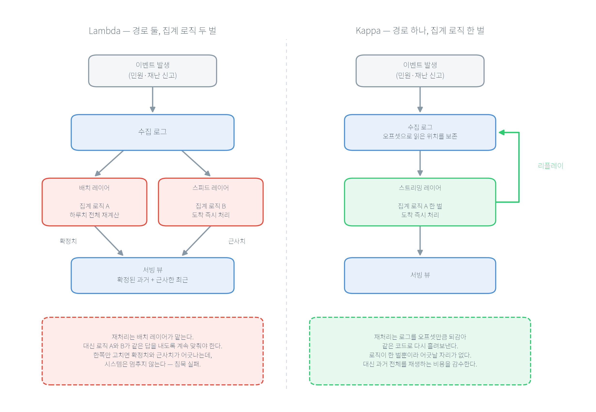

# 제3장 데이터 파이프라인 아키텍처 설계

2장까지 공공 데이터가 어떻게 유입되고 어디서 실패하는지를 검토했다. 이 장은 그 데이터를 담아 흐르게 할 구조 — 파이프라인 아키텍처 — 를 설계하는 관점을 다룬다. 공공 시스템은 재난·교통처럼 지금 이 순간의 값이 중요한 실시간 요구와, 월간·분기 통계 보고처럼 정확하고 재현 가능한 배치 요구를 한 시스템 안에서 동시에 충족해야 한다. 그래서 이 장의 중심 질문은 "어떤 제품을 쓰는가"가 아니라 "실시간 대응·정기 보고·감사 재현이라는 서로 다른 운영 리듬을 어떻게 한 아키텍처로 조립하는가"다. 먼저 배치·스트리밍·하이브리드(Lambda/Kappa)를 재처리 전략의 선택으로 비교하고, 파이프라인을 수집–저장–처리–서빙–모니터링의 다섯 계층으로 나누어 각 계층이 없으면 무엇이 실패하는지를 검토한다. 이어서 보안·감사·개인정보·장애 대응이라는 공공 요구를 설계 산출물로 전환하고, 실습(★★★☆☆)에서는 Docker Compose 구성 파일에서 서비스·포트·의존성·기본 보안을 실제 산출물로 추출한다. 이 장에서 계층으로 나눈 요소들은 이 책의 4장부터 17장까지에서 하나씩 실제로 구현되고 실측된다 — 그래서 이 장은 뒤 장 전체의 지도이기도 하다.

## 학습 목표
- 배치·스트리밍·하이브리드(Lambda/Kappa) 아키텍처를 "정확성·지연·재처리"의 트레이드오프로 비교하고 상황에 맞게 선택할 수 있다.
- 파이프라인을 수집·저장·처리·서빙·모니터링 계층으로 나누어, 각 계층이 없을 때 무엇이 실패하는지와 대표 도구·판단 기준을 설명할 수 있다.
- 보안·감사·개인정보·장애 대응이라는 공공 요구를 설계 산출물과 검수 가능한 요구사항 문장으로 전환할 수 있다.
- 민간 현장의 실시간 아키텍처 방법(이벤트 기반, 멀티테넌시, 실시간 대시보드)을 공공 제약에 맞게 변형해 적용할 수 있다.
- 요구사항에서 로컬 구성 계획(계층·서비스·포트·의존성)을 도출하고, 각 선택의 근거와 뒤로 미룬 계층을 적을 수 있다.

---

## 3.1 배치·스트리밍·하이브리드 아키텍처

### 학습 목표
- 배치·스트리밍·하이브리드의 장단점을 정확성·지연·재처리 관점에서 비교한다.
- Lambda와 Kappa가 같은 문제(재처리)를 다르게 푸는 두 청사진임을 이해하고, 공공에서 하이브리드가 필요한 이유를 말한다.

### 3.1.1 세 가지 처리 시점: 무엇을 언제 계산하는가

파이프라인을 설계할 때 먼저 "데이터를 언제 계산하는가"를 결정한다. 선택지는 세 가지다.

**배치(batch)** 는 데이터를 일정 기간 축적한 뒤 일괄 처리한다. 강점은 정확성과 재현성이다 — 하루분 전체를 대상으로 계산하므로 늦게 도착한 이벤트까지 포함해 "확정된" 수치를 낼 수 있고, 같은 입력으로 재실행하면 같은 결과가 산출된다. 약점은 지연이다 — 어제까지의 데이터로 오늘 아침에 보고서가 나오는 구조에서는 "지금 무슨 일이 벌어지는가"에 답할 수 없다.

**스트리밍(streaming)** 은 이벤트가 도착하는 즉시 처리한다. 강점은 즉시성이다 — 재난 신고가 몰리는 순간의 지역별 건수를 초 단위로 갱신할 수 있다. 약점은 정확한 집계와 재처리의 부담이다 — "23시 58분에 발생한 민원이 00시 03분에 도착하면 이미 닫힌 집계에 넣을 것인가"라는 질문(6장의 지연 이벤트 문제)이 스트리밍에서는 상시 발생한다.

**하이브리드(hybrid)** 는 둘을 결합해 "빠른 근사치 + 정확한 확정치"를 함께 제공한다. 왜 결합이 필요한가는 공공 업무의 이중성에서 나온다 — 재난 상황실은 현재의 신고 건수를 실시간으로 확인해야 하지만(스트리밍), 사후 감사와 통계 보고는 "그날 확정된 정확한 건수"를 요구한다(배치).

하나의 처리 방식만으로는 두 요구를 함께 만족시킬 수 없다는 것이 하이브리드의 출발점이다. 하이브리드를 구성하는 대표적인 설계는 Lambda와 Kappa다.

### 3.1.2 Lambda 아키텍처: 배치 레이어와 스피드 레이어를 나란히

Lambda 아키텍처는 같은 데이터를 두 경로로 동시에 흘려보낸다. **배치 레이어(batch layer)** 는 원천 데이터 전체를 주기적으로 재계산해 정확한 확정치를 만들고, **스피드 레이어(speed layer)** 는 방금 도착한 데이터만 실시간으로 처리해 근사치를 만든다. 조회 시점에는 둘을 합쳐 "확정된 과거 + 근사한 최근"을 함께 제공한다. 재난 대시보드로 옮기면, 어제까지의 지역별 민원 건수는 배치 레이어의 확정 수치로, 오늘 방금까지의 건수는 스피드 레이어의 실시간 근사치로 채우고, 자정이 지나면 오늘 분량도 배치가 재계산해 확정으로 전환한다.

Lambda의 정확성은 대가를 치른다. **같은 집계 로직을 두 벌로 유지해야 한다** — 배치용(예: 하루분 SQL/Spark 잡)과 스트리밍용(예: 윈도우 집계 쿼리)을 별도 코드로 작성하고, 둘이 동일한 결과를 내도록 지속적으로 일치시켜야 한다.

이것이 왜 위험한지는 1장의 CACE 원칙(Changing Anything Changes Everything)과 곧바로 이어진다. 집계 기준 하나(예: 결측 처리 규칙, 창 경계)를 배치 쪽만 바꾸고 스트리밍 쪽을 빠뜨리면, 같은 시각의 확정치와 근사치가 어긋나는데 시스템은 중단되지 않는다 — 전형적 침묵 실패다. 로직 이중화는 그래서 편의가 아니라 상시 관리해야 할 기술 부채다.

민간도 같은 부채를 진다. 배치 쪽을 dbt로, 스트리밍 쪽을 Flink로 구현하면 두 벌을 지속적으로 일치시키는 인건비가 든다. 민간 팀이 이 상태를 관리할 때 쓰는 지표가 **로직 동기화율** — 배치 코드와 스트리밍 코드가 같은 입력에 같은 결과를 내는지 검증한 항목의 비율이다. 100%가 아니면 어긋난 항목이 곧 침묵 실패의 후보다. 공공도 같은 지표를 사용하되 확인 주기를 더 짧게 설정한다. 어긋난 값이 인력 배치와 예산 근거로 사용되기 때문이다.

Lambda의 두 레이어는 이 책에서 각각 실측으로 확인된다. 스피드 레이어의 실제 모습은 6장의 스트리밍 실습이다 — watermark를 선언해 지연 이벤트가 수용되면 집계를 갱신하고(강남구 22:00–22:10 창이 3에서 4로 늘어남) 너무 늦으면 폐기 카운터로만 남긴다.

배치 레이어의 실제 모습은 7장의 배치 정제 실습이다 — 사흘분 민원 60건을 정제하며 총계 보존식 60 = 매핑 54 + 미기재 2 + 미매핑 3 + 중복 1을 검증하고, 같은 날짜를 재실행하면 산출물 해시가 완전히 동일하게 재현된다. "근사하지만 빠른 스피드 레이어(6장)"와 "느리지만 확정·재현되는 배치 레이어(7장)"를 나란히 두는 것이 Lambda의 골격이다.

### 3.1.3 Kappa 아키텍처: 스트리밍 하나로, 재처리는 리플레이로

Kappa 아키텍처는 로직 이중화를 완전히 제거한다. 배치 레이어를 두지 않고 **스트리밍 단일 레이어**만 유지하되, 재처리가 필요하면 로그에 보관된 과거 이벤트를 처음부터 다시 흘려보낸다(리플레이, replay). 집계 로직을 바꿨거나 버그를 고쳤을 때, Lambda라면 배치 잡을 재실행하지만 Kappa는 같은 스트리밍 코드로 과거 로그를 재생해 결과를 다시 산출한다. 로직이 한 벌뿐이므로 배치·스트리밍이 어긋날 여지가 구조적으로 사라진다는 것이 Kappa의 핵심 이점이다.

Kappa가 성립하는 전제는 **이벤트 로그의 보존과 재생 가능성**이다. Kafka 같은 로그 기반 수집 계층은 각 이벤트에 오프셋(offset — 로그 안에서의 위치 번호)을 부여하고 일정 기간 원본을 그대로 보관하므로, 컨슈머(consumer)를 과거 오프셋으로 되돌리면 그 시점부터 다시 읽을 수 있다. Kappa는 이 성질을 재처리 전략으로 승격한 설계다.

한계도 분명하다 — 대규모 과거 데이터 전체를 재생하는 것은 최적화된 배치 스캔보다 비효율적일 수 있고, 복잡한 다차원 집계나 대규모 조인은 여전히 배치 엔진이 유리하다. 그래서 Kappa냐 Lambda냐는 "기술의 우열"이 아니라 "재처리를 어떤 방식으로 감당할 것인가, 로직 이중화 부채와 리플레이 비용 중 무엇을 감수할 것인가"의 선택이다.

민간에서 Kappa는 이벤트 소싱(event sourcing)과 짝을 이뤄 사용된다. 주문의 현재 상태를 저장하는 대신 상태를 바꾼 사건을 순서대로 남기고, 필요할 때 그 사건들을 다시 재생해 현재 상태를 산출하는 방식이다. 주문 상태 추적과 결제 이력 재구성이 그 결과다. 공공의 감사 재현과 구조가 같다 — 남기는 것은 결과가 아니라 사건이고, 결과는 사건에서 다시 산출한다. 다른 것은 목적이다. 민간은 이력 조회와 분쟁 처리를, 공공은 감사 대응을 위해 같은 구조를 사용한다.

Kappa는 최근 스트리밍 인프라(로그 보관 비용 하락, 처리 엔진 성숙)의 발전으로 일부 실시간 파이프라인에서 유력한 선택지로 논의된다. 이 개념적 배경은 Kleppmann의 *Designing Data-Intensive Applications*가 정리한 "파생 데이터(derived data)와 재처리" 논의와 Pathirage 등이 문서화한 Kappa 정의에서 확인할 수 있으며, 한 산업 기술 블로그는 Kappa가 실시간 파이프라인의 주류로 자리 잡아 Lambda를 대체하고 있다고 주장한다(Wähner, 2021). 다만 이 논의들은 모두 민간·산업 일반을 대상으로 한 것으로 공공 부문의 직접 선례는 아니며, 개념과 방법을 차용하는 자격으로 인용한다.



**그림 3.1** Lambda와 Kappa: 재처리를 어디서 감당하는가

두 청사진은 위쪽 절반이 같다 — 같은 이벤트가 같은 수집 로그로 들어간다. 차이는 그 아래에서 나타난다. Lambda는 로그 하나를 배치와 스피드 두 경로로 나누어 확정치와 근사치를 각각 만들고 서빙 뷰에서 합치는데, 그 대가로 집계 로직을 두 벌 유지한다. Kappa는 경로를 하나로 두고, 재처리가 필요하면 로그를 오프셋만큼 되감아 같은 코드로 다시 흘려보낸다(그림 오른쪽의 리플레이 경로). 선택의 축은 정확성이 아니라 재처리를 로직 이중화로 감당할 것인가 리플레이 비용으로 감당할 것인가다.

**표 3.1** 배치·스트리밍·하이브리드(Lambda/Kappa) 비교

| 항목 | 배치 중심 | 스트리밍 중심 | Lambda(하이브리드) | Kappa(하이브리드) |
|---|---|---|---|---|
| 처리 시점 | 주기적 일괄 | 도착 즉시 | 배치+스피드 병렬 | 스트리밍 단일 |
| 지연 | 큼(분·시간) | 작음(초 이하) | 확정은 크고 근사는 작음 | 작음(재처리는 리플레이) |
| 재처리 방식 | 배치 재실행 | 별도 설계 필요 | 배치 레이어가 담당 | 로그 리플레이 |
| 로직 관리 | 한 벌 | 한 벌 | **두 벌(이중화 부채)** | 한 벌 |
| 약점 | 결과 지연 | 정확 집계 부담 | 로직 중복·운영 복잡 | 대규모 배치 분석 비효율 |
| 공공 적용 포인트 | 정기 통계 보고 | 재난·교통 실시간 | 대응+보고 동시 요구 | 재처리·감사 중심 재생 |

### 3.1.4 리플레이와 감사: 재처리 전략이 공공에서 특별한 이유

민간에서 리플레이는 주로 버그 수정·로직 개선을 위한 재계산 수단이다. 공공에서는 여기에 하나가 더 추가된다 — **감사**다. 감사관이 "왜 이 통계가 이렇게 나왔는가"를 물으면, 답은 결국 "그 시점에 들어온 그 데이터로 그 계산을 다시 재현할 수 있는가"로 환원된다. 로그를 보존하고 오프셋으로 되감아 재생할 수 있는 아키텍처는 이 질문에 "재현 가능하다"로 답할 수 있고, 요약본만 남긴 아키텍처는 답할 수 없다. Kappa의 리플레이 능력이 공공 맥락에서 재처리 편의를 넘어 감사 대응 능력이 되는 이유가 이것이다.

이 재현 요구가 실제로 어떻게 코드가 되는지는 뒷장에서 실측으로 확인한다. 9장은 모델 훈련 입력의 지문(sha256)을 기록해 "같은 데이터·설정이면 같은 모델"을 재실행으로 검증하고, 13장은 접근·변경 이력에서 감사 점검표를 실행 산출물로 자동 생성한다.

공통 원칙은 하나다 — 증거를 사람이 사후에 작성하는 문서가 아니라 시스템이 실행 중에 남기는 산출물로 두는 것. 리플레이 가능한 로그는 그 원칙의 아키텍처 수준 표현이다.

선택을 수치로 좁힐 때 사용하는 지표가 둘 있다. 하나는 **재처리 소요 시간**이다 — Lambda는 배치 잡을 재실행하는 시간으로, Kappa는 보관된 로그를 되감아 재생하는 시간으로 측정한다. 로직을 고친 뒤 확정치를 며칠 안에 다시 내야 하는지가 정해져 있으면, 그 기한이 두 방식의 상한을 결정한다. 다른 하나는 **종단 지연**(end-to-end latency)이다 — 이벤트 발생부터 서빙까지 걸리는 시간이며, 민간 실시간 추천은 100ms 이하, 광고 입찰은 10ms 이하를 목표로 설정하는 경우가 많다. 공공에서 이 값의 기준은 사업 성과가 아니라 대응 시한이다. 재난 상황실이 몇 초 안에 갱신된 건수를 봐야 하는가가 곧 스트리밍 계층의 요구가 된다.

### 3.1.5 워크드 예제: 하이브리드 설계 결정(가상 시나리오)

지금까지의 비교를 하나의 결정으로 통합한다. 아래는 실측이 아니라, 요구사항을 아키텍처 선택으로 전환하는 사고 과정을 보이기 위한 가상 시나리오다(수치 없는 구조 서술이며, 각 선택의 실물은 이 책의 실측 장들과 연결된다).

어느 지자체가 "재난 민원 통합 시스템"을 발주하려 한다. 요구를 분석하면 세 갈래다.

- **실시간 대응**: 상황실이 지역별 신고 건수를 초 단위로 봐야 한다 → 스트리밍 처리 필요(스피드 레이어 또는 Kappa 단일 레이어).
- **정기 보고**: 월간·분기 통계는 늦게 도착한 이벤트까지 포함한 확정 수치여야 한다 → 배치 확정 필요.
- **감사 재현**: 감사에서 "그 시점 그 데이터"의 재현을 요구한다 → 원천 로그 보존과 리플레이 필요.

선택 기준은 재처리를 어떻게 감당하느냐다. 팀이 스트리밍 역량은 있으나 배치·스트리밍 두 로직을 계속 맞출 인력이 부족하다면, Kappa가 유리하다 — 로직 한 벌만 유지하고 확정·재현은 리플레이로 얻는다.

반대로 대규모 다차원 통계(교차 분석·장기 추세)가 보고의 핵심이고 그 계산이 배치 엔진에서 훨씬 효율적이라면, Lambda의 배치 레이어를 두는 편이 낫다 — 로직 이중화 부채를 감수하는 대신 대규모 확정 집계를 낮은 비용으로 확보한다.

어느 쪽을 선택하든 공통으로 갖출 것은 수집 계층의 로그 보존(감사 재현의 전제)과 모니터링 계층의 조합 규칙(단일 지표 오판 방지)이다. 이 결정 과정이 곧 이 책의 실습 지도가 된다 — 스트리밍 대응은 6장, 배치 확정은 7장, 재현·감사는 9·13장, 부하 한계는 12장에서 각각 구체적으로 다룬다.

### 공공 사례
민원 시스템은 실시간 현황 모니터링(스트리밍)과 월간·분기 통계 보고(배치)를 모두 요구하고, 사후 감사에서는 "특정 시점에 어떤 데이터가 들어왔는지"의 재현을 요구한다. 세 요구를 한 시스템에 담으려면 단일 처리 방식으로는 부족하다. 재난·안전 데이터는 사건 발생 시 버스트(짧은 시간의 폭증)가 나타나 실시간 대응이 중요하고, 동시에 그 대응의 근거가 사후에 재현 가능해야 한다. 따라서 공공 설계자는 실시간 대응·정기 보고·감사 재현을 분리하면서도 하나의 데이터 흐름 위에서 결합하는 하이브리드 설계에 이르게 된다.

### 핵심 정리
- 아키텍처 선택은 기능 나열이 아니라 정확성·지연·재처리 전략의 선택이다.
- Lambda는 배치+스피드 두 레이어로 정확성을 얻지만 로직 이중화 부채를 진다. Kappa는 로직 한 벌 + 리플레이로 이중화를 없애지만 대규모 배치 분석에 한계가 있다.
- 공공에서 리플레이는 재처리 편의를 넘어 "그 시점 재현" 감사 능력이 된다.

---

## 3.2 파이프라인 계층: 수집·저장·처리·서빙·모니터링

### 학습 목표
- 파이프라인을 다섯 계층으로 나누고, 각 계층이 없을 때 무엇이 실패하는지로 역할을 이해한다.
- 대표 도구를 "제품"이 아니라 "계층이 해결하는 운영 문제"로 읽는다.

계층은 제품 이름의 목록이 아니라 역할의 분해다. 각 계층 정의→왜 필요한가(없으면 무엇이 실패하는가)→구체 시나리오→현장 도구·판단의 순으로 검토한다.

### 3.2.1 수집 계층: 생산과 소비의 속도 차이를 흡수한다

**정의.** 수집 계층은 외부에서 도착하는 이벤트를 받아 버퍼링하고 하류로 전달하며, 필요하면 과거 이벤트를 다시 읽게 한다. **왜 필요한가.** 공공 실시간 데이터의 생산 속도와 소비 속도는 거의 항상 다르다 — 재난 문자 발송 직후 민원이 초당 수백 건 유입될 때, 하류의 처리·저장 서버는 그 속도를 따라가지 못한다. 생산자와 소비자를 직접 연결하면 이 속도 차이가 곧바로 장애(요청 거부, 데이터 유실)가 된다. 수집 계층은 그 사이에 완충 로그를 두어 "빠르게 받고 천천히 처리"를 가능하게 한다.

**시나리오와 현장 방법.** 대표 도구가 Kafka이고, 그 핵심은 이벤트를 오프셋이 매겨진 로그로 보관해 컨슈머가 자기 속도로 읽고 필요하면 되감을 수 있게 하는 것이다.

이 완충과 재생이 없으면 무엇이 실패하는지는 4장에서 실측으로 확인한다 — 같은 이벤트 스트림을 Kafka로 수집하면서 커밋 시점 한 줄만 바꾸면, 한쪽 설계(at-most-once)는 크래시(crash) 시 20건을 오류 로그 없이 유실했고 다른 쪽(at-least-once)은 10건을 중복 수신했다. 유실·중복은 버그가 아니라 전달 보증 설정대로의 동작이며, 수집 계층 설계의 핵심 판단이 바로 이 보증 수준의 선택이다.

### 3.2.2 저장 계층: 원천 보존과 접근 통제를 동시에

**정의.** 저장 계층은 원천 데이터와 가공 데이터를 보존하며, 누가 무엇에 접근하는지를 통제한다. **왜 필요한가.** 원천을 보존하지 않으면 세 가지가 불가능해진다 — 변환 로직 버그가 나중에 발견됐을 때의 재처리, "그때 받은 그대로"를 요구받는 감사, 처음에는 사용하지 않던 필드가 나중에 필요해지는 새 요구. 세 가지 모두 요약본으로는 복원할 수 없다. **시나리오.** 예산 제약으로 원천 전부를 고성능 저장소에 둘 수 없으므로, 현장은 계층형 저장(tiered storage)으로 타협한다 — 최근 데이터는 빠른 저장소(핫), 과거 데이터는 중간(웜), 감사·재처리 대비 원본은 저비용 저장소(콜드)에 두고 보관 기간 후 정책에 따라 폐기한다.

**최신 이론: 레이크하우스.** 전통적으로 저장 계층은 정형 분석을 위한 데이터 웨어하우스(data warehouse)와 원천 대량 보관을 위한 데이터 레이크(data lake)로 나뉘어, 같은 데이터를 두 곳에 중복 저장하곤 했다.

최근의 **레이크하우스(lakehouse)** 는 이 둘을 한 계층으로 통합하려는 아키텍처다. Armbrust 외(2021, CIDR)는 레이크하우스가 개방형 저장 포맷(예: Parquet) 위에서 데이터 최신성·신뢰성·총소유비용(TCO)·데이터 잠금(lock-in) 문제를 완화한다고 논한다.

공공 관점에서 이 통합이 유용한 이유는 명확하다 — 원천 보존(레이크)과 정형 분석·서빙(웨어하우스)을 한 저장 계층에서 다루면 중복 저장 비용과 두 저장소 간 정합성 관리 부담이 감소한다. 다만 이는 개념 소개 수준이며(공공 직접 선례 아님·개념 차용), 3장의 실습은 관계형 DB(Postgres) 기반 최소 구성으로 시작한다.

저장 계층의 접근 통제는 "누가·언제·무엇을·왜 봤는가"의 기록이며, 이는 허용만이 아니라 거부의 기록을 포함한다. 이 통제를 이 책은 5장(UPSERT로 중복을 흡수하는 저장 제약)과 13장(역할·목적 기반 접근과 거부 로그)에서 실측으로 구현한다.

### 3.2.3 처리 계층: 스트리밍·배치 변환과 지연 이벤트

**정의.** 처리 계층은 수집된 데이터를 스트리밍 또는 배치로 변환·집계한다. **왜 필요한가.** 원천 이벤트는 그대로는 사용할 수 없다 — 지역명을 표준 코드로 매핑하고, 시간 창으로 묶어 계수하고, 늦게 도착한 이벤트를 어떻게 처리할지 정해야 의미 있는 지표가 된다. **시나리오.** 스트리밍 처리의 주요 난제는 지연 이벤트다 — 발생 시각과 도착 시각이 다른 이벤트를 "발생한 시간대"에 계수하려면 얼마나 대기한 뒤 창을 닫을지 정해야 하고, 이 판단이 watermark다. 이 책은 6장에서 Spark Structured Streaming으로 지연 이벤트의 수용(집계 갱신)과 폐기(카운터 증가)를 실측하고, 7장에서 배치 정제로 총계 보존식을 검증한다. 오케스트레이션(orchestration, Airflow)은 배치 워크플로의 순서·재시도·SLA(Service Level Agreement)를 조정하는데, 이는 "계층"이라기보다 계층을 잇는 조정자다(7장에서 DAG로 구현).

### 3.2.4 서빙 계층: 조회·리포팅·ML 응답을 통제된 성능으로

**정의.** 서빙 계층은 조회·리포팅·ML 예측 요구에 데이터를 제공한다. **왜 필요한가.** 저장된 데이터가 아무리 정확해도 소비자(대시보드, 시민 창구, 타 기관)가 예측 가능한 성능과 통제된 권한으로 꺼내 쓸 수 없으면 서비스가 아니다.

**시나리오.** 서빙의 운영 질문은 "새 모델을 어떻게 투입하는가"보다 "잘못됐을 때 어떻게 되돌리는가"이고, 공공에서 특히 유용한 전략이 섀도 배포다. 10장에서 이를 실측한다 — 이용자에게는 champion 모델의 예측(6.0)이 나가고, 로그에는 challenger 모델의 예측(7.3636)이 조용히 축적되어, 이용자 위험 없이 후보를 재평가할 자료가 된다. 서빙 계층의 접근 통제와 성능 요구가 함께 걸린다는 점이 공공 서빙 설계의 핵심이다.

### 3.2.5 모니터링 계층: 관측성과 골든 시그널

**정의.** 모니터링 계층은 메트릭·대시보드로 시스템과 모델의 상태를 관측 가능하게 한다. **왜 필요한가.** 모니터링이 없으면 침묵 실패가 발견되지 않는다 — 시스템이 중단되지 않은 채 틀린 값을 계속 산출하는 상황을 누군가 의심하기 전까지 아무도 인지하지 못한다.

**현장 방법.** 무엇을 관측할 것인가의 출발점이 Google SRE(Site Reliability Engineering)의 네 가지 골든 시그널 — 지연(latency), 트래픽(traffic), 오류(errors), 포화(saturation) — 다. Prometheus가 메트릭을 수집하고 Grafana가 대시보드로 제시하는 조합이 대표적이다.

이 책은 11장에서 드리프트 감시(입력 분포 변화)를, 12장에서 포화(부하 한계)를 실측한다. 11장은 9일 간격 대기질 스냅샷 비교에서 PSI 0.3324(경보 대역)와 KS 검정 비유의(p=0.2657)가 동시에 나와 단일 지표가 아닌 조합 규칙이 필요함을 보인다. 12장은 단일 워커의 CPU가 106.3%(한 코어)로 포화해 처리량이 약 2,700 RPS 천장에 묶이고 사용자를 5배 늘려도 지연만 5배가 되는 것을 실측한다. "감지 ≠ 항상 경보"와 "포화는 사전에 측정해야 파악된다"가 각각 11·12장의 교훈이다.

**표 3.2** 계층별 역할과 공공 고려사항, 이 책에서 실측하는 곳

| 계층 | 역할(없으면 실패하는 것) | 대표 도구(예) | 공공 고려사항 | 이 책 회수 |
|---|---|---|---|---|
| 수집 | 속도 차 완충·전달·리플레이(없으면 유실·과부하) | Kafka | TLS 전송, 접근 로그 | 4장(유실 20·중복 10) |
| 저장 | 원천 보존·접근 통제(없으면 재처리·감사 불가) | Postgres, 레이크하우스 | 암호화, 보관 기간, 거부 로그 | 5장(UPSERT), 13장(접근) |
| 처리 | 표준화·집계·지연 처리(없으면 의미 없는 원천) | Spark, Airflow | 지연 이벤트 규칙, 총계 보존 | 6장(watermark), 7장(정제) |
| 서빙 | 통제된 조회·예측(없으면 데이터가 서비스되지 않음) | DB 조회, API | 권한 분리, 응답 성능, 롤백 | 10장(섀도 6.0/7.3636) |
| 모니터링 | 관측성(없으면 침묵 실패 미발견) | Prometheus, Grafana | 실시간 알림, 조합 규칙 | 11장(PSI 0.3324), 12장(포화) |

표의 대표 도구는 정답이 아니다. 같은 계층을 다른 제품으로 채워도 되고, 현장은 조건에 따라 다르게 선택한다. 선택 시 검토하는 것이 세 가지다. 첫째, 그 계층이 없을 때 실패하는 것을 이 제품이 실제로 막는가 — 수집 계층에 큐를 두더라도 읽은 메시지를 삭제하는 큐라면 리플레이가 안 되므로 감사 재현 요구를 충족하지 못한다. 둘째, 운영 인력이 그 제품을 감당하는가 — Kafka 클러스터를 직접 운영하면 전담 인력이 필요하고, 관리형 서비스를 사용하면 비용이 이를 대체한다. 셋째, 이 선택이 뒤 계층의 선택을 얼마나 묶는가 — 저장 포맷을 특정 벤더에 묶으면 나중에 처리 엔진 선택지가 줄어든다.

민간은 여기에 비용을 네 번째 축으로 더한다. 수집·저장·처리·서빙의 클라우드 비용을 계층별로 따로 추적하고, 이벤트 1건을 끝까지 처리하는 데 드는 비용(cost per event)으로 아키텍처 안을 비교한다. 공공에서 이 축이 약한 이유는 비용이 덜 중요해서가 아니라 예산이 연간으로 묶여 월 단위 최적화의 여지가 적기 때문이다(3.4.5).

### 3.2.6 민간 실시간 아키텍처의 공공 적용

계층 설계의 성숙한 방법은 민간 실시간 현장에서 먼저 다듬어졌다. 세 가지를 공공에 적용한다.

첫째, **이벤트 기반 아키텍처(event-driven architecture)**. 민간은 서비스 간을 직접 호출로 잇는 대신 이벤트를 발행·구독으로 느슨하게 잇는다(Fowler/Betts의 정리 — 이벤트 통지, 이벤트-반송 상태 전이 등 여러 뜻이 섞여 쓰이므로 정의를 먼저 합의해야 한다).

공공 적용은 수집 계층(Kafka)을 중심에 두고 민원·재난 이벤트를 발행하면 집계·알림·예측이 각자 구독해 처리하는 구조다. 한 소비자의 장애가 다른 소비자로 전파되지 않게 격리한다(14장 통합에서 이 격리를 드릴로 검증).

둘째, **멀티테넌시(multi-tenancy)**. 민간 SaaS는 한 인프라 위에서 여러 고객사의 데이터를 격리해 운영한다(Microsoft의 멀티테넌시 가이드). 공공 적용은 한 파이프라인 위에서 여러 기관·지자체의 데이터를 격리하는 것으로, 형평성·책임성 때문에 "누구의 데이터가 어디까지 섞여도 되는가"의 경계가 민간보다 엄격하다 — 기관 간 데이터 공유는 개인정보 목적 제한(제18조)과 직접 충돌할 수 있다. 격리의 근거가 다르다는 점이 중요하다. 민간에서 판매자 A의 매출을 판매자 B가 조회하면 계약 위반(SLA·NDA(비밀유지계약))이고 배상 범위도 계약이 정한다. 공공에서 기관 A의 개인정보를 기관 B가 조회하면 법 위반이며, 배상이 아니라 처분의 문제가 된다. 그래서 격리 기술이 같아도 공공에는 "경계를 넘지 않았다"를 로그로 증명할 의무가 한 겹 더 추가된다(13장).

셋째, **실시간 대시보드**. 민간은 매출·트래픽을 사업 지표+시스템 지표로 실시간 표시한다. 공공 적용은 민원 유입·처리 현황판, 재난 접수 현황판이며, 공공 특수성에 따른 변형은 지표에 형평 축(지역·집단별 분해)을 더하는 것이다 — 평균이 양호해도 특정 지역이 저조하면 문제이기 때문이다(16장의 공정성 평가와 연결). 방법의 목적은 유지하고 수단을 공공 제약에 맞추는 이 적용 패턴은 이 책 전체에서 반복된다.

### 공공 사례
교통 데이터는 초당 고빈도로 들어오므로 수집 계층(메시징)이 없으면 생산자·소비자 속도 차이가 곧바로 장애가 된다. 반대로 정기 보고서는 배치와 스케줄링이 핵심이라, 오케스트레이션이 없으면 운영이 수작업으로 회귀한다. "계층 연결"은 단순한 선 연결이 아니라 서로 다른 운영 리듬(실시간/배치)을 맞추는 설계다.

### 핵심 정리
- 계층은 제품 이름이 아니라 "없으면 무엇이 실패하는가"로 이해하는 역할 분해다.
- 각 계층은 이 책 4~13장에서 실측으로 구현되며, 이 장의 5계층 표에 장별 실습과의 대응 관계가 정리되어 있다.
- 민간 실시간 아키텍처(이벤트 기반·멀티테넌시·실시간 대시보드)는 공공 특수성(격리·형평)에 맞춘 변형과 함께 적용한다.

---

## 3.3 공공 영역 요구사항: 보안·감사·개인정보·장애 대응

### 학습 목표
- 보안·감사·개인정보·장애 대응을 설계 산출물(권한·로그·라인리지(lineage)·복구 절차)로 전환한다.
- 요구사항을 검수 가능한 문장과 검수표로 정리해 설계 검토에 적용한다.

### 3.3.1 보안: 원칙이 아니라 설정으로

**보안**은 "안전하게 하라"는 구호가 아니라 구체적 설정으로 구현된다 — 전송 암호화(TLS), 저장 암호화, 역할 기반 접근 제어(RBAC), 네트워크 분리(망분리). 이 중 실습과 직접 닿는 것이 비밀 관리다.

실습 3.1의 compose 파일은 데이터베이스 비밀번호를 파일 안에 평문으로 담고 있고, 파서는 이를 보안 경고로 검출한다. 여기서 중요한 현장 원칙이 12-factor App의 III. Config다 — **설정, 특히 비밀은 코드·구성 파일이 아니라 환경(환경변수·시크릿 저장소)에 두어야 한다**.

이유는 명확하다. 비밀이 파일에 있으면 버전 관리 저장소에 그대로 커밋되어 접근 권한이 있는 누구에게나 노출되고, 유출 시 회수도 어렵다. 운영에서는 이 값을 환경변수나 전용 시크릿 관리 도구로 분리하고, 구성 파일에는 참조만 남긴다.

### 3.3.2 감사: 재현할 수 없으면 증거가 아니다

**감사**는 접근 로그, 변경 이력, 라인리지(데이터→피처→모델→결과의 추적), 보관 정책을 통해 "증거"를 남기는 요구다. 감사의 요체는 3.1.4에서 본 재현성이며, 핵심 방법은 증거를 사람이 사후에 작성하는 문서가 아니라 시스템이 실행 중에 생성하는 산출물로 두는 것이다.

이 책은 13장에서 이를 실측으로 구현한다 — 역할·목적 기반 접근 정책으로 12건의 요청을 판정하면 허용 8건·거부 4건이 나오고, 거부 4건(로그 권한 없음, 감사 값 조회 제한, 미등록 역할, 카탈로그 미등록)이 각기 다른 통제 지점을 드러내며 모두 로그에 남는다. 나아가 그 로그에서 10개 항목의 감사 점검표를 자동 생성해 전항 통과를 확인한다. "접근 통제가 있다"는 말의 운영적 의미는 이 로그와 점검표를 제시할 수 있다는 뜻이다.

### 3.3.3 개인정보: 조문이 설계를 결정한다

**개인정보** 보호는 마스킹·가명처리, 수집 최소화, 보관 기간, 국외 이전 제한 같은 운영 정책으로 구현되며, 그 근거는 "개인정보를 보호하라"는 구호가 아니라 개인정보 보호법의 구체 조문이다. 1장에서 소개하고 16장에서 실측으로 다루는 네 조문이 각각 설계의 어느 지점을 결정하는지 검토한다.

제18조(목적 외 이용·제공 제한)는 접근 정책의 형태를 바꾼다. 접근을 "누가"만으로 통제하면 이 조문을 지킬 수 없다 — 정책에 "무슨 목적으로"가 함께 들어가야 하고, 목적 밖의 조회는 거부되며 그 거부가 기록되어야 한다(13장의 목적 기반 접근 제어가 정확히 이 구조다). 제23조(민감정보 처리 제한)는 건강 등 민감정보에 한정된 더 강한 통제로, 저장 계층에서 민감 필드를 일반 필드와 분리해 접근 조건을 달리 거는 설계로 전환된다.

제33조(개인정보 영향평가)는 코드보다 앞선다. 공공기관이 일정 규모 이상의 개인정보파일을 운용하면 침해 위험을 사전에 평가해야 하므로, 개인 단위 데이터를 다루는 시스템은 파이프라인을 구성하기 전에 "영향평가 대상인가"의 판정이 선행되어야 한다. 제37조의2(자동화된 결정에 대한 권리, 2024년 3월 시행)는 서빙 계층에 새 요구를 추가한다 — AI가 민원 배정·우선순위를 자동 결정하는 서비스라면, 이의 제기를 받는 창구와 결정 근거를 설명하는 절차가 처음부터 시스템 요구사항으로 들어가야 한다.

조문 인용에는 주의가 필요하다 — 제23조는 민감정보 한정이고 개인정보 일반의 목적 제한은 제18조이므로, 제23조를 일반 통제 근거로 넓혀 인용하면 검수에서 지적된다. 상세와 실측 적용은 16장에서 다루되, 이 장에서 기억할 원칙은 "규제는 배포 직전 체크리스트가 아니라 설계 시작 시점의 입력"이라는 것이다.

### 3.3.4 장애 대응: 고장을 의도적으로 유발해야 확인된다

**장애 대응**은 재시도·멱등 처리, 이중화, 백업·복구(DR), 유실 방지 절차로 구체화된다. 핵심 통찰은 "비기능 요구는 고장을 의도적으로 유발하기 전에는 확인되지 않는다"는 것이다 — 기능은 시연으로 확인되지만, "구성 요소 하나가 중단되어도 전체가 멈추지 않는가"는 실제로 중단시켜야 확인된다.

이 책은 14장의 통합 실습에서 장애 드릴 3종으로 이를 검증한다.

- **오염 이벤트**: JSON으로 파싱되지 않는 페이로드(payload) 1건을 정상 이벤트 사이에 투입하면, 처리기가 그 1건을 격리 큐에 사유째 보존하고 다음 처리로 진행해 그날 집계는 온전히 확정된다.
- **재전송**: 마지막 10건을 중복 재전송해도 멱등 설계에 따라 집계는 불변이다.
- **부분 실패**: 모델 API가 중단된 동안에도 집계는 확정되고 예측만 대기 상태로 격리된다 — 한 부품의 장애가 전체를 멈추지 않는다.

이 세 드릴이 "장애 대응이 문서가 아니라 실측된 동작"임을 보인다. 재시도와 멱등성은 특히 한 쌍으로 설계된다 — 재시도가 유실을 막는 대신 중복을 발생시키므로, 저장소의 멱등 처리(5장의 UPSERT)가 그 중복을 무해화해야 비로소 "유실도 이중 집계도 없는" 상태가 된다.

복구 목표를 숫자로 적는 관행은 민간 SLA에서 왔다. **RTO(Recovery Time Objective)** 는 장애 발생 후 서비스가 복구되기까지 허용하는 시간이고, 가용성은 연간 99.9%(약 8.7시간 정지 허용)나 99.99%(약 52분)처럼 등급으로 정한다. 공공에서도 같은 수치를 사용하되 정하는 근거가 다르다 — 민간은 위약금 산정을 위해, 공공은 "이 업무가 몇 시간 멈춰도 되는가"를 업무 성격으로 정한다. 재난 접수처럼 멈추면 안 되는 업무와 월간 통계 산출처럼 하루 늦어도 되는 업무를 한 등급으로 묶으면 예산도 설계도 어긋난다.

### 3.3.5 요구사항은 검수 가능해야 한다

공공 AI의 현실은 직접 개발만큼이나 발주와 검수다. 검수 관점의 핵심 원칙은 **요구사항의 검수 가능성**이다 — "실시간 처리를 지원할 것"은 검수할 수 없지만, "지연 이벤트의 수용·폐기 규칙을 제시하고 폐기 건수를 지표로 노출할 것"(6장), "정제 전후 총계 보존을 검증하고 위반 시 실패시킬 것"(7장), "부하 시나리오별 처리량 천장과 포화 자원을 실측 보고할 것"(12장)은 검수할 수 있다.

SRE의 골든 시그널(지연·트래픽·오류·포화)을 발주 언어로 옮기면 각각 측정 지표와 임계, 대응 절차를 산출물로 요구하는 것이 된다. 검수표는 이 요구가 실제로 충족되는지 점검하는 도구이며, 14장의 인수 검수표 16항목이 그 실물이다.

민간도 같은 문장 규율을 사용한다. "주문 이벤트는 발생 후 5초 이내에 처리 계층에 도달해야 한다" 같은 데이터 적시성 SLA가 그 예이고, 측정 방법과 임계가 문장 안에 있다는 점에서 공공 검수 문장과 형태가 같다. 다른 것은 문장을 쓰게 만드는 동기다. 민간에서 이 문장을 어기면 계약상 위약금이 발생하고, 공공에서는 감사 지적과 인수 거부로 이어진다.

**표 3.3** 공공 요구사항 → 설계 산출물 → 운영 확인 → 이 책 실물

| 요구사항 | 설계 산출물(예) | 운영에서 확인할 것 | 이 책 실물 |
|---|---|---|---|
| 보안 | TLS, 저장 암호화, RBAC, 시크릿 분리 | 접근 로그, 권한 변경 이력, 평문 비밀 부재 | 실습 3.1 경고, 13장 접근 로그 |
| 감사 | 라인리지, 변경 이력, 데이터 지문 | 특정 시점 재현 가능 여부 | 9장 지문·재실행, 13장 감사표 10항목 |
| 개인정보 | 목적 포함 접근 정책, 마스킹, 보관·폐기 | 목적 외 조회 거부·기록, 영향평가 대상 판정 | 13장 거부 4건, 16장 법령 대응 |
| 장애 대응 | 재시도·멱등키, 격리 큐, 이중화, DR | 드릴에서 격리·흡수·수렴 확인 | 14장 드릴 3종 |
| 검수 가능성 | 검수표, 수치 임계, 드릴 시나리오 | 인수 시점 전항 통과 | 14장 검수표 16항목 |

### 공공 사례
감사 대응의 "왜 이 수치가 이렇게 나왔는가"는 결국 처리의 증거(로그·버전·라인리지)를 요구하고, 재난·교통처럼 놓치면 안 되는 이벤트는 재시도와 멱등 처리로 유실을 막아야 한다. 보안·감사·개인정보·장애 대응은 문서에만 있는 규칙이 아니라 파이프라인 설계와 운영 절차에 산출물로 박혀야 한다.
### 핵심 정리
- 공공 요구사항은 원칙이 아니라 설계 산출물과 검수 가능한 문장으로 변환되어야 한다.
- 비기능 요구(장애 대응)는 드릴로 고장을 내 봐야 확인된다.
- 조문은 설계 입력이며, 제23조(민감정보)와 제18조(목적 제한)의 적용 범위를 혼동하지 않는다.

---

## 3.4 로컬 실습 환경의 최소 구성

### 학습 목표
- 학습·개발 단계에서 "최소 구성"이 필요한 이유와 기준을 설명한다.
- 어떤 계층을 남기고 어떤 계층을 뒤로 미룰지 판단한다.

### 3.4.1 왜 최소로 시작하는가

실제 공공 시스템의 전체 아키텍처를 한 번에 구축하면 학습이 어렵고, 무엇이 왜 필요한지 파악하기 전에 도구 설치에 시간을 소모하게 된다. 그래서 수업·개발 단계에서는 필요한 계층만 담은 최소 구성으로 시작한다.

최소 구성의 기준은 하나다 — **"이 장의 개념을 직접 확인할 수 있는가"**. 3장에서는 수집(메시징)·저장·모니터링 계층을 우선 세우고, 처리(Spark)·오케스트레이션(Airflow)은 각각 6·7장에서 추가한다.

처리·오케스트레이션을 뒤로 미루는 것은 생략이 아니라 범위 조정에 따른 설계 판단이다 — 이 장의 목표는 "구성 요소가 무엇을 하는지"를 관찰하는 것이지 스트리밍 처리를 구현하는 것이 아니므로, 지금 Spark를 구축하면 학습 부하만 늘고 이 장의 개념은 더 명확해지지 않는다.

무엇을 남기고 무엇을 미룰지는 세 질문으로 정한다. 첫째, 이 계층을 제외하면 이 장에서 제시하려는 것이 관찰되지 않는가 — 수집·저장·모니터링을 제외하면 "계층이 나뉘어 있다"는 사실 자체가 관찰되지 않는다. 둘째, 이 계층이 없어도 뒤 실습의 진행에 지장이 없는가 — 처리 계층은 6장에서 처음 필요하므로 지금 없어도 3~5장이 진행된다. 셋째, 구축했을 때 드는 학습 부하가 그 계층에서 얻는 관찰보다 큰가 — Spark와 Airflow는 설정 항목이 많아 이 장에서는 부하가 관찰을 넘어선다. 세 질문을 뒤집으면 추가 시점도 정해진다. 실습이 진행되지 않는 시점이 곧 그 계층을 추가할 시점이다.

### 3.4.2 Docker란 무엇인가

Docker는 애플리케이션과 실행에 필요한 파일·라이브러리·설정을 하나의 패키지로 묶고, 이를 **컨테이너(container)**라는 격리된 실행 공간에서 시작하게 하는 도구다. 여기서 격리는 "컴퓨터 안의 또 다른 완전한 컴퓨터"를 만든다는 뜻이 아니다. 컨테이너는 호스트 컴퓨터의 운영체제 자원을 함께 사용하면서도 프로세스·네트워크·파일 공간을 서로 구분해 실행하는 방식이다.

처음에는 다음 세 단어를 구분하면 된다.

| 용어 | 쉬운 뜻 | 비유 |
|---|---|---|
| 이미지(image) | 컨테이너를 만들 때 쓰는 읽기 전용 패키지 | 재료와 조리법이 들어 있는 포장 세트 |
| 컨테이너(container) | 이미지를 실제로 실행한 인스턴스 | 포장 세트로 만든 한 그릇의 음식 |
| Docker Engine | 이미지를 내려받고 컨테이너를 시작·중지하는 실행 프로그램 | 주방과 조리 도구 |

예를 들어 PostgreSQL을 노트북에 직접 설치하면 운영체제별 설치 방법, 버전, 설정 파일을 따로 맞춰야 한다. PostgreSQL 이미지로 컨테이너를 시작하면 필요한 프로그램과 기본 파일을 이미지에서 가져오므로, 학습자는 데이터베이스를 설치하는 과정과 애플리케이션의 데이터 처리 과정을 분리해서 볼 수 있다. 다만 데이터베이스에 저장한 데이터까지 컨테이너 안에만 두면 컨테이너를 삭제할 때 함께 사라질 수 있으므로, 운영에서는 볼륨(volume) 같은 지속 저장소를 별도로 연결한다.

Docker를 사용하면 "내 컴퓨터에서는 실행되는데 다른 컴퓨터에서는 실행되지 않는" 문제를 줄일 수 있다. 그렇다고 모든 차이가 자동으로 사라지는 것은 아니다. 호스트의 CPU·메모리, 네트워크 포트, 파일 권한, 이미지의 버전, 비밀값 설정은 여전히 확인해야 한다. 컨테이너는 실행 환경을 묶어 주지만, 데이터 보존·보안 설정·자원 한계까지 대신 결정하지 않는다.

실행 흐름은 다음과 같다.

1. Docker가 레지스트리에서 필요한 이미지를 내려받거나(`pull`), Dockerfile로 직접 만든다.
2. 이미지에서 컨테이너를 만든다.
3. 컨테이너에 포트·환경변수·볼륨·네트워크를 연결하고 실행한다.
4. 작업이 끝나면 컨테이너를 중지하거나 삭제한다. 보존해야 할 데이터는 볼륨에 남긴다.

이제 `docker run`은 컨테이너 하나를 실행하는 명령이고, `docker compose`는 여러 컨테이너와 그 연결 관계를 한 번에 관리하는 명령이라고 구분할 수 있다. 이 장의 Compose 파일에는 Kafka, PostgreSQL, Prometheus, Grafana처럼 서로 역할이 다른 서비스가 정의되어 있다. 다만 실습 3.1의 명령은 컨테이너를 실제로 시작하지 않고 이 파일을 정적으로 파싱해 서비스·포트·의존성·보안 경고를 추출한다. Docker 공식 문서도 이미지와 컨테이너를 이 관계로 설명하며, Compose를 여러 컨테이너로 구성된 애플리케이션을 관리하는 도구로 소개한다(개념·도구 설명, 직접 선례 아님).

### 3.4.3 선언적 구성과 재현성

Docker Compose는 여러 서비스를 한 파일에 선언적으로 정의해, 같은 구성을 누구나 재현할 수 있게 한다. 명령을 순서대로 입력하는 절차적 방식과 달리, 선언적 구성은 "무엇이 있어야 하는가"의 최종 상태를 기술하므로 구성 자체가 사람이 읽는 문서이자 실행 가능한 설계도가 된다. 이 재현성이 공공 검수에서 특히 중요하다 — 발주자가 "이 구성이 실제로 이렇게 구성되는가"를 같은 파일로 재현해 확인할 수 있기 때문이다. 로컬 구성에서 자주 겪는 문제는 포트 충돌과 리소스 부족이므로, 어떤 서비스가 어떤 포트를 열고 어떤 서비스에 의존하는지를 먼저 파악하는 것이 첫 작업이다(실습 3.1이 정확히 이 추출을 한다).

### 3.4.4 배포 환경 선택은 별도 의사결정

실제 배포 환경 선택 — 공공 클라우드, 클라우드 보안인증(CSAP), 망분리, 데이터 등급별 배치 — 은 이 장의 범위를 넘어서는 별도 의사결정이며, 규제·인증의 상세는 16장(공공 AI 윤리와 규제)에서 다룬다. 여기서는 제도의 이름만 간단히 언급한다: 공공 부문 클라우드 도입에는 데이터 등급 분류와 보안 인증, 망분리 요건이 따르며, 이 요건들이 "어떤 데이터를 어떤 환경에 둘 수 있는가"를 제약한다. 본문은 "로컬에서 재현 가능한 최소 구성"에 집중하고, 운영 환경 설계는 그 위에 추가한다.

### 3.4.5 비용: 측정한 뒤에 증설한다

공공 예산은 연간 편성과 집행 절차에 묶여 "필요하면 늘린다"가 성립하지 않으므로, 총소유비용(TCO) 관점과 **측정 후 증설** 원칙이 필요하다.

증설의 효과는 직관이 아니라 측정으로 확인해야 한다는 뜻이다 — 12장의 실측에서 단일 워커(worker)는 한 코어를 채워(CPU 106.3%) 처리량이 약 2,700 RPS 천장에 묶였고, 사용자를 5배로 늘려도 처리량은 제자리이고 지연만 5배가 되었다. 이런 실측 없이 "5배 증설했으니 5배 처리"를 가정한 예산은 실제와 어긋난다.

비용은 계층별로 분해해야 증가 지점이 드러난다. 민간은 수집·저장·처리·서빙의 비용을 따로 추적하고, 저장 안에서는 핫·웜·콜드 비율을 함께 본다. 콜드로 내려야 할 데이터가 핫에 남아 있으면 비용이 늘어나는데, 총액만 보면 어느 계층에서 늘었는지 알 수 없다. 공공에서 이 분해가 특히 유용한 이유는 예산 항목과 대응시킬 수 있기 때문이다 — "저장 비용이 늘었다"보다 "보관 기간을 늘린 만큼 콜드 저장 비용이 얼마 늘었다"가 증액 근거가 된다.

저장 비용은 3.2.2의 계층형 저장으로, 컴퓨팅 비용은 부하 실측(12장)으로 관리한다. 민간의 클라우드 비용 최적화 방법(AWS Well-Architected의 비용 최적화 원칙 등)도 같은 정신 — 측정 가능한 지표로 자원을 수요에 맞추는 것 — 이며, 공공에서는 여기에 예산 주기의 경직성이라는 제약이 더해진다.

### 역방향: 이 장의 아키텍처를 민간 현장에 옮기면

지금까지는 민간에서 다듬어진 방법을 공공에 적용했다. 반대 방향도 성립한다. 이 장에서 세운 구조 — 하이브리드 선택, 5계층 분해, 로컬 최소 구성 — 를 그대로 민간 현장에 적용하면 무엇이 바뀌고 무엇이 유지되는지 세 현장에서 확인한다.

**실시간 추천 시스템**은 Lambda가 그대로 재현되는 현장이다. 스피드 레이어는 방금 들어온 클릭·구매를 실시간 집계해 추천 피처를 갱신하고, 배치 레이어는 전일 전체 로그를 재처리해 협업 필터링 모델을 재학습하고 오프라인 피처를 확정한다. 3.1.2에서 경고한 로직 이중화 부채도 그대로 수반된다 — "최근 7일 구매 횟수"를 스트리밍과 배치가 각각 계산하는데 창(window) 경계 처리가 어긋나면 추천 품질이 저하된다. 공공 대시보드에서 확정치와 근사치가 어긋나던 것과 같은 실패이고, 다른 것은 드러나는 방식이다. 공공에서는 감사가 검출하고, 여기서는 지표 하락이 검출한다.

**광고 플랫폼**은 리플레이의 용도가 바뀌는 현장이다. 실시간 대시보드에 노출·클릭 근사치를 제시하고, 자정 이후 전일 로그를 재집계해 확정 과금액을 산출한다. 3.1.4에서 감사 대응 능력이라고 부른 리플레이가 여기서는 과금 분쟁 해결 수단이다 — 광고주가 "그 시간대 노출 수가 맞는가"를 물으면 로그를 되감아 재집계한 결과를 증거로 제시한다. 요구하는 사람이 감사관에서 거래 상대로 바뀔 뿐, 아키텍처에 요구되는 성질(원천 로그 보존, 같은 코드로 재생)은 같다.

**이커머스**는 3.2.6의 이벤트 기반 아키텍처와 멀티테넌시가 함께 사용되는 현장이다. "주문 접수" 이벤트를 재고·결제·알림 서비스가 각자 구독하고, 한 서비스의 장애가 다른 서비스로 전파되지 않게 격리한다. 마켓플레이스에서는 입점 판매자별 데이터 격리가 멀티테넌시의 구체적 사례다 — 판매자 A의 매출이 판매자 B에게 노출되면 계약 위반이다. 모니터링도 그대로 옮겨진다. 골든 시그널 네 가지가 이커머스 SRE 대시보드의 기본 구성이다.

**공통 원칙.** 이 장의 핵심 결정 네 가지 — 재처리를 로직 이중화로 감당할지 리플레이로 감당할지, 계층을 어디까지 나눌지, 어느 계층을 뒤로 미룰지, 비밀과 구성을 어디에 둘지 — 는 도메인과 무관하게 똑같이 내려야 한다. **근거만 도메인에 따라 달라진다.** 공공에서 그 근거가 감사 재현·형평성·법적 의무라면, 민간에서는 매출·비용·SLA다. 방향은 비대칭이다. 민간 설계를 공공에 도입하면 증거 산출 의무가 한 겹 추가되지만, 공공 설계를 민간에 도입하면 그 의무를 제외해도 손실이 없다 — 감사용 리플레이는 분쟁 증거가 되고, 재현 가능한 구성 파일은 배포 신뢰도가 된다.

### 공공 사례
공공 기관이 새 파이프라인을 검토할 때도 처음부터 운영 환경을 세우기보다 로컬 최소 구성으로 "서비스가 정상 실행되는지, 포트가 충돌하지 않는지, 기본 설정이 안전한지"를 먼저 확인한다. 이 최소 구성 점검이 곧 다음 단계(운영 환경 설계·발주 검수)의 기초 자료가 된다.

### 핵심 정리
- 최소 구성은 "적게 세워 개념을 확인하고, 필요할 때 계층을 추가한다"는 원칙이며 기준은 "개념을 직접 확인할 수 있는가"다.
- 선언적 구성은 재현성을 확보하고, 재현성은 공공 검수의 전제가 된다.
- 배포 환경 선택과 비용은 별도 의사결정이며, 증설은 측정 뒤에 한다.
- 하이브리드 선택·계층 분해·구성 재현이라는 결정은 민간에서도 같고, 근거만 도메인에 따라 달라진다.

---

## 실습 3.1 Docker Compose 기반 파이프라인 구성(★★★)

이 실습은 **설계 → 실행 → 대조** 순으로 진행한다. 순서에 의도가 있다. 기존 compose 파일을 먼저 열면 거기 적힌 서비스 목록이 정답처럼 보이고, "왜 이 여섯 개인가"를 묻지 않게 된다. 파일을 열기 전에 5계층 모델에서 필요한 서비스를 먼저 도출해 적고 그다음 실제 파일과 대조하면, 어긋난 칸이 자기 판단의 결함이거나 도구의 한계다. 둘 중 어느 쪽인지 판별하는 것이 3단계다.

### 실습 목표
- 요구사항과 5계층 모델에서 필요한 서비스·포트·의존성을 **스스로 정하고 근거를 적는다**(설계).
- `docker-compose.yml`에서 서비스·포트·의존성을 추출해 "구성 계획"을 산출물로 만든다(실행).
- 설계에서 예측한 구성을 추출 산출물과 대조하고, 어긋난 원인을 설명한다(대조).
- 기본 보안 점검(약한 기본 패스워드 등)을 산출물로 남기고, 그 한계까지 관찰한다.

### 1단계 설계 — 구성 계획을 먼저 적는다

`docker-compose.yml`을 열기 전에 표 3.4를 채운다. 아래 조건에서 시작한다.

**요구사항(가상 발주 조건)**
- 민원 이벤트를 실시간으로 받아 저장하고, 유입 현황을 대시보드로 확인한다.
- 감사에 대비해 원천 이벤트를 일정 기간 되감아 다시 읽을 수 있어야 한다.
- 스트리밍 집계와 배치 정제는 이 단계에서 구현하지 않는다(각각 6·7장).
- 노트북 한 대에서 모두 실행되어야 한다.

**표 3.4** 로컬 구성 설계표 — 학습자 작성용

| 계층 | 이번 구성에 넣는가(예/미룸) | 내가 고른 서비스 | 열 호스트 포트 | 무엇에 의존하는가 | 근거(요구사항의 어느 문장에서 나왔는가) |
|---|---|---|---|---|---|
| 수집 | | | | | |
| 저장 | | | | | |
| 처리 | | | | | |
| 서빙 | | | | | |
| 모니터링 | | | | | |

근거 칸에 "기본값이라서"나 "보통 그렇게 쓴다"를 적지 않는다. 요구사항의 어느 문장에서 나왔는지를 제시하거나, 3.2에서 각 계층이 없을 때 무엇이 실패한다고 했는지를 제시해야 한다. "미룸"으로 적은 계층에는 **언제 추가할 것인지**를 근거 칸에 함께 적는다(3.4.1의 세 질문).

**합계 예측**: 표를 채운 뒤, 실행하기 전에 세 숫자를 적어 둔다.

| | 서비스 수 | 호스트 포트 수 | 의존성 수 |
|---|---|---|---|
| 내 예측 | | | |
| 실제(3단계 기입) | | | |

### 2단계 실행

```bash
cd practice/chapter3
python3 code/3-1-compose-plan.py
```

### 핵심 코드

```python
data = yaml.safe_load(COMPOSE_PATH.read_text(encoding="utf-8"))
services = data.get("services", {})
OUTPUT_PATH.write_text(json.dumps(plan, ensure_ascii=False, indent=2) + "\n", encoding="utf-8")
```

_전체 코드는 practice/chapter3/code/3-1-compose-plan.py 참고_

### 2단계 실행 결과(실제)
`docker-compose.yml`을 파싱해 만든 구성 계획이다(출력: `practice/chapter3/data/output/ch3_compose_plan.json`).

- 포함 서비스(6개): zookeeper, kafka, postgres, prometheus, grafana, kafka-ui
- 호스트 포트(7개): 2181, 3000, 5432, 8080, 9090, 9092, 29092
- 추출된 의존성: `grafana → prometheus`, `kafka-ui → kafka`
- 보안 경고(2건): `postgres: weak/default password in POSTGRES_PASSWORD`, `grafana: weak/default password in GF_SECURITY_ADMIN_PASSWORD`

이 최소 구성은 수집(kafka·zookeeper), 저장(postgres), 모니터링(prometheus·grafana·kafka-ui) 계층에 해당한다. 처리(Spark)·오케스트레이션(Airflow) 계층은 포함하지 않으며, 6·7장에서 추가한다. 3.2의 5계층 표와 대조하면, 이 구성이 다섯 계층 중 셋을 세우고 둘을 뒤로 미룬 최소 구성임이 한눈에 보인다.

### 3단계 대조 — 예측과 산출물의 대조

예측표의 "실제" 줄을 위 결과로 채운다 — 서비스 6개, 호스트 포트 7개, 추출된 의존성 2개다. 세 수치 중 하나라도 어긋났다면 원인을 규명한다.

- **예측한 서비스 수가 실제(6개)보다 적었다면**, 대개 계층 하나를 서비스 하나로 계산했기 때문이다. 수집 계층에 kafka와 zookeeper 둘이 필요하고, 모니터링에는 prometheus·grafana·kafka-ui 셋이 들어간다. 계층과 서비스는 1대 1이 아니다.
- **처리·서빙 계층을 "예"로 적었다면**, 실제 구성에는 그 자리가 비어 있다. 처리(Spark)와 오케스트레이션(Airflow)은 6·7장에서, 서빙 API는 10장에서 추가된다. 요구사항 셋째 줄이 그 판단의 근거였다.
- **포트 수가 서비스 수보다 하나 많은 이유**는 kafka가 9092와 29092 둘을 여는 데 있다. 9092는 호스트에서 접속하는 통로이고(`PLAINTEXT_HOST`), 29092는 컨테이너 사이에서 사용하는 통로다(`PLAINTEXT`). "서비스 하나에 포트 하나"라는 예측은 여기서 성립하지 않는다.
- **의존성을 3으로 예측했다면 그 예측이 타당하다.** compose 파일에는 `kafka → zookeeper`, `grafana → prometheus`, `kafka-ui → kafka` 세 의존이 있는데 산출물에는 둘만 있다. 여기서 어긋난 것은 설계가 아니라 도구이며, 그 이유가 아래 관찰 2다.

마지막 항목이 이 실습의 핵심이다. 예측과 산출물이 어긋났을 때 자기 판단을 고칠 것인지 도구를 고칠 것인지는 원본과 대조해야 정해진다. 설계를 먼저 적어 두지 않으면 이 질문 자체가 생기지 않는다 — 산출물의 "의존성 2개"를 그대로 수용하게 된다.

### 관찰 1: 보안 경고는 값의 복잡도가 아니라 평문 존재를 가리킨다
보안 경고는 "값이 얼마나 복잡한가"가 아니라, compose 파일에 **비밀번호가 평문으로 들어 있다는 사실** 자체를 알리는 신호로 읽어야 한다. 실제로 `POSTGRES_PASSWORD`는 `secure_password`인데도 경고가 발생한다 — 값이 복잡해 보여도 파일에 평문으로 있으면 위험이라는 뜻이다.

이것이 3.3.1에서 본 12-factor config 원칙의 구체적 사례다. 운영에서는 이 값을 환경변수나 시크릿 저장소로 분리하고, 구성 파일에는 참조만 남긴다. 이 경고 2건을 검수 언어로 옮기면 "구성 파일에 평문 비밀이 없을 것, 비밀은 환경·시크릿으로 주입할 것"이 된다.

### 관찰 2: 도구의 출력과 파일의 실제 내용은 다를 수 있다
스크립트가 추출한 의존성은 2개다. `depends_on`을 리스트 형태로 기술한 서비스(grafana, kafka-ui)만 추출되었고, `kafka`는 `depends_on`을 헬스체크 조건(맵 형태 — `condition: service_healthy`)으로 써서 이 간단한 파서에는 포착되지 않았다. 즉 실제 compose 파일에는 `kafka → zookeeper` 의존이 분명히 있는데도, 파서의 산출물에는 나타나지 않는다.

이것은 버그라기보다 관찰 대상이다 — **"도구의 출력"과 "구성 파일의 실제 내용"이 항상 같지 않다.** 감사·검수 관점에서 이 간극은 중요하다. 자동 추출 산출물을 근거로 "의존성은 2개"라고 보고하면 오류다.

도구의 출력은 원본과 대조되어야 하며, 이 대조 자체가 검수 절차의 일부다. 운영 코드라면 파서를 두 형태(list-form·map-form) 모두 처리하도록 보강해 이 간극을 없앤다.

### 검수 포인트(발주 요구사항으로 전환)
이 실습의 관찰을 3.3.5의 원칙대로 검수 가능한 요구사항 문장으로 바꾼다.

- "구성 파일에 평문 비밀번호를 두지 말고, 비밀은 환경변수·시크릿으로 주입하며 그 부재를 자동 점검으로 증빙할 것."
- "서비스·포트·의존성 목록을 구성 파일에서 자동 추출하고, 추출 산출물을 원본과 대조해 누락(예: map-form 의존성)을 보고할 것."
- "포트 충돌 여부를 호스트 포트 목록으로 사전 점검하고, 충돌 시 실행 전에 실패시킬 것."
- "최소 구성에 포함한 계층과 뒤로 미룬 계층을 명시하고, 미룬 계층이 어느 단계에서 추가되는지 문서화할 것."

**제출물 2종**: ① 표 3.4 구성 설계표(3단계 대조를 반영한 최종본), ② `ch3_compose_plan.json`. ①이 설계 근거이고 ②가 실행 증거이며, 넷째 검수 문장은 둘을 대조해야 답할 수 있다.

### 실습 확장
- compose 파일에 처리 계층(예: 임의의 워커 서비스)을 한 개 추가해 서비스·포트가 어떻게 늘어나는지 재추출한다.
- `depends_on`을 map-form으로 바꾼 서비스를 파서가 포착하도록 코드를 보강하고, 산출물의 의존성이 늘어나는지 확인한다(관찰 2의 간극 보완).
- 호스트 포트 하나를 의도적으로 중복시켜 충돌을 유발하고, 사전 점검이 이를 검출하는지 확인한다.

---

## 핵심 용어

| 용어 | 뜻 | 이 책에서 다루는 곳 |
|---|---|---|
| 배치/스트리밍/하이브리드 | 주기 일괄 처리 / 즉시 처리 / 둘을 결합 | 6장(스트리밍), 7장(배치) |
| Lambda 아키텍처 | 배치+스피드 레이어 병렬, 로직 이중화 | 6·7장(두 레이어 실측) |
| Kappa 아키텍처 | 스트리밍 단일 + 로그 리플레이 재처리 | 4장(오프셋), 9·13장(재현·감사) |
| 리플레이 | 로그를 되감아 재처리(재현·감사와 연결) | 9장(지문), 13장(감사표) |
| 계층(수집·저장·처리·서빙·모니터링) | 파이프라인을 역할로 나눈 구분 | 4~13장 전반 |
| 레이크하우스 | 레이크+웨어하우스를 통합한 저장 아키텍처 | 3.2.2(개념 소개) |
| 골든 시그널 | 지연·트래픽·오류·포화의 4대 관측 지표 | 11장(드리프트), 12장(포화) |
| 오케스트레이션 | 배치의 순서·재시도·SLA 조정 | 7장(Airflow DAG) |
| 시크릿 분리(12-factor) | 비밀을 코드가 아닌 환경에 두기 | 실습 3.1(평문 경고) |
| 페이로드(payload) | 메시지·요청의 실제 데이터 본문(헤더, 메타데이터 제외) | 실습 3.2(오염 이벤트) |

## 다음 장 예고
다음 장부터는 이 장에서 계층으로 나눈 구성 요소를 하나씩 심화한다. 먼저 수집 계층의 핵심인 Kafka를 토픽 설계·전달 보장 관점에서 구현으로 들어가, 이 장에서 "설정 한 줄"로 간단히 언급한 유실·중복이 실제 브로커에서 어떻게 발생하는지(유실 20건·중복 10건)를 실측으로 확인한다.

## 참고문헌
1. Pathirage, M. (n.d.). *Kappa Architecture*. https://milinda.pathirage.org/kappa-architecture.com/
2. Kleppmann, M. (2017). *Designing Data-Intensive Applications*. https://dataintensive.net/
3. Armbrust, M., Ghodsi, A., Xin, R., & Zaharia, M. (2021). *Lakehouse: A New Generation of Open Platforms that Unify Data Warehousing and Advanced Analytics*. CIDR 2021. https://www.cidrdb.org/cidr2021/papers/cidr2021_paper17.pdf
4. Fowler, M. (2015). *Data Lake*. martinfowler.com. https://martinfowler.com/bliki/DataLake.html
5. Fowler, M., & Betts, D. (2017). *What do you mean by "Event-Driven"?* martinfowler.com. https://martinfowler.com/articles/201701-event-driven.html
6. Wähner, K. (2021). *Kappa Architecture is Mainstream Replacing Lambda*. https://www.kai-waehner.de/blog/2021/09/23/real-time-kappa-architecture-mainstream-replacing-batch-lambda/
7. The Twelve-Factor App. (n.d.). *III. Config*. https://12factor.net/config
8. Beyer, B., Jones, C., Petoff, J., & Murphy, N. R. (2016). *Site Reliability Engineering: Monitoring Distributed Systems*. Google. https://sre.google/sre-book/monitoring-distributed-systems/
9. Microsoft Learn. (n.d.). *Architecting multitenant solutions on Azure*. https://learn.microsoft.com/en-us/azure/architecture/guide/multitenant/overview
10. Amazon Web Services. (n.d.). *Cost Optimization Pillar — AWS Well-Architected Framework*. https://docs.aws.amazon.com/wellarchitected/latest/cost-optimization-pillar/welcome.html
11. Apache Kafka. (n.d.). *Documentation*. https://kafka.apache.org/documentation/
12. Docker. (n.d.). *What is Docker?* https://docs.docker.com/get-started/docker-overview/
13. Docker. (n.d.). *Docker Compose overview*. https://docs.docker.com/compose/
14. Prometheus. (n.d.). *Overview*. https://prometheus.io/docs/introduction/overview/
15. Grafana Labs. (n.d.). *Grafana documentation*. https://grafana.com/docs/grafana/latest/
